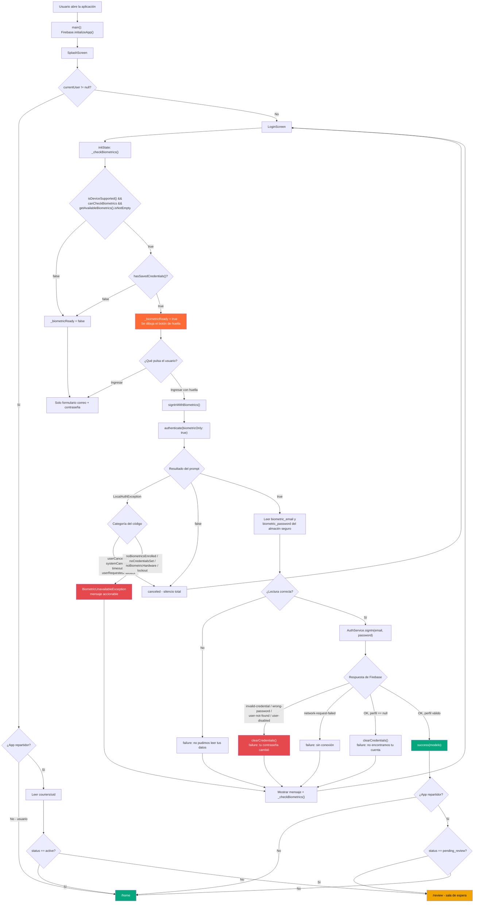
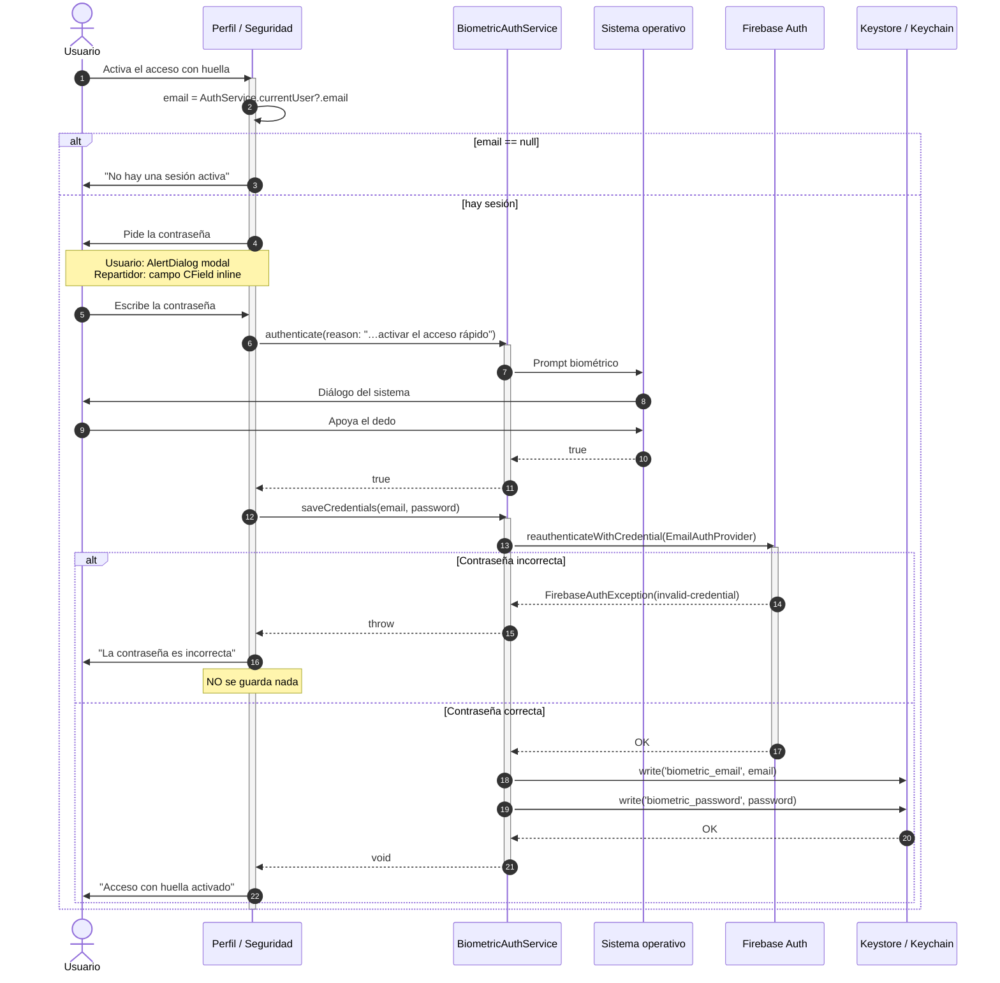
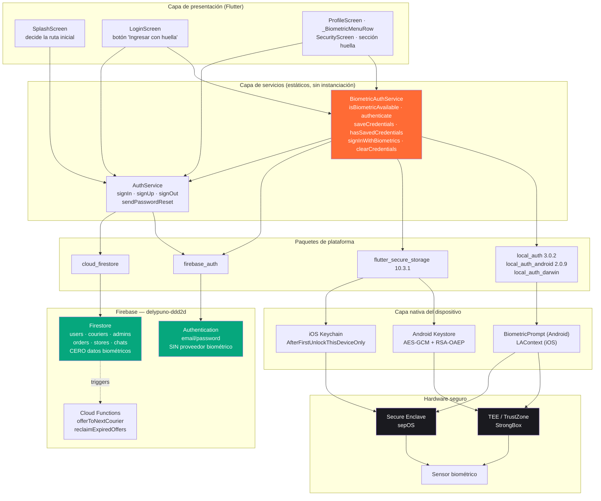
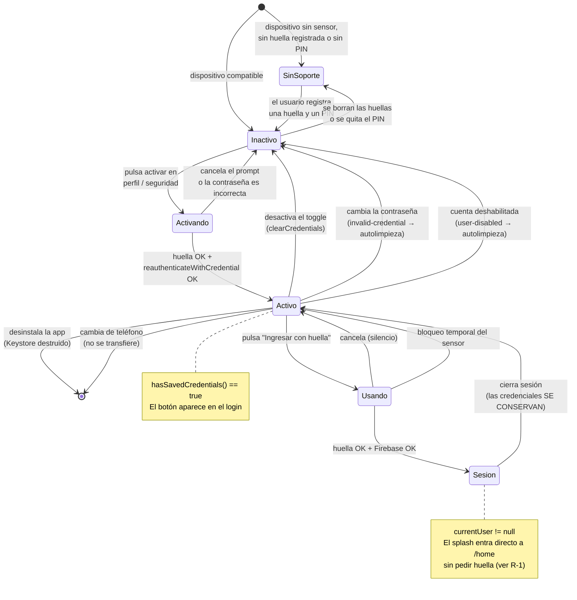

# Autenticación biométrica por huella digital — DeliPuno

**Documentación técnica oficial**
Proyecto: plataforma DeliPuno (`delypuno-ddd2d`)
Aplicaciones cubiertas: `app_delivery_usuario` (DeliPuno) y `app_delivery_repartidor` (Dely Repartidor)
Estado: **implementado y en el repositorio** — commit `15ffa30` *"integracion de huella digital para iniciar sesion"* (30 de julio de 2026)
Versión del documento: 1.0

---

## Índice

1. [Introducción](#1-introducción)
2. [Objetivo del inicio de sesión con huella](#2-objetivo-del-inicio-de-sesión-con-huella)
3. [Cómo funciona dentro del sistema](#3-cómo-funciona-dentro-del-sistema)
4. [¿Qué hace realmente la huella?](#4-qué-hace-realmente-la-huella)
5. [¿Cómo funciona en Android?](#5-cómo-funciona-en-android)
6. [¿Cómo funciona en iPhone?](#6-cómo-funciona-en-iphone)
7. [¿Cómo interactúa Flutter?](#7-cómo-interactúa-flutter)
8. [Integración con Firebase](#8-integración-con-firebase)
9. [Flujo específico para la App Usuario](#9-flujo-específico-para-la-app-usuario)
10. [Flujo específico para la App Repartidor](#10-flujo-específico-para-la-app-repartidor)
11. [Seguridad](#11-seguridad)
12. [Casos especiales](#12-casos-especiales)
13. [Riesgos](#13-riesgos)
14. [Buenas prácticas](#14-buenas-prácticas)
15. [Relación con el resto del sistema](#15-relación-con-el-resto-del-sistema)
16. [Diagrama completo](#16-diagrama-completo)
17. [Conclusiones](#17-conclusiones)
18. [Recomendaciones](#18-recomendaciones)

---

## Nota preliminar: alcance y veracidad de este documento

Este documento **no describe un diseño propuesto**: describe el código que existe hoy en el repositorio. Cada afirmación técnica sobre el comportamiento del sistema está anclada a un archivo y, cuando aplica, a una línea concreta. Los archivos que componen la funcionalidad son:

| Archivo | Aplicación | Rol |
|---|---|---|
| `app_delivery_usuario/lib/services/biometric_auth_service.dart` | Usuario | Servicio biométrico completo (221 líneas) |
| `app_delivery_usuario/lib/screens/login_screen.dart` | Usuario | Botón "Ingresar con huella" |
| `app_delivery_usuario/lib/screens/profile_screen.dart` | Usuario | Switch de activación (`_BiometricMenuRow`, línea 510+) |
| `app_delivery_usuario/lib/services/auth_service.dart` | Usuario | Login tradicional; documenta por qué `signOut` no borra credenciales |
| `app_delivery_repartidor/lib/services/biometric_auth_service.dart` | Repartidor | Servicio biométrico completo (230 líneas) |
| `app_delivery_repartidor/lib/screens/login_screen.dart` | Repartidor | Botón "Ingresar con huella" |
| `app_delivery_repartidor/lib/screens/profile/security_screen.dart` | Repartidor | Sección "ACCESO CON HUELLA" |
| `app_delivery_repartidor/lib/services/auth_service.dart` | Repartidor | Login tradicional + `changePassword` |
| `*/android/app/src/main/AndroidManifest.xml` | Ambas | Permiso `USE_BIOMETRIC` |
| `*/android/.../MainActivity.kt` | Ambas | Cambio a `FlutterFragmentActivity` |
| `*/ios/Runner/Info.plist` | Ambas | `NSFaceIDUsageDescription` |
| `*/pubspec.yaml` | Ambas | `local_auth: ^3.0.2`, `flutter_secure_storage: ^10.3.1` |

**La aplicación de administración (`app_delivery_administrator`) NO tiene autenticación biométrica.** Es Flutter Web y la biometría del proyecto está construida sobre APIs nativas móviles. Esto es una decisión, no un olvido, y se justifica en el capítulo 15.

Las secciones que señalan carencias o riesgos están agrupadas en los capítulos 13 y 18 y describen limitaciones reales del código actual, no defectos hipotéticos.

---

# 1. Introducción

## 1.1 Qué es la autenticación biométrica mediante huella digital

La autenticación biométrica es un mecanismo de verificación de identidad que utiliza una característica física medible e irrepetible de una persona —en este caso, el patrón de crestas y valles de la yema de un dedo— en lugar de un dato memorizado (una contraseña) o poseído (una tarjeta, un token).

Técnicamente, el proceso se descompone en dos fases que ocurren en momentos muy distintos:

**Fase de registro (*enrollment*).** Ocurre **una sola vez**, y **fuera de nuestra aplicación**: cuando la persona configura su teléfono, o entra a *Ajustes → Seguridad → Huella digital*. El sensor captura varias imágenes del dedo desde ángulos ligeramente distintos, extrae de ellas un conjunto de puntos característicos (*minutiae*: bifurcaciones, terminaciones de cresta, deltas, núcleos) y construye a partir de ellos una **plantilla matemática**. Esa plantilla no es una fotografía de la huella y no permite reconstruirla. Se almacena cifrada en una región de memoria a la que el sistema operativo de propósito general **no tiene acceso** (ver capítulos 5 y 6).

**Fase de verificación (*matching*).** Ocurre cada vez que algo pide autenticación. El sensor vuelve a capturar el dedo, extrae de nuevo los puntos característicos y los compara contra la plantilla almacenada. La comparación **nunca es exacta**: un dedo nunca se apoya dos veces igual, y siempre hay ruido, humedad, presión y ángulo distintos. Por eso el algoritmo calcula un *score* de similitud y lo contrasta contra un umbral. El resultado de todo ese proceso es, literalmente, **un bit**: coincide o no coincide.

Ese bit —y absolutamente nada más— es lo que la aplicación recibe. El capítulo 4 desarrolla esta idea, que es la más importante de todo el documento.

## 1.2 Por qué se decidió utilizarla dentro del proyecto

DeliPuno es una plataforma de delivery con tres perfiles de uso muy distintos, y en dos de ellos la fricción del login tradicional tiene un coste real y medible.

**El problema concreto que se resolvió.** Antes del commit `15ffa30`, ambas aplicaciones móviles tenían exactamente un camino de entrada: escribir correo y contraseña en `login_screen.dart`. Ese formulario sigue existiendo y sigue siendo el camino principal, pero era también el único. Para un repartidor que trabaja en la calle, con guantes, con lluvia, con el teléfono en un soporte de moto y con una pantalla mojada, escribir `micorreo@gmail.com` seguido de una contraseña de ocho caracteres no es una molestia menor: es una barrera operativa que se paga en minutos de conexión perdidos y, en el peor caso, en un repartidor que decide no volver a conectarse hasta llegar a casa.

Existía además un efecto de segundo orden más grave. Cuando escribir la contraseña es incómodo, la respuesta natural del usuario no es escribir mejor: es **elegir una contraseña más corta y más fácil**. La fricción del login no protege la cuenta; la degrada. La biometría rompe ese compromiso: permite que la contraseña real sea larga y fuerte, porque el usuario la escribe una sola vez y después entra con el dedo.

**Por qué ahora y no antes.** La plataforma llegó a este punto con toda la infraestructura de identidad ya consolidada: Firebase Authentication con correo y contraseña operativo en las tres aplicaciones, colecciones de perfil separadas por rol (`users/`, `couriers/`, `admins/`), reglas de Firestore que dependen de esa separación, y pantallas de sesión estables. Añadir biometría sobre una base así es una capa aditiva de bajo riesgo. Hacerlo antes habría significado construir sobre un flujo de identidad todavía en movimiento.

**Por qué esta arquitectura y no otra.** Firebase Authentication no ofrece un proveedor de identidad biométrico. No existe un `signInWithFingerprint()`. Cualquier integración de huella con Firebase es, necesariamente, un mecanismo **local** que desbloquea unas credenciales que Firebase sí entiende. El proyecto asumió eso de forma explícita en lugar de fingir lo contrario, y lo dejó escrito en la documentación del propio servicio:

```dart
// app_delivery_usuario/lib/services/biometric_auth_service.dart:8-13
/// Resultado de un intento de ingreso con huella.
///
/// La biometría no es un proveedor de Firebase: es un desbloqueo local de unas
/// credenciales guardadas. Por eso el resultado distingue tres casos, y no dos:
/// éxito, cancelación del usuario (no es un error, no se muestra nada) y error
/// real (se muestra el mensaje).
```

## 1.3 Beneficios para el usuario

**Velocidad medible.** El login tradicional en la app de usuario exige: enfocar el campo de correo, desplegar el teclado, escribir entre 15 y 30 caracteres, cambiar de campo, escribir la contraseña, pulsar *Ingresar*. Realista: entre 12 y 25 segundos. El login biométrico exige: pulsar un botón, apoyar el dedo. Realista: entre 1 y 3 segundos, más la latencia de red de `signInWithEmailAndPassword`.

**Eliminación del olvido.** El cliente de delivery es un usuario de baja frecuencia: pide comida una o dos veces por semana, quizá menos. Es el perfil exacto que olvida contraseñas. Cada olvido dispara el flujo de `sendPasswordReset` —implementado en `auth_service.dart:50`— que implica salir de la app, abrir el correo, seguir un enlace y volver. La huella no se olvida.

**Privacidad en público.** Escribir una contraseña en un paradero, en una cola o en un restaurante es un vector de *shoulder surfing* trivial de explotar. Apoyar un dedo no revela nada a quien mira.

**Reversibilidad total.** El usuario puede activar y desactivar la función cuando quiera desde su perfil, con un `Switch` (`profile_screen.dart:510+`). Desactivarlo borra las credenciales del dispositivo de forma inmediata (`BiometricAuthService.clearCredentials()`). No es un compromiso permanente.

## 1.4 Beneficios para el repartidor

El repartidor tiene los mismos beneficios que el usuario, amplificados, y además algunos exclusivos de su rol:

**Frecuencia de sesión mucho mayor.** El cliente entra a la app dos veces por semana; el repartidor entra al inicio de cada turno, y potencialmente varias veces al día si el sistema operativo mata el proceso por presión de memoria mientras la app está en segundo plano —algo perfectamente normal en gama de entrada, que es el hardware realista de este perfil. Cada reinicio es un login.

**Condiciones ambientales adversas.** Guantes, lluvia, sol directo que impide leer la pantalla, manos ocupadas con la mochila térmica, el teléfono montado en la moto. Escribir es difícil; apoyar un dedo, no.

**Impacto directo en la operación.** Y este es el punto crítico del negocio: mientras el repartidor no está conectado, **no recibe ofertas de pedido**. El sistema de despacho del proyecto (`functions/index.js`, función `offerToNextCourier`) ofrece cada pedido a **un repartidor en línea a la vez**, con una ventana de 30 segundos, y rota al siguiente si no responde. Un repartidor que tarda 25 segundos en teclear su contraseña es un repartidor que está **fuera de la rotación** durante esos 25 segundos. Reducir el login de 25 segundos a 3 no es una mejora cosmética de UX: es tiempo real de disponibilidad devuelto a la operación.

**Recuperación rápida tras el cierre de sesión.** La pantalla `/review` (sala de espera del repartidor pendiente de aprobación) ofrece un botón de cerrar sesión (`review_screen.dart:40`). El repartidor que sale de ahí y vuelve entra con la huella.

---

# 2. Objetivo del inicio de sesión con huella

Los cuatro objetivos que el proyecto se planteó son inseparables: cualquiera de ellos, perseguido en solitario, produce un mal diseño. Se documentan por separado por claridad, pero el valor está en su intersección.

## 2.1 Evitar escribir la contraseña cada vez

Este es el objetivo funcional inmediato, y el código lo cumple de forma literal: la contraseña se escribe **exactamente una vez**, en el momento de activar la función, y a partir de ahí queda cifrada en el almacén seguro del sistema operativo.

En la app de usuario, ese momento único es un diálogo modal explícito:

```dart
// app_delivery_usuario/lib/screens/profile_screen.dart:608+ (_askPassword)
title: const Text('Confirma tu contraseña'),
content: Column(
  mainAxisSize: MainAxisSize.min,
  children: [
    const Text(
      'Se guardará cifrada en este dispositivo para poder ingresar '
      'con tu huella.',
      ...
```

Obsérvese que el texto le dice al usuario **exactamente** lo que va a ocurrir: la contraseña se guarda, cifrada, en este dispositivo. No hay ambigüedad ni eufemismo. Esto es deliberado y es la postura correcta: el usuario está tomando una decisión de seguridad y merece saber en qué consiste.

En la app de repartidor el equivalente es un campo permanente dentro de la pantalla de Seguridad, no un diálogo:

```dart
// app_delivery_repartidor/lib/screens/profile/security_screen.dart:216-222
CField(
  label: 'Confirma tu contraseña',
  controller: _bioPass,
  obscureText: true,
  placeholder: '••••••••',
  icon: Icons.lock_outline_rounded,
),
```

Una decisión importante y menos obvia: **la contraseña se verifica contra Firebase antes de guardarla**. No basta con que el usuario escriba algo; ese algo tiene que ser realmente su contraseña:

```dart
// biometric_auth_service.dart:114-126 (usuario) / :121-133 (repartidor)
static Future<void> saveCredentials(String email, String password) async {
  final user = AuthService.currentUser;
  if (user == null) {
    throw FirebaseAuthException(
      code: 'no-user',
      message: 'No hay una sesión activa.',
    );
  }
  final cred = EmailAuthProvider.credential(email: email, password: password);
  await user.reauthenticateWithCredential(cred);
  await _storage.write(key: _kEmail, value: email);
  await _storage.write(key: _kPassword, value: password);
}
```

El `reauthenticateWithCredential` es la pieza clave. Sin él, un usuario que escribiera mal su contraseña activaría "correctamente" la huella y descubriría el fallo días después, en el peor momento posible: intentando entrar. El servicio lo documenta con esa misma justificación:

> *"Reautentica primero contra Firebase con `EmailAuthProvider` — el mismo mecanismo que usa el cambio de contraseña — para no llegar a persistir una contraseña equivocada que luego rompería el ingreso con huella."*

## 2.2 Mejorar la experiencia de usuario

La mejora de experiencia se diseñó alrededor de un principio: **la biometría nunca debe empeorar la experiencia de quien no la usa o no puede usarla**. Esto se traduce en tres reglas visibles en el código.

**Regla 1 — El botón solo aparece si sirve.** En ambos logins, la condición de visibilidad es una conjunción de dos comprobaciones independientes:

```dart
// login_screen.dart (ambas apps), método _checkBiometrics
final available = await BiometricAuthService.isBiometricAvailable();
final saved = await BiometricAuthService.hasSavedCredentials();
if (mounted) setState(() => _biometricReady = available && saved);
```

`available` responde a "¿este teléfono puede?"; `saved` responde a "¿este usuario quiso?". Si falta cualquiera de las dos, el botón sencillamente no se dibuja. Un usuario con un teléfono sin sensor **jamás ve un control que no puede usar**, y un usuario que nunca activó la función tampoco. Es la diferencia entre una interfaz que se adapta y una que ofrece opciones muertas.

**Regla 2 — La fila de configuración también desaparece si no aplica.** En el perfil de usuario, `_BiometricMenuRow` se autoelimina del árbol de widgets si el dispositivo no soporta biometría:

```dart
// app_delivery_usuario/lib/screens/profile_screen.dart, build() de _BiometricMenuRowState
// Sin sensor o sin huella registrada la fila no aporta nada: se oculta.
if (!_loaded || !_available) return const SizedBox.shrink();
```

La app de repartidor toma la decisión opuesta y también correcta para su contexto: en lugar de ocultar, **explica**, porque en la pantalla de Seguridad la ausencia de una opción anunciada sería confusa:

```dart
// security_screen.dart:183-191
if (!_bioAvailable) {
  return const [
    Text(
      'Este dispositivo no tiene huella registrada o no cuenta con sensor '
      'biométrico. Puedes seguir ingresando con tu correo y contraseña.',
      ...
```

**Regla 3 — Cancelar no es fallar.** Esta es la decisión de diseño más fina de toda la implementación. El resultado de un intento biométrico no es un booleano, es un tipo de tres estados:

```dart
// biometric_auth_service.dart:14-26 (usuario)
class BiometricSignInResult {
  final UserModel? user;
  final String? error;
  final bool canceled;

  const BiometricSignInResult._({this.user, this.error, this.canceled = false});

  const BiometricSignInResult.success(UserModel user) : this._(user: user);
  const BiometricSignInResult.canceled() : this._(canceled: true);
  const BiometricSignInResult.failure(String message) : this._(error: message);

  bool get isSuccess => user != null;
}
```

¿Por qué tres y no dos? Porque un usuario que pulsa "Cancelar" en el diálogo del sistema **no ha cometido ningún error**. Cambió de opinión, o se dio cuenta de que quería entrar con otra cuenta, o simplemente pulsó sin querer. Mostrarle un `SnackBar` rojo diciendo "No se pudo verificar tu huella" sería castigarlo por una acción deliberada y perfectamente legítima. El login lo trata en consecuencia:

```dart
// app_delivery_usuario/lib/screens/login_screen.dart:58-59
// Cancelar no es un error: el usuario simplemente vuelve al formulario.
if (result.canceled) return;
```

Un `bool` no habría podido expresar esta distinción, y la interfaz habría sido peor. El tipo existe por una razón de producto, no de arquitectura.

## 2.3 Acelerar el ingreso

Desglose realista del camino biométrico, tal como está implementado:

| Paso | Operación | Coste |
|---|---|---|
| 1 | Pulsar "Ingresar con huella" | ~0 s |
| 2 | `LocalAuthentication.authenticate()` levanta `BiometricPrompt` | 100–300 ms |
| 3 | Usuario apoya el dedo; el TEE compara | 200–800 ms |
| 4 | Lectura de dos claves de `flutter_secure_storage` | 20–100 ms |
| 5 | `AuthService.signIn()` → `signInWithEmailAndPassword` (red) | 300–1500 ms |
| 6 | Lectura del perfil `users/{uid}` o `couriers/{uid}` (red) | 100–500 ms |
| 7 | `Navigator.pushReplacementNamed('/home')` | ~16 ms |

Total típico: **1 a 3 segundos**, dominado por los pasos 5 y 6, que son exactamente los mismos que ejecuta el login tradicional. Es decir: **la biometría no añade latencia de red; elimina latencia humana**. Lo que se ahorra son los 10–25 segundos de tecleo del paso previo, no el trabajo del backend.

Un detalle de implementación relevante: los pasos 5 y 6 ocurren porque el servicio **reutiliza deliberadamente `AuthService.signIn`** en lugar de duplicar la lógica de Firebase:

```dart
// biometric_auth_service.dart:172 (usuario)
final user = await AuthService.signIn(email, password);
```

Esto garantiza que el login biométrico y el login tradicional producen **exactamente el mismo estado**: mismo `UserCredential`, mismo perfil leído de Firestore, mismas reglas aplicadas. No hay dos caminos que puedan divergir con el tiempo. Es una decisión de mantenibilidad tan importante como la de seguridad.

## 2.4 Mantener la seguridad

El objetivo explícito no era "hacer el login más fácil", que sería trivial y peligroso, sino **hacerlo más fácil sin bajar el listón**. Los mecanismos concretos por los que el código sostiene ese equilibrio:

**No se degrada a PIN.** La llamada pasa `biometricOnly: true`:

```dart
// biometric_auth_service.dart:73-79 (usuario)
static Future<bool> authenticate({String? reason}) async {
  try {
    return await _localAuth.authenticate(
      localizedReason:
          reason ?? 'Verifica tu identidad para ingresar a DeliPuno',
      biometricOnly: true,
    );
```

Sin ese flag, `local_auth` permitiría que el usuario pulsara "Usar PIN" en el diálogo del sistema y entrara con el código de desbloqueo del teléfono. Eso convertiría el "acceso con huella" en un "acceso con el PIN que cualquiera que mire por encima del hombro ya conoce". El comentario del código lo dice sin rodeos: *"`biometricOnly: true` impide que el PIN o el patrón del dispositivo sustituyan a la huella"*.

Este flag tiene un coste —lo tratamos honestamente en el capítulo 12, caso "sistema sin PIN" y caso "bloqueo biométrico"— pero es el compromiso correcto para una función que es *opcional* y que siempre tiene el login tradicional debajo.

**Nada biométrico viaja a la nube.** No existe ninguna escritura relacionada con la huella en Firestore. Búsquese en `firestore.rules`: no hay ninguna colección, campo ni regla asociada a biometría, y no la hay porque no hay nada que guardar allí. Las credenciales viven **solo** en el almacén del dispositivo. Esto es una propiedad de seguridad, no una omisión: significa que comprometer la base de datos del proyecto no expone ni una sola credencial biométrica.

**La verificación biométrica precede a cualquier lectura.** En `signInWithBiometrics`, el orden es rígido: primero se verifica la huella, y solo si eso devuelve `true` se leen las credenciales. Si la verificación falla o se cancela, la función retorna **antes** de tocar el almacén:

```dart
// biometric_auth_service.dart:146-156 (usuario)
static Future<BiometricSignInResult> signInWithBiometrics() async {
  try {
    final ok = await authenticate();
    if (!ok) return const BiometricSignInResult.canceled();
  } on BiometricUnavailableException catch (e) {
    return BiometricSignInResult.failure(e.message);
  } catch (_) {
    return const BiometricSignInResult.failure(
        'No pudimos verificar tu huella. Ingresa con tu contraseña.');
  }
  // ...solo ahora se leen las credenciales
```

**Las credenciales obsoletas se autodestruyen.** Si la contraseña cambió desde otro dispositivo, Firebase rechaza el `signIn` y el servicio borra lo guardado en lugar de dejar basura que fallará indefinidamente:

```dart
// biometric_auth_service.dart:179-186 (usuario)
} on FirebaseAuthException catch (e) {
  if (e.code == 'invalid-credential' ||
      e.code == 'wrong-password' ||
      e.code == 'user-not-found' ||
      e.code == 'user-disabled') {
    await clearCredentials();
    return const BiometricSignInResult.failure(
        'Tu contraseña cambió. Ingresa con tu contraseña para reactivar la huella.');
  }
```

Nótese `user-disabled` en esa lista: si un administrador deshabilita una cuenta desde la consola de Firebase, el acceso biométrico de ese dispositivo se limpia solo en el siguiente intento. La revocación central tiene efecto local.

**El login tradicional nunca se retira.** Es la garantía de fondo. Ningún fallo biométrico —sensor roto, huella borrada, bloqueo por intentos, teléfono nuevo— puede dejar a nadie fuera de su cuenta, porque el formulario de correo y contraseña sigue en pantalla, intacto, en todo momento.

---

# 3. Cómo funciona dentro del sistema

Este capítulo recorre el flujo completo, paso a paso, tal como está implementado. Es importante entender que en el sistema real existen **dos caminos distintos** y que el diagrama clásico del enunciado ("la app verifica si existe sesión previa → pregunta si desea autenticarse") describe un patrón de *app lock* que este proyecto **no** implementa exactamente así. Documentamos el flujo real y señalamos la diferencia con precisión, porque confundirlos llevaría a conclusiones falsas sobre la seguridad del sistema.

## 3.0 Los dos caminos de entrada

```
                    ┌─ Sesión de Firebase VIVA ──→ SplashScreen navega directo a /home
Usuario abre la app ─┤                              (NO se pide huella — ver 3.10)
                    └─ Sesión AUSENTE ───────────→ LoginScreen
                                                    ├─ Formulario correo+contraseña
                                                    └─ Botón "Ingresar con huella"  ← el flujo de este capítulo
```

El camino biométrico se recorre **cuando no hay sesión de Firebase activa**: tras un cierre de sesión explícito, tras reinstalar, o tras una expiración/revocación del token. Mientras la sesión persistida siga viva, el splash entra directo. Esto se analiza en detalle en la sección 3.10 y se problematiza en el capítulo 13 y en la recomendación R-1.

## 3.1 Paso 1 — El usuario abre la aplicación

`main()` se ejecuta. En ambas apps hace lo mismo en lo esencial: inicializar el binding de Flutter, inicializar Firebase con las opciones generadas, fijar la orientación vertical y lanzar el `MaterialApp`.

```dart
// app_delivery_usuario/lib/main.dart:28-34
void main() async {
  WidgetsFlutterBinding.ensureInitialized();
  await Firebase.initializeApp(options: DefaultFirebaseOptions.currentPlatform);
  await SeedService.seedIfEmpty();
  SystemChrome.setPreferredOrientations([DeviceOrientation.portraitUp]);
  runApp(const DeliPunoApp());
}
```

```dart
// app_delivery_repartidor/lib/main.dart:27-42
Future<void> main() async {
  WidgetsFlutterBinding.ensureInitialized();
  await Firebase.initializeApp(
    options: DefaultFirebaseOptions.currentPlatform,
  );
  await SystemChrome.setPreferredOrientations([
    DeviceOrientation.portraitUp,
  ]);
  SystemChrome.setSystemUIOverlayStyle(const SystemUiOverlayStyle(...));
  runApp(const RepartidorApp());
}
```

El detalle que importa para la biometría es que `Firebase.initializeApp` es `await`-eado. Cuando esa línea termina, el SDK de Firebase Auth **ya ha rehidratado desde disco cualquier sesión previa**. Es decir: para cuando la primera pantalla se dibuja, `FirebaseAuth.instance.currentUser` ya tiene el valor correcto. Esto es lo que hace posible el paso siguiente.

En Android hay además una precondición estructural que se resolvió en este mismo commit y sin la cual nada de esto funcionaría —se detalla en 3.4 y en el capítulo 5.

## 3.2 Paso 2 — La aplicación verifica si existe una sesión previa

La ruta inicial `'/'` es el `SplashScreen` en ambas apps. Su única responsabilidad es decidir a dónde ir.

**App de usuario** — decisión simple y síncrona sobre el estado de Auth:

```dart
// app_delivery_usuario/lib/screens/splash_screen.dart:17-23
@override
void initState() {
  super.initState();
  Timer(const Duration(seconds: 2), () {
    if (!mounted) return;
    final dest = AuthService.currentUser != null ? '/home' : '/login';
    Navigator.pushReplacementNamed(context, dest);
  });
}
```

**App de repartidor** — decisión con un salto adicional a Firestore, porque el destino depende del estado de aprobación del repartidor:

```dart
// app_delivery_repartidor/lib/screens/splash_screen.dart:20-39
Future<void> _decideNext() async {
  await Future.delayed(const Duration(milliseconds: 1400));
  if (!mounted) return;
  final uid = AuthService.currentUid;
  if (uid == null) {
    Navigator.of(context).pushReplacementNamed('/login');
    return;
  }
  final courier = await CourierService.getCourier(uid);
  if (!mounted) return;
  if (courier == null) {
    Navigator.of(context).pushReplacementNamed('/login');
  } else if (courier.status == 'active') {
    Navigator.of(context).pushReplacementNamed('/home');
  } else {
    // pending_review / rejected / suspended → waiting room, which live-streams
    // the status and advances on its own once the admin approves.
    Navigator.of(context).pushReplacementNamed('/review');
  }
}
```

Esta asimetría es correcta y refleja una diferencia real de dominio: un cliente que se registra puede comprar de inmediato; un repartidor que se registra **no puede repartir hasta que un administrador lo apruebe**. El splash del repartidor no puede decidir el destino solo con Auth; necesita el `status` de Firestore.

**Consecuencia para la biometría, y es fundamental:** si `currentUser != null`, ninguno de los dos splash pide huella. Se entra directamente. El botón biométrico solo entra en juego cuando el splash decide `/login`.

## 3.3 Paso 3 — Comprueba si el dispositivo tiene sensor biométrico

Al montarse `LoginScreen`, su `initState` dispara una comprobación asíncrona:

```dart
// app_delivery_usuario/lib/screens/login_screen.dart:24-46
@override
void initState() {
  super.initState();
  _checkBiometrics();
}

Future<void> _checkBiometrics() async {
  try {
    final available = await BiometricAuthService.isBiometricAvailable();
    final saved = await BiometricAuthService.hasSavedCredentials();
    if (mounted) setState(() => _biometricReady = available && saved);
  } catch (_) {
    // Sin biometría el formulario tradicional sigue intacto: no hay nada que
    // informarle al usuario.
  }
}
```

Obsérvese que el `catch` está **vacío a propósito**, y el comentario explica por qué: si la comprobación falla, `_biometricReady` se queda en `false`, el botón no aparece y el usuario ve un login normal. No hay nada que reportar. Tragar una excepción es casi siempre un error; aquí es la decisión correcta, y está justificada por escrito.

La comprobación de disponibilidad es una conjunción de tres condiciones:

```dart
// biometric_auth_service.dart:56-65 (usuario)
static Future<bool> isBiometricAvailable() async {
  try {
    if (!await _localAuth.isDeviceSupported()) return false;
    if (!await _localAuth.canCheckBiometrics) return false;
    final enrolled = await _localAuth.getAvailableBiometrics();
    return enrolled.isNotEmpty;
  } catch (_) {
    return false;
  }
}
```

Las tres son necesarias y ninguna es redundante:

| Llamada | Pregunta que responde | Por qué no basta con las otras |
|---|---|---|
| `isDeviceSupported()` | ¿El dispositivo tiene un mecanismo de bloqueo seguro configurado? | Un teléfono con sensor pero **sin PIN/patrón** no puede usar el Keystore respaldado por hardware. Devuelve `false` ahí. |
| `canCheckBiometrics` | ¿Hay hardware biométrico presente y accesible ahora mismo? | Un dispositivo puede soportar credenciales seguras (PIN) pero no tener sensor biométrico. |
| `getAvailableBiometrics()` | ¿Hay al menos **una huella o rostro realmente registrado**? | Las dos anteriores pueden devolver `true` con **cero huellas dadas de alta**. Sin esta tercera, el botón aparecería y al pulsarlo el prompt fallaría. |

El comentario del código resume exactamente eso: *"True solo si el dispositivo tiene hardware biométrico Y hay al menos una huella/rostro registrado. Sin lo segundo el prompt fallaría al invocarse."*

## 3.4 Precondición de plataforma — `FlutterFragmentActivity`

Antes de continuar con el flujo, hay que documentar un requisito estructural sin el cual todo lo anterior compila pero **falla en tiempo de ejecución**.

En Android, `local_auth` no dibuja su propio diálogo: delega en `BiometricPrompt`, la API de AndroidX. Y `BiometricPrompt` exige que la `Activity` anfitriona sea una `FragmentActivity`, porque internamente monta un `Fragment` invisible para gestionar el ciclo de vida del diálogo. La plantilla por defecto de Flutter genera una `FlutterActivity`, que **no** lo es. Por eso ambas apps cambiaron su `MainActivity`:

```kotlin
// app_delivery_usuario/android/app/src/main/kotlin/com/example/app_delibery/MainActivity.kt
package com.example.app_delibery

import io.flutter.embedding.android.FlutterFragmentActivity

// FlutterFragmentActivity (y no FlutterActivity) porque local_auth usa
// BiometricPrompt en Android, que exige un host FragmentActivity. Con
// FlutterActivity el plugin falla en runtime con "no_fragment_activity".
class MainActivity : FlutterFragmentActivity()
```

El archivo equivalente en el repartidor (`com/example/app_delivery_repartidor/MainActivity.kt`) es idéntico salvo el paquete. El comentario nombra el error concreto —`no_fragment_activity`— que se obtendría de olvidarlo, lo cual convierte el comentario en documentación operativa: quien vea ese error en un log sabrá inmediatamente dónde mirar.

Junto a esto, el manifiesto declara el permiso:

```xml
<!-- android/app/src/main/AndroidManifest.xml (ambas apps) -->
<!-- Biometría: acceso rápido con huella / Face ID (local_auth). -->
<uses-permission android:name="android.permission.USE_BIOMETRIC"/>
```

`USE_BIOMETRIC` es un permiso **normal**, no *dangerous*: se concede en tiempo de instalación y no dispara ningún diálogo de permisos en tiempo de ejecución. El usuario nunca ve una pregunta del tipo "¿Permitir que DeliPuno acceda a tu huella?", porque la app no accede a la huella —ver capítulo 4.

Y en iOS, la cadena de justificación obligatoria para Face ID:

```xml
<!-- ios/Runner/Info.plist (ambas apps) -->
<key>NSFaceIDUsageDescription</key>
<string>Esta app usa Face ID para permitir un inicio de sesión más rápido y seguro.</string>
```

Sin esa clave, iOS **termina el proceso** con una excepción en cuanto se invoca Face ID. No es un aviso: es un crash. Y App Store Review rechaza la app en revisión estática si detecta el uso de la API sin la descripción.

## 3.5 Paso 4 — Pregunta si desea autenticarse

Aquí el sistema real difiere del patrón genérico, y la diferencia es deliberada.

El proyecto **no** muestra un diálogo "¿Deseas autenticarte con huella?". En su lugar, **ofrece un botón** que el usuario pulsa si quiere. La autenticación biométrica nunca se dispara sola.

```dart
// app_delivery_usuario/lib/screens/login_screen.dart:183-192
if (_biometricReady && !_loading) ...[
  const SizedBox(height: 12),
  AppButton(
    label: 'Ingresar con huella',
    variant: 'ghost',
    onTap: _signInWithBiometrics,
    leading: const Icon(Icons.fingerprint,
        size: 22, color: AppColors.primary),
  ),
],
```

```dart
// app_delivery_repartidor/lib/screens/login_screen.dart:223-232
if (_biometricReady) ...[
  const SizedBox(height: 12),
  CButton(
    label: 'Ingresar con huella',
    icon: Icons.fingerprint_rounded,
    size: CButtonSize.xl,
    variant: CButtonVariant.ghost,
    onPressed: _loading ? null : _signInWithBiometrics,
  ),
],
```

Ambos usan la variante `ghost` (secundaria, sin relleno sólido). Es una señal visual coherente: el botón primario relleno sigue siendo *Ingresar* con contraseña. La huella es **el atajo, no el camino oficial**. Esa jerarquía visual comunica correctamente la arquitectura real del sistema.

La justificación de no auto-disparar el prompt es de experiencia de usuario: si la app lanzara el diálogo biométrico automáticamente al abrir el login, un usuario que quiere entrar con **otra cuenta** —muy común en dispositivos compartidos, y en el caso del repartidor, en un teléfono de flota— tendría que cancelar un diálogo modal antes de poder escribir. El botón invierte el control: la app ofrece, el usuario decide.

## 3.6 Paso 5 — Android o iOS solicita la huella

Al pulsar, `_signInWithBiometrics` bloquea la interfaz y llama al servicio:

```dart
// app_delivery_usuario/lib/screens/login_screen.dart:48-57
Future<void> _signInWithBiometrics() async {
  if (_loading) return;
  setState(() => _loading = true);
  try {
    final result = await BiometricAuthService.signInWithBiometrics();
    if (!mounted) return;
    if (result.isSuccess) {
      Navigator.pushReplacementNamed(context, '/home');
      return;
    }
```

La guarda `if (_loading) return;` en la primera línea evita el doble disparo por doble toque, que produciría dos prompts biométricos encolados —un fallo clásico y desagradable.

Dentro del servicio, `authenticate()` invoca `local_auth`, que cruza el *platform channel* hacia el código nativo. A partir de ese instante **el control sale de Flutter por completo**. El diálogo que aparece:

- **No** lo dibuja Flutter. Es una superficie del sistema operativo.
- **No** puede ser capturado, leído ni manipulado por el proceso de la app.
- **No** es personalizable más allá del texto que se le pasa (`localizedReason`).

Ese texto es lo único que la aplicación controla, y ambas apps lo personalizan con su propia identidad:

```dart
// usuario
localizedReason: reason ?? 'Verifica tu identidad para ingresar a DeliPuno',
// repartidor
localizedReason: reason ?? 'Verifica tu identidad para ingresar a Dely Repartidor',
```

El parámetro `reason` es opcional y se sobrescribe cuando el contexto cambia. Al **activar** la función desde el perfil, el mensaje es distinto porque la intención es distinta:

```dart
// security_screen.dart:75-77 y profile_screen.dart (_enable)
final verified = await BiometricAuthService.authenticate(
  reason: 'Verifica tu huella para activar el acceso rápido',
);
```

Un detalle de calidad que se nota: el usuario que activa la función lee "para activar el acceso rápido", no "para ingresar". El sistema le habla de lo que realmente está haciendo.

## 3.7 Paso 6 — El sistema operativo valida la huella

Este paso ocurre íntegramente **fuera del proceso de la aplicación**. La secuencia física, en Android:

1. El sensor capacitivo, óptico o ultrasónico captura la imagen del dedo.
2. La imagen se transfiere a un entorno aislado (TEE / StrongBox — capítulo 5). En hardware moderno, ese transporte está cifrado extremo a extremo desde el propio sensor.
3. Dentro del entorno aislado se extraen las *minutiae* y se comparan contra la plantilla registrada, que **nunca sale de ahí**.
4. Se calcula un *score* de similitud y se compara contra el umbral de aceptación del fabricante.
5. El entorno aislado emite un veredicto binario firmado hacia el sistema Android.
6. Android entrega el resultado al `FragmentActivity` que lanzó el `BiometricPrompt`.
7. El plugin `local_auth_android` traduce el resultado y lo devuelve a Dart por el canal.

En iOS el proceso es análogo con el Secure Enclave (capítulo 6).

Durante todos estos pasos, el código Dart está simplemente suspendido en un `await`. No participa, no observa, no puede intervenir.

## 3.8 Paso 7 — La aplicación recibe únicamente un resultado verdadero o falso

La firma del método lo dice todo:

```dart
static Future<bool> authenticate({String? reason}) async
```

`Future<bool>`. Un bit. Este es el corazón del modelo de seguridad y el capítulo 4 está enteramente dedicado a sus implicaciones.

El manejo de errores es donde la implementación demuestra madurez. `local_auth` 3.x lanza `LocalAuthException` con un código enumerado, y el servicio lo traduce a tres categorías de comportamiento:

```dart
// biometric_auth_service.dart:80-103 (usuario)
} on LocalAuthException catch (e) {
  switch (e.code) {
    case LocalAuthExceptionCode.userCanceled:
    case LocalAuthExceptionCode.systemCanceled:
    case LocalAuthExceptionCode.timeout:
    case LocalAuthExceptionCode.userRequestedFallback:
      return false;
    case LocalAuthExceptionCode.noBiometricsEnrolled:
    case LocalAuthExceptionCode.noCredentialsSet:
      throw const BiometricUnavailableException(
          'No tienes ninguna huella registrada en este dispositivo.');
    case LocalAuthExceptionCode.noBiometricHardware:
    case LocalAuthExceptionCode.biometricHardwareTemporarilyUnavailable:
      throw const BiometricUnavailableException(
          'El sensor de huella no está disponible en este momento.');
    case LocalAuthExceptionCode.temporaryLockout:
    case LocalAuthExceptionCode.biometricLockout:
      throw const BiometricUnavailableException(
          'Demasiados intentos fallidos. Ingresa con tu contraseña.');
    default:
      throw const BiometricUnavailableException(
          'No pudimos verificar tu huella. Ingresa con tu contraseña.');
  }
}
```

La taxonomía es:

| Categoría | Códigos | Comportamiento | Razón |
|---|---|---|---|
| **Cancelación** | `userCanceled`, `systemCanceled`, `timeout`, `userRequestedFallback` | `return false` — silencio total | El usuario o el sistema decidieron no seguir. No hay error que reportar. |
| **Configuración del dispositivo** | `noBiometricsEnrolled`, `noCredentialsSet`, `noBiometricHardware`, `biometricHardwareTemporarilyUnavailable` | Lanza `BiometricUnavailableException` con mensaje accionable | El usuario puede arreglarlo (registrar una huella, esperar). Merece saberlo. |
| **Bloqueo por intentos** | `temporaryLockout`, `biometricLockout` | Lanza excepción que **redirige a contraseña** | El sensor está bloqueado por el SO. El único camino es el tradicional. |

Merece atención `userRequestedFallback`, agrupado con las cancelaciones. Ese código se emite cuando el usuario pulsa el botón de alternativa en el diálogo del sistema. Como la app usa `biometricOnly: true`, no hay alternativa nativa que ofrecer, así que tratarlo como "cancelado" y devolver al formulario de contraseña es exactamente el comportamiento deseado: el usuario pidió otra vía, y la otra vía está detrás.

Y los mensajes de los bloqueos son notables por lo que hacen bien: `'Demasiados intentos fallidos. Ingresa con tu contraseña.'` no solo informa del problema, **indica la salida**. Un mensaje de error que deja al usuario sin saber qué hacer es un mensaje a medias.

La excepción propia es deliberadamente mínima, y su razón de ser es transportar un mensaje ya redactado para pantalla:

```dart
// biometric_auth_service.dart:213-221 (usuario)
/// Problema de configuración o disponibilidad del sensor, con un mensaje ya
/// listo para mostrarle al usuario.
class BiometricUnavailableException implements Exception {
  final String message;
  const BiometricUnavailableException(this.message);

  @override
  String toString() => message;
}
```

## 3.9 Paso 8 — Si es verdadero, se permite ingresar

Aquí está el matiz que distingue este sistema de una implementación ingenua: **un `true` biométrico no otorga acceso por sí mismo**. Otorga acceso a las credenciales, y son las credenciales las que producen la sesión.

```dart
// biometric_auth_service.dart:157-197 (usuario), resumido y anotado
// (A) Leer del almacén seguro — solo se llega aquí si la huella dio true
String? email;
String? password;
try {
  email = await _storage.read(key: _kEmail);
  password = await _storage.read(key: _kPassword);
} catch (_) {
  return const BiometricSignInResult.failure(
      'No pudimos leer tus datos guardados. Ingresa con tu contraseña.');
}
if (email == null || password == null) {
  return const BiometricSignInResult.failure(
      'No hay un acceso con huella configurado. Ingresa con tu contraseña.');
}

// (B) Autenticar contra Firebase — la sesión REAL nace aquí, no en la huella
try {
  final user = await AuthService.signIn(email, password);
  if (user == null) {
    await clearCredentials();
    return const BiometricSignInResult.failure(
        'No encontramos tu cuenta. Ingresa con tu contraseña.');
  }
  return BiometricSignInResult.success(user);
}
```

Tres cosas que hace bien este fragmento:

1. La lectura del almacén está en su propio `try`. Si el Keystore fue invalidado (ver capítulo 12), el fallo se distingue del fallo de red y produce un mensaje distinto.
2. El caso `user == null` significa "Firebase autenticó, pero no existe el documento `users/{uid}`" — una cuenta huérfana. Se limpian las credenciales, porque volver a intentarlo dará el mismo resultado.
3. El resultado transporta el modelo (`UserModel` / `CourierModel`), no solo un booleano. La razón se ve en el repartidor, y está documentada en el propio tipo: *"El `CourierModel` viaja de vuelta porque el login necesita su `status` para decidir entre /home y /review."*

La navegación posterior difiere entre apps, y esa diferencia es exactamente la diferencia de dominio:

```dart
// usuario — destino único
if (result.isSuccess) {
  Navigator.pushReplacementNamed(context, '/home');
  return;
}
```

```dart
// repartidor — destino condicionado por el estado de aprobación
final courier = result.courier;
if (courier != null) {
  if (courier.status == 'pending_review') {
    Navigator.of(context).pushReplacementNamed('/review');
  } else {
    Navigator.of(context).pushReplacementNamed('/home');
  }
  return;
}
```

En ambos casos `pushReplacementNamed` y no `pushNamed`: el login se **sustituye**, no se apila. Un botón "atrás" desde `/home` no puede devolver a la pantalla de login. Correcto y necesario.

## 3.10 Paso 9 — Si es falso, vuelve al login tradicional

El fallo no destruye nada. La pantalla de login **nunca se abandonó**: el prompt biométrico es una superficie superpuesta del sistema, y al cerrarse deja debajo el mismo formulario con el mismo estado.

```dart
// app_delivery_usuario/lib/screens/login_screen.dart:58-77
// Cancelar no es un error: el usuario simplemente vuelve al formulario.
if (result.canceled) return;
ScaffoldMessenger.of(context).showSnackBar(SnackBar(
  content: Text(result.error ?? 'No pudimos ingresar con tu huella'),
  backgroundColor: AppColors.danger,
));
// Si las credenciales se borraron por estar obsoletas, el botón debe
// desaparecer hasta que el usuario vuelva a activarlo desde su perfil.
await _checkBiometrics();
```

La llamada final a `_checkBiometrics()` es sutil y muy correcta. Si el fallo fue "tu contraseña cambió", el servicio **ya borró** las credenciales. Sin esta reevaluación, el botón "Ingresar con huella" seguiría en pantalla ofreciendo algo que ya no existe, y el usuario lo pulsaría en bucle. Con ella, el botón desaparece en el mismo fotograma y el usuario ve un login limpio.

El repartidor hace lo mismo, mostrando el error en un panel embebido en lugar de un `SnackBar`, coherente con su patrón de errores:

```dart
// app_delivery_repartidor/lib/screens/login_screen.dart:68-73
// Cancelar no es un error: el repartidor vuelve al formulario sin ruido.
if (result.canceled) return;
setState(() => _error = result.error);
// Si las credenciales se borraron por estar obsoletas, el botón debe
// desaparecer hasta que vuelva a activarlo desde Seguridad.
await _checkBiometrics();
```

Y ambos liberan el estado de carga en un `finally`, de modo que ninguna ruta de error puede dejar la interfaz colgada en "cargando":

```dart
} finally {
  if (mounted) setState(() => _loading = false);
}
```

## 3.11 Observación honesta sobre el alcance real de la protección

Es necesario dejar constancia clara de una propiedad del sistema tal como está construido hoy, porque afecta a cómo debe interpretarse todo lo anterior.

**La biometría en este proyecto protege el momento del `signIn`, no el acceso continuado a la app.**

La razón está en la interacción entre dos hechos:

1. Firebase Auth **persiste la sesión en disco** por defecto en Android e iOS. Sobrevive al cierre de la app y al reinicio del teléfono.
2. Ambos `SplashScreen` navegan a `/home` si `currentUser != null`, **sin pedir huella**.

De lo cual se sigue: alguien con el teléfono desbloqueado en la mano y una sesión viva **entra a la app sin tocar el sensor**, exactamente igual que antes de que existiera esta funcionalidad. El escenario en el que la huella se ejerce es el de la sesión ausente.

Esto **no invalida** la funcionalidad —cumple su objetivo declarado, que es no volver a escribir la contraseña— pero sí acota su alcance: es un *acelerador de login*, no un *bloqueo de aplicación*. Convertirlo en lo segundo es una extensión natural y de bajo coste; se especifica en la recomendación **R-1** del capítulo 18.

---

# 4. ¿Qué hace realmente la huella?

Este capítulo es el más importante del documento desde el punto de vista conceptual, y el que más malentendidos corrige. Se desarrolla en detalle porque la mayoría de las objeciones de privacidad a la biometría en aplicaciones móviles nacen de suponer exactamente lo contrario de lo que ocurre.

## 4.1 Las cuatro afirmaciones negativas

### La aplicación NO almacena huellas

**Afirmación:** en ningún punto del código de DeliPuno se escribe un dato biométrico. En ningún disco, en ninguna base de datos, en ninguna variable.

**Demostración por inventario.** El almacenamiento persistente de la funcionalidad se reduce a **dos claves de texto**:

```dart
// biometric_auth_service.dart:51-52 (usuario) / :57-58 (repartidor)
static const _kEmail = 'biometric_email';
static const _kPassword = 'biometric_password';
```

Y las únicas escrituras del servicio son estas dos líneas:

```dart
await _storage.write(key: _kEmail, value: email);
await _storage.write(key: _kPassword, value: password);
```

`email` es una cadena de correo electrónico. `password` es la contraseña que el usuario escribió. **No hay una tercera clave.** No existe `biometric_template`, ni `fingerprint_hash`, ni nada equivalente, porque no habría nada que poner dentro.

El nombre de las claves —`biometric_email`, `biometric_password`— puede inducir a error a quien lea el código por encima. El prefijo `biometric_` indica *"credenciales asociadas al acceso biométrico"*, no *"datos biométricos"*. Lo que se guarda son las credenciales de Firebase que la huella desbloquea.

**Y en el backend, nada en absoluto.** Revísese `firestore.rules` completo: no hay ninguna colección, subcolección, campo ni regla relacionada con biometría. Las colecciones del proyecto son `admins/`, `users/` (con subcolección `addresses/`), `couriers/`, `stores/` (con `products/`), `orders/`, `tickets/`, `chats/` (con `messages/`), y `courierLocations/`. Ninguna contiene un solo byte biométrico. **La huella nunca toca la red.**

### La aplicación NO puede leer la huella

**Afirmación:** aunque el código de DeliPuno quisiera, no podría obtener la imagen ni la plantilla de la huella.

**Demostración por la superficie de la API.** El contrato completo entre la app y el subsistema biométrico son estos cuatro métodos de `local_auth`, y ninguno devuelve datos biométricos:

| Método | Tipo de retorno | Qué devuelve realmente |
|---|---|---|
| `isDeviceSupported()` | `Future<bool>` | Un bit: si el dispositivo puede |
| `canCheckBiometrics` | `Future<bool>` | Un bit: si hay hardware |
| `getAvailableBiometrics()` | `Future<List<BiometricType>>` | Una lista de **enums**: `fingerprint`, `face`, `iris`, `strong`, `weak` |
| `authenticate(...)` | `Future<bool>` | Un bit: si coincidió |

`getAvailableBiometrics()` merece un comentario, porque es el único que devuelve algo más que un booleano y podría parecer sospechoso. Lo que devuelve es una lista de **categorías de hardware disponibles** —"este teléfono tiene sensor de huella y reconocimiento facial"— no información sobre las huellas registradas. El código del proyecto ni siquiera inspecciona los valores: solo comprueba que la lista no esté vacía.

```dart
final enrolled = await _localAuth.getAvailableBiometrics();
return enrolled.isNotEmpty;
```

No hay ninguna API de imagen. No hay ninguna API de plantilla. **No es que el proyecto haya elegido no usarlas: es que Android e iOS no las exponen a aplicaciones de terceros.** Una app de tienda no puede pedir la huella en crudo, sin importar los permisos que declare.

### La aplicación NO puede copiar la huella

Se sigue de lo anterior por implicación lógica directa. No se puede copiar lo que no se puede leer.

Pero conviene añadir la barrera de más abajo, porque es la que hace que la afirmación sea robusta incluso frente a un atacante que controlara el código de la app: **la plantilla biométrica nunca abandona el hardware seguro**. Ni siquiera el sistema operativo Android completo —el kernel de Linux, el framework, los servicios del sistema— tiene acceso a ella. Vive en el TEE (capítulo 5) o en el Secure Enclave (capítulo 6), que son procesadores separados con su propia memoria.

Una consecuencia práctica que ilustra lo fuerte que es esta barrera: **el propio fabricante del teléfono no puede extraer tu plantilla mediante una actualización de software**, porque el software del SO principal no tiene el camino de acceso. La barrera es de silicio, no de política.

### La aplicación NO conoce la huella

Una forma útil de comprobar esta afirmación es preguntar qué podría responder la aplicación si se le interrogara:

| Pregunta | ¿Puede responderla DeliPuno? |
|---|---|
| ¿Con qué dedo se autenticó el usuario? | **No** |
| ¿Cuántas huellas tiene registradas? | **No** |
| ¿Es la misma huella que la vez anterior? | **No** |
| ¿Qué aspecto tiene la huella? | **No** |
| ¿Fue huella o fue reconocimiento facial? | **No** (solo sabe qué tipos *soporta* el hardware) |
| ¿La verificación tuvo éxito? | **Sí** — y esto es lo único |

La aplicación conoce **un bit por intento**. Ni uno más.

## 4.2 Toda la validación la realiza el sistema operativo

El reparto de responsabilidades, sin zonas grises:

```
┌──────────────────────────────────────────────────────────────────┐
│  APLICACIÓN DELIPUNO  (proceso de usuario, sin privilegios)      │
│                                                                  │
│  Responsabilidades:                                              │
│   · Decidir CUÁNDO pedir verificación                            │
│   · Redactar el TEXTO del prompt (localizedReason)               │
│   · Pedir biometría estricta (biometricOnly: true)               │
│   · Reaccionar al bit devuelto                                   │
│                                                                  │
│  Datos biométricos accesibles:  NINGUNO                          │
└────────────────────────────┬─────────────────────────────────────┘
                             │  authenticate()  →
                             │  ←  true | false | LocalAuthException
┌────────────────────────────┴─────────────────────────────────────┐
│  SISTEMA OPERATIVO  (Android / iOS)                              │
│                                                                  │
│  Responsabilidades:                                              │
│   · Dibujar el diálogo (superficie del sistema, no de la app)    │
│   · Activar el sensor                                            │
│   · Aplicar límites de intentos y bloqueos                       │
│   · Enrutar la captura hacia el hardware seguro                  │
└────────────────────────────┬─────────────────────────────────────┘
                             │  imagen del sensor (canal cifrado)
┌────────────────────────────┴─────────────────────────────────────┐
│  HARDWARE SEGURO  (TEE / StrongBox / Secure Enclave)             │
│                                                                  │
│  Responsabilidades:                                              │
│   · Custodiar la plantilla biométrica  ← NUNCA SALE DE AQUÍ      │
│   · Extraer minutiae de la captura                               │
│   · Comparar contra la plantilla                                 │
│   · Emitir el veredicto binario                                  │
└──────────────────────────────────────────────────────────────────┘
```

Cada frontera de este diagrama es una frontera **de proceso o de hardware**, no una convención de programación. La aplicación no puede cruzarlas aunque su código fuera malicioso.

## 4.3 Entonces, ¿qué hace realmente la huella en DeliPuno?

Formulado con precisión:

> **La huella es la condición que autoriza la lectura de dos cadenas de texto —un correo y una contraseña— desde el almacén cifrado del dispositivo, para que esas cadenas se envíen a Firebase Authentication y produzcan una sesión.**

Analogía exacta: la huella es **la llave de la caja fuerte donde está guardada la contraseña**, no la contraseña. Quien abre la caja obtiene la contraseña; la huella en sí misma no vale nada frente a Firebase, que ni siquiera sabe que existe.

Esto explica de forma natural una propiedad que de otro modo parecería arbitraria: **si cambias tu contraseña desde otro dispositivo, la huella de este dispositivo deja de funcionar**. Por supuesto: la caja fuerte sigue abriéndose con el dedo, pero la contraseña que hay dentro ya no es válida. El código detecta exactamente eso y vacía la caja:

```dart
if (e.code == 'invalid-credential' || ...) {
  await clearCredentials();
  return const BiometricSignInResult.failure(
      'Tu contraseña cambió. Ingresa con tu contraseña para reactivar la huella.');
}
```

Y explica también por qué la huella es **estrictamente local**: la caja fuerte está en este teléfono. En otro teléfono no hay caja, y por tanto no hay atajo, aunque sea el mismo dedo y la misma persona. Ver capítulo 12, "cambio de teléfono".

## 4.4 Implicaciones prácticas para el usuario final

De todo lo anterior se derivan garantías concretas que pueden comunicarse a los usuarios sin matices ni letra pequeña:

- **DeliPuno no tiene tu huella.** No la tiene el teléfono a disposición de la app, no la tiene el servidor, no la tiene la base de datos, no la tiene nadie en el equipo del proyecto.
- **Si la base de datos de DeliPuno fuera comprometida, no se filtraría ningún dato biométrico**, porque no hay ninguno almacenado.
- **Desinstalar la app no afecta a tu huella del teléfono**, porque la app nunca la tuvo. Sí borra las credenciales guardadas (capítulo 12).
- **La misma huella que usas para desbloquear el teléfono es la que usa DeliPuno**, porque es la del sistema. La app no registra una huella propia ni podría hacerlo.
- **Puedes revocar el acceso en cualquier momento** desactivando el switch en tu perfil, y las credenciales se borran del dispositivo de inmediato.

---

# 5. ¿Cómo funciona en Android?

Este capítulo describe la pila completa de Android sobre la que se apoya `local_auth`, desde la API de alto nivel hasta el silicio.

## 5.1 BiometricPrompt

`BiometricPrompt` (paquete `androidx.biometric`) es la API oficial y única recomendada desde Android 9 (API 28) para solicitar autenticación biométrica. Sustituyó a `FingerprintManager`, hoy obsoleta.

**Qué aporta y por qué es la única opción sensata:**

- **Diálogo del sistema, no de la app.** La superficie la dibuja Android. La aplicación no puede capturarla, superponerse a ella ni leer su contenido. Esto es lo que impide que una app maliciosa imite un prompt biométrico para engañar al usuario: el diálogo real tiene un aspecto que la app no puede replicar dentro de su propia ventana.
- **Abstracción sobre el tipo de biometría.** El mismo código sirve para huella, rostro o iris. El fabricante decide qué hardware hay; la app no se entera ni le importa.
- **Adaptación al hardware.** En un teléfono con lector bajo pantalla, muestra el círculo en la posición correcta. En uno con lector trasero, muestra la ilustración adecuada. La app no gestiona nada de esto.
- **Política de intentos centralizada.** Android cuenta los fallos y aplica los bloqueos. La app no puede eludirlos ni reiniciar el contador.
- **Localización automática.** Los textos del sistema ("Toca el sensor", "No se reconoce") salen en el idioma del dispositivo sin que la app aporte traducciones.

**Clases de seguridad.** Android clasifica los sensores en tres niveles según su tasa de aceptación falsa y su resistencia a suplantación:

| Clase | Nombre en la API | Requisito aproximado | Uso permitido |
|---|---|---|---|
| **Clase 3** | `BIOMETRIC_STRONG` | SAR ≤ 7%, FAR ≤ 1/50 000 | Puede desbloquear claves del Keystore |
| **Clase 2** | `BIOMETRIC_WEAK` | SAR ≤ 20%, FAR ≤ 1/50 000 | Solo desbloqueo de app; **no** puede liberar claves |
| **Clase 1** | *Convenience* | Sin garantías | No utilizable para autenticación |

La mayoría de sensores de huella actuales son Clase 3. El reconocimiento facial basado solo en cámara 2D suele ser Clase 2, porque una fotografía puede engañarlo.

Esta distinción es directamente relevante para la recomendación **R-3** del capítulo 18: la implementación actual no vincula criptográficamente el almacén a la biometría, y hacerlo requeriría exigir Clase 3.

**Por qué exige `FragmentActivity`.** `BiometricPrompt` gestiona su ciclo de vida mediante un `Fragment` retenido, para sobrevivir a rotaciones y a la recreación de la `Activity` mientras el diálogo está abierto. Esto obliga a que el anfitrión sea una `FragmentActivity`, y es la razón exacta del cambio documentado en la sección 3.4:

```kotlin
class MainActivity : FlutterFragmentActivity()
```

## 5.2 Android Keystore

El Android Keystore System es el subsistema que custodia material criptográfico. Su propiedad definitoria es que **una clave puede existir sin que la aplicación pueda extraerla**: la app obtiene un identificador y pide operaciones (cifrar, descifrar, firmar), pero los bytes de la clave nunca entran en su espacio de memoria.

**Cómo lo usa DeliPuno.** A través de `flutter_secure_storage` 10.3.1, configurado así:

```dart
// biometric_auth_service.dart:44-49 (usuario) / :50-55 (repartidor)
static const _storage = FlutterSecureStorage(
  aOptions: AndroidOptions(),
  iOptions: IOSOptions(
    accessibility: KeychainAccessibility.first_unlock_this_device,
  ),
);
```

El comentario que precede a esta declaración documenta una decisión de mantenimiento que merece conservarse, porque explica una ausencia que un revisor podría tomar por descuido:

```dart
/// `AndroidOptions()` por defecto ya cifra con AES-GCM y envuelve la llave con
/// RSA-OAEP en el Android Keystore. El antiguo flag `encryptedSharedPreferences`
/// quedó deprecado en la v10 del paquete (la librería Jetpack Security que lo
/// respaldaba fue descontinuada por Google) y hoy se ignora, así que no se pasa.
```

Esto es exacto: en `flutter_secure_storage` v10, la ruta por defecto en Android ya cifra los valores con AES-GCM usando una clave envuelta por RSA-OAEP en el Keystore. El flag `encryptedSharedPreferences`, que en versiones anteriores activaba `androidx.security.crypto`, dejó de tener efecto cuando Google descontinuó esa biblioteca. Pasarlo hoy sería ruido; no pasarlo es correcto.

**Qué protege esto en la práctica.** Los valores en disco están cifrados, y la clave que los descifra vive en el Keystore, ligada al dispositivo. Un atacante que extraiga el sistema de archivos —vía copia de seguridad, extracción forense o acceso físico al almacenamiento— obtiene **ciphertext inútil** sin el Keystore del dispositivo original.

**Qué NO protege, y hay que decirlo con claridad.** La clave del Keystore se libera al proceso de la aplicación **sin exigir autenticación biométrica**, porque el proyecto no la creó con `setUserAuthenticationRequired(true)`. Consecuencia: la protección biométrica sobre la lectura de credenciales es **una condición impuesta por el código Dart** (`if (!ok) return;` antes de leer), no una condición impuesta por el hardware. En un dispositivo íntegro esa diferencia no se nota; en un dispositivo con root, sí. Es la base de la recomendación **R-3**.

**StrongBox.** Desde Android 9, los dispositivos con un elemento seguro discreto certificado pueden alojar el Keystore en él (`setIsStrongBoxBacked(true)`). Es un chip físicamente separado, con su propia CPU, RAM y almacenamiento, resistente a ataques de canal lateral y a manipulación física. La configuración actual del proyecto no lo solicita explícitamente; la plataforma elige el respaldo disponible.

## 5.3 Trusted Execution Environment (TEE)

El TEE es un **entorno de ejecución aislado que coexiste con Android en el mismo SoC**, pero en un mundo de ejecución separado. En procesadores ARM se implementa mediante **TrustZone**, que divide el chip en:

- **Mundo Normal (*Normal World*)**: Android completo — kernel Linux, framework, aplicaciones. Todo lo que el usuario ve.
- **Mundo Seguro (*Secure World*)**: un SO reducido y auditado (Trusty, QSEE, Kinibi según el fabricante) que ejecuta solo *trustlets* firmados por el fabricante.

La separación la impone el hardware: hay un bit de estado (el *NS bit*) que el hardware de memoria y periféricos consulta en cada acceso. **Código del Mundo Normal no puede leer memoria del Mundo Seguro. Ni el kernel. Ni con root.**

**Qué ocurre dentro del TEE en una autenticación de DeliPuno:**

1. El sensor entrega la captura al TEE por un canal que el Mundo Normal no puede interceptar (en hardware moderno, cifrado desde el propio sensor).
2. El *trustlet* biométrico extrae los puntos característicos.
3. Los compara contra la plantilla, **que está almacenada cifrada dentro del dominio del TEE y nunca se expone**.
4. Emite el veredicto binario, firmado, hacia el Mundo Normal.

Por eso las afirmaciones del capítulo 4 son sólidas: la aplicación no tiene la plantilla, y Android tampoco. Está detrás de una frontera de silicio.

## 5.4 Hardware Security Module (HSM) y elementos seguros

Un HSM es un dispositivo criptográfico dedicado con resistencia física a manipulación. En el contexto móvil, el análogo es el **Secure Element** discreto que respalda StrongBox: un chip aparte del SoC principal, con memoria propia y contramedidas contra ataques de fallo, análisis de consumo y desencapsulado.

La jerarquía de garantías, de menor a mayor:

| Nivel | Respaldo | Resistencia |
|---|---|---|
| Software | Clave en memoria del proceso | Ninguna frente a root |
| TEE | TrustZone en el SoC | Resiste root y kernel comprometido |
| StrongBox / SE | Chip discreto certificado | Resiste además ataques físicos |

Estas garantías las hereda DeliPuno de forma transparente: el proyecto no elige el nivel; usa la API estándar y la plataforma proporciona el mejor respaldo disponible en cada dispositivo. Un teléfono de gama alta ofrecerá StrongBox; uno de gama de entrada, TEE. En ambos casos el código Dart es idéntico.

## 5.5 Secure Lock Screen

Es la precondición de todo lo anterior: **si el usuario no tiene PIN, patrón o contraseña de desbloqueo, no hay Keystore respaldado por hardware ni biometría utilizable.**

La razón es criptográfica, no de política. La clave maestra que protege el Keystore se deriva en parte del secreto de desbloqueo. Sin secreto, no hay derivación, y el almacenamiento cifrado del dispositivo (FBE, *File-Based Encryption*) no tiene raíz de confianza.

Y Android es estricto en la dirección contraria: **si el usuario elimina su bloqueo de pantalla, todas las plantillas biométricas se borran y las claves del Keystore que dependían de autenticación se invalidan permanentemente**.

El proyecto cubre este caso en dos puntos. Primero, en la detección de disponibilidad: `isDeviceSupported()` devuelve `false` sin bloqueo seguro, así que el botón nunca aparece. Segundo, en la limpieza, donde el `catch` vacío está justificado precisamente por este escenario:

```dart
// biometric_auth_service.dart:201-210 (usuario)
static Future<void> clearCredentials() async {
  try {
    await _storage.delete(key: _kEmail);
    await _storage.delete(key: _kPassword);
  } catch (_) {
    // El almacén seguro puede fallar si el Keystore fue invalidado (por
    // ejemplo, al quitar el bloqueo de pantalla). En ese caso las credenciales
    // ya son ilegibles, así que no hay nada que rescatar ni que informar.
  }
}
```

El razonamiento es impecable: si el Keystore se invalidó, el ciphertext en disco es **matemáticamente indescifrable**. Fallar al borrar basura ilegible no es un problema de seguridad, y molestar al usuario con un error sobre ello sería ruido puro.

## 5.6 Resumen de la pila Android

```
DeliPuno (Dart)
    │  BiometricAuthService.authenticate()
    ▼
local_auth 3.0.2  →  local_auth_android 2.0.9
    │  MethodChannel
    ▼
androidx.biometric.BiometricPrompt      ← exige FlutterFragmentActivity
    │
    ├─→ Diálogo del sistema (superficie fuera del control de la app)
    ├─→ Política de intentos y bloqueos
    ▼
Framework Android  (Mundo Normal)
    │
    ▼
TEE / TrustZone  (Mundo Seguro)         ← la plantilla vive aquí y no sale
    │
    ▼
Sensor  +  StrongBox / Secure Element   ← respaldo físico opcional

En paralelo, para las credenciales:
flutter_secure_storage 10.3.1 → AES-GCM + RSA-OAEP → Android Keystore
```

---

# 6. ¿Cómo funciona en iPhone?

La implementación de DeliPuno es **idéntica en Dart para iOS y Android**. La única diferencia en el repositorio es la clave de `Info.plist`. Todo lo demás lo absorbe `local_auth_darwin`.

## 6.1 Touch ID

Touch ID es el sistema de huella de Apple, introducido en el iPhone 5s (2013) y presente hoy en el botón lateral de los iPad Air/mini y en varios modelos de Mac.

**Características técnicas:**

- Sensor capacitivo que lee la capa subepidérmica, no la superficie visible de la piel. Esto lo hace mucho más resistente a moldes y copias superficiales que un sensor óptico.
- Resolución de 500 ppp sobre un área de 170 µm.
- Lectura omnidireccional: el dedo puede apoyarse en cualquier orientación.
- Tasa de falsa aceptación declarada por Apple: **1 entre 50 000** con una huella registrada.
- Anillo detector de acero inoxidable que activa el sensor al detectar el dedo.

**Registro.** El usuario apoya el dedo varias veces desde ángulos distintos. iOS construye un mapa de nodos característicos, no una imagen. Ese mapa se cifra y se almacena **exclusivamente en el Secure Enclave**.

## 6.2 Face ID

Face ID llegó con el iPhone X (2017) y utiliza el sistema de cámaras TrueDepth.

**Componentes del sistema TrueDepth:**

| Componente | Función |
|---|---|
| Proyector de puntos | Proyecta más de 30 000 puntos infrarrojos invisibles sobre el rostro |
| Cámara infrarroja | Captura la deformación del patrón de puntos → mapa de profundidad 3D |
| Iluminador de inundación IR | Permite operar en oscuridad total |
| Cámara frontal | Captura una imagen 2D complementaria |
| Neural Engine | Procesa el mapa y ejecuta la comparación |

**Propiedades relevantes:**

- Tasa de falsa aceptación: **1 entre 1 000 000** con un rostro registrado — veinte veces mejor que Touch ID.
- **Detección de atención** (*attention aware*): opcionalmente exige que los ojos estén abiertos y mirando al dispositivo. Impide el desbloqueo mientras el usuario duerme o está inconsciente.
- **Antisuplantación por profundidad**: al trabajar con geometría 3D, una fotografía o un vídeo no funcionan. Apple entrenó específicamente contra máscaras realistas fabricadas por profesionales de efectos especiales.
- **Adaptación progresiva**: el modelo se actualiza con cambios graduales (barba, gafas, corte de pelo) sin necesidad de volver a registrar.

**Requisito obligatorio en el proyecto.** iOS exige que la app declare el propósito antes de usar Face ID:

```xml
<!-- ios/Runner/Info.plist (ambas apps) -->
<key>NSFaceIDUsageDescription</key>
<string>Esta app usa Face ID para permitir un inicio de sesión más rápido y seguro.</string>
```

Esta cadena es la que iOS muestra en el diálogo de consentimiento **la primera vez** que la app solicita Face ID. Sin la clave, el sistema **termina el proceso** con `NSInvalidArgumentException` en cuanto se llama a la API —un crash, no un aviso— y App Store Review rechaza el binario en el análisis estático.

Nótese que **no existe una clave equivalente para Touch ID**. Apple considera que apoyar el dedo es un acto físico deliberado que constituye consentimiento por sí mismo, mientras que Face ID puede activarse simplemente mirando el teléfono, y por eso exige aviso previo.

## 6.3 Secure Enclave

El Secure Enclave es el equivalente de Apple al TEE, y es arquitectónicamente más estricto: es un **coprocesador físicamente separado**, integrado en el SoC pero con su propio núcleo, su propia memoria cifrada y su propio arranque seguro.

**Propiedades:**

- **Procesador dedicado.** Un núcleo ARM independiente del CPU de aplicaciones, con su propio microkernel (sepOS) derivado de L4.
- **Memoria cifrada y autenticada.** La RAM del Enclave se cifra con claves efímeras generadas en cada arranque, con protección de integridad y anti-*replay*.
- **UID único e inextraíble.** Cada Enclave tiene una clave de 256 bits grabada en fusibles durante la fabricación, no conocida por Apple, no extraíble por ningún medio de software.
- **Arranque seguro independiente.** El Enclave verifica su propio firmware con una cadena de confianza separada de la del SO principal.
- **Canal exclusivo con los sensores.** Touch ID y Face ID están conectados al Enclave por un enlace serie dedicado, cifrado con una clave de sesión negociada por pares. **iOS no ve nunca los datos del sensor en crudo.**

**Qué ocurre durante una autenticación de DeliPuno en iOS:**

1. `local_auth_darwin` llama a `LAContext.evaluatePolicy(.deviceOwnerAuthenticationWithBiometrics, ...)`. La política **con biometría estricta**, que es lo que corresponde a `biometricOnly: true`.
2. iOS presenta el diálogo del sistema con el `localizedReason` de la app.
3. El sensor captura y transmite al Enclave por el canal cifrado.
4. El Enclave compara contra la plantilla que custodia. **La plantilla nunca se expone a iOS.**
5. El Enclave emite el veredicto y lo comunica al framework `LocalAuthentication`.
6. El plugin devuelve el booleano a Dart.

**Contadores de intentos.** El Enclave aplica sus propios límites: cinco fallos consecutivos con Face ID o Touch ID deshabilitan la biometría hasta que se introduzca el código del dispositivo. Este contador vive dentro del Enclave y **no puede reiniciarse desde iOS**, y mucho menos desde la app.

## 6.4 Apple Security — el Keychain

Para las credenciales, iOS ofrece el **Keychain**, y el proyecto lo usa a través de `flutter_secure_storage` con una configuración explícita:

```dart
iOptions: IOSOptions(
  accessibility: KeychainAccessibility.first_unlock_this_device,
),
```

Este valor corresponde a `kSecAttrAccessibleAfterFirstUnlockThisDeviceOnly`, y es una elección deliberada con dos propiedades importantes:

**`AfterFirstUnlock`** — el elemento es legible desde el primer desbloqueo tras el arranque hasta el siguiente apagado. No exige que el dispositivo esté desbloqueado en el instante de la lectura. Esto es necesario para que la app funcione con normalidad y no falle si el sistema la reanuda en segundo plano.

**`ThisDeviceOnly`** — y esta es la parte crítica: **el elemento NO se sincroniza con el Llavero de iCloud y NO se incluye en las copias de seguridad de iCloud ni en las de iTunes/Finder**.

Las consecuencias de seguridad son directas y muy positivas:

- La contraseña guardada **no se propaga a otros dispositivos Apple del usuario**. Un iPad con la misma cuenta de iCloud no recibe la credencial.
- La contraseña **no aparece en una copia de seguridad**, ni siquiera cifrada. Restaurar un iPhone desde backup **no** transfiere el acceso biométrico.
- Un compromiso de la cuenta de iCloud del usuario **no expone la credencial de DeliPuno**.

Esto alinea el comportamiento de iOS con el de Android por diseño: en ambas plataformas las credenciales son estrictamente locales al dispositivo. El resultado es que "cambio de teléfono" se comporta igual en las dos (capítulo 12), lo cual es exactamente lo que se quiere de una función de seguridad: comportamiento predecible e idéntico, sin sorpresas específicas de plataforma.

## 6.5 Comparación de las dos plataformas en este proyecto

| Aspecto | Android | iOS |
|---|---|---|
| API biométrica | `BiometricPrompt` | `LAContext.evaluatePolicy` |
| Hardware seguro | TEE / TrustZone (+ StrongBox opcional) | Secure Enclave (siempre presente) |
| Almacén de credenciales | Keystore + AES-GCM/RSA-OAEP | Keychain |
| Declaración requerida | `USE_BIOMETRIC` en manifiesto | `NSFaceIDUsageDescription` en `Info.plist` |
| Requisito de host | `FlutterFragmentActivity` | Ninguno |
| Consecuencia de omitirlo | Error `no_fragment_activity` | Crash + rechazo en App Store |
| Sincronización a la nube | No aplica (Keystore es local) | Desactivada explícitamente (`ThisDeviceOnly`) |
| **Código Dart necesario** | **El mismo** | **El mismo** |

La última fila es el resumen de valor de `local_auth`: una sola implementación en `biometric_auth_service.dart` cubre ambas plataformas sin una sola rama condicional por sistema operativo.

---

# 7. ¿Cómo interactúa Flutter?

## 7.1 El paquete `local_auth`

Versiones exactas presentes en el proyecto (verificadas en `pubspec.lock` de ambas apps):

```yaml
# pubspec.yaml (usuario y repartidor)
local_auth: ^3.0.2
flutter_secure_storage: ^10.3.1
```

```
local_auth                          3.0.2   (direct main)
local_auth_android                  2.0.9   (transitive)
local_auth_darwin                           (transitive)
flutter_secure_storage             10.3.1   (direct main)
flutter_secure_storage_darwin               (transitive)
flutter_secure_storage_linux                (transitive)
flutter_secure_storage_web                  (transitive)
flutter_secure_storage_windows              (transitive)
```

`local_auth` es un plugin **federado**: el paquete principal define la interfaz y delega en implementaciones específicas por plataforma que se registran automáticamente. El código de la app llama siempre a la misma API.

La instancia es un `static final` a nivel de clase, creada una sola vez:

```dart
// biometric_auth_service.dart:38 (usuario) / :44 (repartidor)
static final _localAuth = LocalAuthentication();
```

Esto es coherente con la convención de todo el proyecto, declarada en `CLAUDE.md` y aplicada en `AuthService`, `DbService`, `CartService`, `OrderService` y `CourierService`: **servicios completamente estáticos, sin instanciación**. El comentario de la clase lo hace explícito: *"Mismo patrón que [AuthService]: todo estático, sin instanciación."*

## 7.2 `isDeviceSupported()`

```dart
Future<bool> isDeviceSupported()
```

Responde: **¿este dispositivo tiene una credencial de desbloqueo segura configurada?**

En Android devuelve `true` si hay PIN, patrón o contraseña. En iOS, si hay código de dispositivo. Es la comprobación **más fundamental** de las tres, porque sin credencial de desbloqueo no hay Keystore/Keychain respaldado por hardware y toda la cadena de confianza se desmorona.

Es también la más olvidada en implementaciones apresuradas, que suelen comprobar solo `canCheckBiometrics` y descubren en producción que fallan en dispositivos sin bloqueo. El proyecto la comprueba **primero**:

```dart
if (!await _localAuth.isDeviceSupported()) return false;
```

## 7.3 `canCheckBiometrics`

```dart
Future<bool> get canCheckBiometrics
```

Es un **getter**, no un método —detalle de la API que se refleja en el código: se llama sin paréntesis.

Responde: **¿hay hardware biométrico presente y accesible en este momento?**

Puede devolver `false` en un dispositivo con sensor si el hardware está temporalmente inaccesible (por ejemplo, por una política de administración de dispositivos empresarial que deshabilite la biometría).

```dart
if (!await _localAuth.canCheckBiometrics) return false;
```

## 7.4 `getAvailableBiometrics()`

```dart
Future<List<BiometricType>> getAvailableBiometrics()
```

Devuelve la lista de tipos biométricos **registrados y utilizables**. Los valores posibles del enum:

| Valor | Significado |
|---|---|
| `BiometricType.fingerprint` | Huella dactilar |
| `BiometricType.face` | Reconocimiento facial |
| `BiometricType.iris` | Reconocimiento de iris |
| `BiometricType.strong` | Biometría Clase 3 (Android) sin especificar tipo |
| `BiometricType.weak` | Biometría Clase 2 (Android) sin especificar tipo |

**Por qué el proyecto la necesita.** Las dos comprobaciones anteriores pueden devolver `true` en un dispositivo con sensor pero **sin ninguna huella dada de alta**. En ese caso, el botón aparecería, el usuario lo pulsaría y el prompt fallaría inmediatamente. Esta tercera llamada cierra esa brecha:

```dart
final enrolled = await _localAuth.getAvailableBiometrics();
return enrolled.isNotEmpty;
```

El proyecto usa la lista **solo para saber si está vacía**. No inspecciona los tipos, y esa simplicidad es intencional: la app no necesita saber si el usuario usará huella o rostro. Le da igual, y debe darle igual. Ofrecer "Ingresar con huella" a alguien que usará Face ID sería un detalle de copy mejorable (ver **R-8**), pero funcionalmente es irrelevante.

## 7.5 `authenticate()`

El método central. Firma efectiva en la v3 del paquete, con los parámetros que usa el proyecto:

```dart
Future<bool> authenticate({
  required String localizedReason,
  bool biometricOnly = false,
  // ... otras opciones no usadas por el proyecto
})
```

Llamada real:

```dart
// biometric_auth_service.dart:75-79 (usuario)
return await _localAuth.authenticate(
  localizedReason:
      reason ?? 'Verifica tu identidad para ingresar a DeliPuno',
  biometricOnly: true,
);
```

**`localizedReason`** — obligatorio. Es el texto que el sistema operativo muestra en su diálogo. Debe explicar **por qué** se pide la verificación, en el idioma del usuario. En iOS es especialmente visible; en Android aparece como subtítulo del prompt. El proyecto lo parametriza para adaptarlo al contexto (ingresar vs. activar), como se vio en 3.6.

**`biometricOnly: true`** — impide el *fallback* a PIN/patrón/contraseña del dispositivo. Analizado en 2.4; su contrapartida se trata en el capítulo 12.

**Valor de retorno.** `true` si la verificación tuvo éxito, `false` si el usuario canceló o no coincidió. Cualquier otra situación se comunica mediante `LocalAuthException`.

**Opciones que el proyecto NO usa,** y merecen mención porque una de ellas es una mejora identificada:

| Opción | Qué hace | Estado en el proyecto |
|---|---|---|
| `stickyAuth` | Reanuda el prompt tras volver de segundo plano en lugar de cancelarlo | **No usada** — ver recomendación **R-4** |
| `useErrorDialogs` | Deja que el plugin muestre diálogos de error del sistema | No usada; la app gestiona sus propios mensajes, lo cual es preferible |
| `sensitiveTransaction` | Marca la operación como sensible (afecta al texto del sistema) | No usada; no aplica a un login |

## 7.6 Flujo completo en Flutter, extremo a extremo

Trazado de una autenticación exitosa desde el toque hasta la navegación:

```
[1] Usuario pulsa "Ingresar con huella"
       │  login_screen.dart → _signInWithBiometrics()
       │  guarda: if (_loading) return;
       │  setState(() => _loading = true);
       ▼
[2] BiometricAuthService.signInWithBiometrics()
       │
       ├──[2a] authenticate()
       │        └─ _localAuth.authenticate(localizedReason:…, biometricOnly:true)
       │             └─ MethodChannel → local_auth_android / local_auth_darwin
       │                  └─ BiometricPrompt  /  LAContext.evaluatePolicy
       │                       └─ TEE / Secure Enclave  →  bit
       │        ← true
       │
       ├──[2b] _storage.read(key:'biometric_email')     → Keystore / Keychain
       │       _storage.read(key:'biometric_password')  → Keystore / Keychain
       │
       ├──[2c] AuthService.signIn(email, password)
       │        ├─ FirebaseAuth.signInWithEmailAndPassword()   [RED]
       │        └─ Firestore: users/{uid}  ó  couriers/{uid}   [RED]
       │        ← UserModel / CourierModel
       │
       └─ return BiometricSignInResult.success(model)
       ▼
[3] login_screen.dart evalúa el resultado
       ├─ isSuccess          → Navigator.pushReplacementNamed('/home')
       │                       (repartidor: '/review' si status == 'pending_review')
       ├─ canceled           → return, silencio
       └─ error != null      → SnackBar / panel + await _checkBiometrics()
       ▼
[4] finally { if (mounted) setState(() => _loading = false); }
```

**Manejo de `mounted`.** Cada `setState` posterior a un `await` está protegido:

```dart
final result = await BiometricAuthService.signInWithBiometrics();
if (!mounted) return;
```

Es imprescindible aquí más que en ningún otro sitio: el prompt biométrico puede durar varios segundos, durante los cuales el usuario puede haber salido de la pantalla o el sistema haber destruido el widget. Sin la guarda, se produciría el clásico `setState() called after dispose()`.

## 7.7 `flutter_secure_storage` — el complemento imprescindible

`local_auth` responde "sí o no". No guarda nada. Para que ese "sí" sirva de algo hace falta un almacén, y ahí entra `flutter_secure_storage` 10.3.1.

Cobertura por plataforma:

| Plataforma | Backend | Nivel de protección |
|---|---|---|
| Android | Keystore + AES-GCM / RSA-OAEP | Alto (hardware) |
| iOS / macOS | Keychain (`AfterFirstUnlockThisDeviceOnly`) | Alto (Secure Enclave) |
| Linux | libsecret | Medio |
| Windows | DPAPI | Medio |
| **Web** | **`localStorage`** | **Bajo — ver R-6** |

La fila de Web importa: `flutter_secure_storage_web` aparece como dependencia transitiva en ambos `pubspec.lock`. Hoy es inocua, porque `isDeviceSupported()` devuelve `false` en navegador y el botón nunca se muestra. Pero si alguna vez se compilara la app de usuario para web con la biometría activa, la contraseña acabaría en `localStorage`, accesible desde JavaScript. Se registra como **R-6**.

---

# 8. Integración con Firebase

## 8.1 La huella NO reemplaza Firebase Authentication

Esta es la afirmación arquitectónica central, y no es una decisión de diseño del proyecto: **es una restricción de Firebase**.

Firebase Authentication soporta estos proveedores: correo/contraseña, enlace de correo, teléfono (SMS), Google, Apple, Facebook, Twitter/X, GitHub, Microsoft, Yahoo, Play Games, Game Center, anónimo y OIDC/SAML personalizados.

**No existe un proveedor biométrico. No existe `signInWithFingerprint()`. No puede existir.**

La razón es fundamental, no una omisión de Google: Firebase Auth valida credenciales **en el servidor**. Para que la biometría fuera un proveedor, el servidor tendría que recibir y verificar algo biométrico — exactamente lo que todo el diseño de los capítulos 4, 5 y 6 impide. La plantilla no sale del hardware seguro del dispositivo; no hay nada que enviar.

Existe una vía teórica —usar el Keystore para firmar un *challenge* con una clave asimétrica desbloqueada por biometría, y validar esa firma en un backend que emite un *custom token* de Firebase— pero requiere infraestructura de servidor propia, gestión de claves públicas por dispositivo y una función de nube dedicada. Es la arquitectura que usan las apps bancarias. El proyecto **no la implementa**, y para su perfil de riesgo la decisión es proporcionada. Se documenta como alternativa en **R-2**.

El código expresa esta restricción de forma explícita, y es la primera línea de documentación del servicio:

```dart
/// La biometría no es un proveedor de Firebase: es un desbloqueo local de unas
/// credenciales guardadas.
```

## 8.2 La huella solamente desbloquea una sesión previamente autenticada

Con más precisión: **la huella desbloquea las credenciales que permiten crear una nueva sesión**.

La distinción importa. El sistema no "reanuda" una sesión suspendida: ejecuta un `signInWithEmailAndPassword` completo contra los servidores de Firebase, con la misma validación, las mismas comprobaciones de cuenta deshabilitada y los mismos tokens que un login manual.

Por eso el login biométrico:

- **Requiere conexión a internet.** Sin red, `signInWithEmailAndPassword` falla. El proyecto lo contempla en la app de usuario:
  ```dart
  if (e.code == 'network-request-failed') {
    return const BiometricSignInResult.failure('Sin conexión a internet');
  }
  ```
- **Respeta la revocación central.** Si un administrador deshabilita la cuenta, Firebase devuelve `user-disabled` y el acceso se corta, además de limpiarse las credenciales locales.
- **Respeta el cambio de contraseña.** Tratado en 2.4 y 4.3.
- **Produce un estado idéntico** al login manual: mismo `User`, mismos claims, mismas reglas de Firestore aplicadas.

## 8.3 El flujo completo Email → Contraseña → Firebase → Sesión → Huella

### Etapa 1 — Registro o login inicial (obligatorio, sin biometría)

Todo empieza necesariamente por el camino tradicional. No hay forma de activar la huella sin haber iniciado sesión antes.

```dart
// app_delivery_usuario/lib/services/auth_service.dart:14-21
static Future<UserModel?> signIn(String email, String password) async {
  final cred = await _auth.signInWithEmailAndPassword(
      email: email, password: password);
  final uid = cred.user!.uid;
  final doc = await _db.collection('users').doc(uid).get();
  if (!doc.exists) return null;
  return UserModel.fromMap(uid, doc.data()!);
}
```

Obsérvese el patrón de dos fases, común a las tres apps del proyecto: **autenticar contra Auth, luego leer el perfil de Firestore**. El `uid` es el vínculo. Si el documento de perfil no existe, se devuelve `null` — la cuenta existe en Auth pero no en el dominio de la aplicación.

El registro es simétrico y crea ambos lados:

```dart
// app_delivery_usuario/lib/services/auth_service.dart:23-41
static Future<UserModel> signUp({
  required String email,
  required String password,
  required String name,
  required String phone,
}) async {
  final cred = await _auth.createUserWithEmailAndPassword(
      email: email, password: password);
  final uid = cred.user!.uid;
  final user = UserModel(
    uid: uid, name: name, email: email, phone: phone,
    memberSince: DateTime.now(),
  );
  await _db.collection('users').doc(uid).set(user.toMap());
  return user;
}
```

### Etapa 2 — Firebase persiste la sesión

Tras un `signIn` exitoso, el SDK de Firebase almacena el *refresh token* en el almacenamiento seguro de la plataforma. En Android e iOS la persistencia por defecto es `LOCAL`: **la sesión sobrevive al cierre de la app y al reinicio del dispositivo**.

El proyecto **no modifica** este comportamiento: no hay ninguna llamada a `setPersistence` en ninguna de las tres aplicaciones (verificado por búsqueda en todo el código Dart). Se usa el comportamiento por defecto, que es el correcto para una app móvil.

Es exactamente esta persistencia la que consultan los dos `SplashScreen` en el paso 2 del capítulo 3.

### Etapa 3 — El usuario activa el acceso con huella

Desde el perfil (usuario) o desde Seguridad (repartidor). Requiere sesión activa **y** volver a escribir la contraseña.

```dart
// biometric_auth_service.dart, saveCredentials
final cred = EmailAuthProvider.credential(email: email, password: password);
await user.reauthenticateWithCredential(cred);
await _storage.write(key: _kEmail, value: email);
await _storage.write(key: _kPassword, value: password);
```

**¿Por qué pedir la contraseña si ya hay sesión?** Porque **la contraseña no está en memoria**. Firebase no la conserva tras el login —guarda tokens, no la contraseña— y no expone ninguna API para recuperarla. Es un buen diseño de Firebase, y obliga al proyecto a pedirla de nuevo. El código lo documenta:

```dart
// app_delivery_usuario/lib/screens/profile_screen.dart, _enable()
// La contraseña no está en memoria tras el login, así que se pide de nuevo:
// sirve de confirmación y evita guardar una contraseña equivocada.
```

Y hay un beneficio de seguridad añadido: exigir la contraseña convierte la activación en una operación que **solo puede hacer quien conoce la contraseña**, no simplemente quien tenga el teléfono desbloqueado en la mano.

**Orden de las operaciones.** Ambas apps verifican la huella **antes** de guardar, aunque con una diferencia menor en cuándo se recoge la contraseña:

```dart
// repartidor — security_screen.dart:74-82
// Primero la huella: sin verificarla no tiene sentido guardar nada.
final verified = await BiometricAuthService.authenticate(
  reason: 'Verifica tu huella para activar el acceso rápido',
);
if (!verified) {
  if (mounted) setState(() => _bioBusy = false);
  return;
}
await BiometricAuthService.saveCredentials(email, _bioPass.text);
```

El razonamiento del comentario es correcto: activar un acceso biométrico sin comprobar que la biometría del dispositivo funciona dejaría al usuario con una función activada que fallaría al primer uso.

### Etapa 4 — Ingresos posteriores con huella

Ya detallado en 3.9. En resumen: huella → lectura del almacén → `AuthService.signIn` → sesión.

### Diagrama del ciclo completo

```
    ┌──────────────────────────────────────────────────────────┐
    │  PRIMERA VEZ  (obligatorio, sin biometría)               │
    │                                                          │
    │  Email + Contraseña                                      │
    │        ↓                                                 │
    │  FirebaseAuth.signInWithEmailAndPassword()               │
    │        ↓                                                 │
    │  Firestore: users/{uid}  ó  couriers/{uid}               │
    │        ↓                                                 │
    │  Sesión persistida por el SDK de Firebase                │
    └───────────────────────┬──────────────────────────────────┘
                            │
    ┌───────────────────────▼──────────────────────────────────┐
    │  ACTIVACIÓN  (opcional, decisión del usuario)            │
    │                                                          │
    │  Perfil / Seguridad → activar acceso con huella          │
    │        ↓                                                 │
    │  Escribir contraseña otra vez                            │
    │        ↓                                                 │
    │  authenticate()  →  verificar huella                     │
    │        ↓                                                 │
    │  reauthenticateWithCredential()  →  validar contraseña   │
    │        ↓                                                 │
    │  Keystore / Keychain ← email + contraseña (cifrados)     │
    └───────────────────────┬──────────────────────────────────┘
                            │
    ┌───────────────────────▼──────────────────────────────────┐
    │  USOS POSTERIORES  (tras cerrar sesión o reinstalar)     │
    │                                                          │
    │  Pulsar "Ingresar con huella"                            │
    │        ↓                                                 │
    │  authenticate()  →  bit del TEE / Secure Enclave         │
    │        ↓  (solo si true)                                 │
    │  Keystore / Keychain → email + contraseña                │
    │        ↓                                                 │
    │  FirebaseAuth.signInWithEmailAndPassword()               │
    │        ↓                                                 │
    │  Sesión nueva, idéntica a la del camino tradicional      │
    └──────────────────────────────────────────────────────────┘
```

## 8.4 Por qué funciona de esa manera

Cinco razones, ordenadas de más a menos fundamental:

**1. Firebase no puede verificar biometría.** Ya desarrollado en 8.1. Es una restricción dura, no una preferencia.

**2. La plantilla biométrica no es transmisible.** Aunque Firebase tuviera un proveedor biométrico, el dispositivo no podría enviarle nada útil: la plantilla no sale del hardware seguro. Esta es la misma propiedad que hace la biometría segura y que la hace inservible como credencial de red.

**3. Un `bool` local no es una prueba de identidad para un servidor.** El `true` que devuelve `authenticate()` es una afirmación del sistema operativo del cliente. Un servidor **jamás** debe conceder acceso porque un cliente afirme "me autentiqué". Ese cliente puede estar comprometido, modificado o ser un emulador. La única prueba que Firebase acepta es una credencial que él mismo pueda verificar. Por eso la contraseña sigue siendo indispensable.

**4. El modelo de amenazas se mantiene íntegro.** Al no cambiar el mecanismo de autenticación contra el servidor, la biometría **no introduce ninguna vía nueva de acceso remoto**. Un atacante en internet no gana absolutamente nada con esta función: sigue necesitando la contraseña. Toda la superficie añadida es local y requiere posesión física del dispositivo. Es una propiedad excelente y fue el objetivo del diseño.

**5. La reutilización de `AuthService.signIn` garantiza equivalencia.** Ya señalado en 2.3: como el camino biométrico termina llamando al mismo método que el camino manual, es **estructuralmente imposible** que ambos produzcan estados distintos. Un cambio futuro en la lógica de login se aplica a los dos automáticamente. Es una decisión de arquitectura que evita toda una clase de bugs.

## 8.5 Lo que NO cambia en Firebase

Para dejarlo escrito sin ambigüedad, esta funcionalidad **no toca nada** de lo siguiente:

- No hay proveedores de autenticación nuevos en la consola de Firebase.
- No hay cambios en `firestore.rules` — verificado: el archivo no contiene ninguna referencia a biometría.
- No hay colecciones ni campos nuevos en Firestore.
- No hay *custom claims* ni *custom tokens*.
- No hay Cloud Functions nuevas ni modificadas. `functions/index.js` mantiene únicamente la lógica de despacho round-robin (`offerToNextCourier`, `offerOrderOnCreate`, `offerOrderOnReleased`, `reclaimExpiredOffers`).
- No hay cambios en el proyecto `delypuno-ddd2d` a nivel de configuración.

**La biometría es una capa puramente cliente sobre una autenticación de servidor que no se modificó.** Ese es, precisamente, el motivo por el que fue una funcionalidad de bajo riesgo de integrar.

---

# 9. Flujo específico para la App Usuario

Análisis exhaustivo de `app_delivery_usuario` (DeliPuno, aplicación del cliente).

## 9.1 Pantallas que participan

Cuatro pantallas intervienen en el ciclo de vida completo de la funcionalidad:

| Pantalla | Archivo | Ruta | Papel en la biometría |
|---|---|---|---|
| `SplashScreen` | `lib/screens/splash_screen.dart` | `/` | Decide si se llega al login. **No pide huella.** |
| `LoginScreen` | `lib/screens/login_screen.dart` | `/login` | **Consume** la biometría: botón "Ingresar con huella" |
| `ProfileScreen` | `lib/screens/profile_screen.dart` | dentro de `/home` | **Configura** la biometría: `_BiometricMenuRow` (línea 510+) |
| `RegisterScreen` | `lib/screens/register_screen.dart` | `/register` | **Ninguno** — el registro no ofrece biometría (correcto: no hay contraseña verificada aún) |

`ProfileScreen` no es una ruta del `MaterialApp`: es una de las cuatro pestañas del `IndexedStack` de `MainShell` (`lib/screens/main_shell.dart`), junto a `HomeScreen`, `SearchScreen` e `HistoryScreen`.

La tabla de rutas completa está en `lib/main.dart:46-67`, con `routes:` clásico (a diferencia del repartidor, que usa `onGenerateRoute`).

## 9.2 Qué Provider, Bloc, Controller o Service interviene

**Respuesta directa: ninguno de los tres primeros. El proyecto no usa librería de gestión de estado.**

Esto está declarado como decisión arquitectónica en `CLAUDE.md`:

> *"**DeliPuno** is a Flutter delivery app (portrait-only, Material 3) with no state management library — all state is local `StatefulWidget` or `setState`."*

No hay `provider`, `riverpod`, `bloc`, `get_it` ni `getx` en `pubspec.yaml`. El estado es local a cada widget, y la comunicación con Firebase se hace mediante clases de servicio con **métodos estáticos**.

Los servicios que intervienen:

### `BiometricAuthService` — `lib/services/biometric_auth_service.dart`

El servicio nuevo, 221 líneas. Toda la lógica biométrica. API pública:

| Miembro | Firma | Responsabilidad |
|---|---|---|
| `isBiometricAvailable()` | `Future<bool>` | Las tres comprobaciones de disponibilidad |
| `authenticate({reason})` | `Future<bool>` | Lanza el prompt; traduce `LocalAuthException` |
| `saveCredentials(email, password)` | `Future<void>` | Reautentica y cifra en el almacén |
| `hasSavedCredentials()` | `Future<bool>` | Si hay acceso configurado |
| `signInWithBiometrics()` | `Future<BiometricSignInResult>` | Flujo completo huella → Firebase |
| `clearCredentials()` | `Future<void>` | Borrado del almacén |

Más dos tipos auxiliares: `BiometricSignInResult` (el resultado de tres estados) y `BiometricUnavailableException`.

Estado interno: dos campos estáticos (`_localAuth`, `_storage`) y dos constantes de clave (`_kEmail`, `_kPassword`). **Sin instancias, sin singleton explícito, sin inyección de dependencias** — exactamente el patrón del resto del proyecto.

### `AuthService` — `lib/services/auth_service.dart`

El servicio preexistente, ampliado en este commit con **6 líneas, todas de documentación**. Su método `signIn` es reutilizado por el flujo biométrico (ver 2.3).

### `FlutterSecureStorage` y `LocalAuthentication`

Instancias de librería, encapsuladas dentro de `BiometricAuthService` y **no accesibles desde ninguna pantalla**. Ninguna UI importa `local_auth` ni `flutter_secure_storage` directamente. Toda la interacción pasa por el servicio. Este encapsulamiento es correcto y facilita cualquier cambio futuro de librería.

## 9.3 Qué archivos llaman al login

**Login tradicional — `AuthService.signIn`:**

| Archivo | Línea | Contexto |
|---|---|---|
| `lib/screens/login_screen.dart` | 83 | `_signIn()`, pulsación del botón "Ingresar" |
| `lib/services/biometric_auth_service.dart` | 172 | `signInWithBiometrics()`, tras verificar la huella |

Solo dos llamadas en toda la aplicación. La segunda es la que une ambos caminos.

**Registro — `AuthService.signUp`:**

| Archivo | Contexto |
|---|---|
| `lib/screens/register_screen.dart` | `_signUp()` → navega a `/verify` |

**Cierre de sesión — `AuthService.signOut`:**

| Archivo | Línea | Contexto |
|---|---|---|
| `lib/screens/profile_screen.dart` | 324 | `_confirmLogout()`, tras diálogo de confirmación |

## 9.4 Qué archivo llama al login biométrico

**`lib/screens/login_screen.dart` es el único punto de consumo.** Método `_signInWithBiometrics()`, líneas 48-77.

La pregunta del enunciado —"qué archivo *debería* llamar al login biométrico"— ya está resuelta en el código, y la ubicación elegida es la correcta por tres razones:

1. **Es donde el usuario está sin sesión.** El login es, por definición, la pantalla donde alguien quiere entrar. Cualquier otro punto sería artificial.
2. **El fallback está en la misma pantalla.** Si la huella falla, el formulario tradicional está literalmente debajo del botón. Cero navegación de recuperación.
3. **No interfiere con quien no la usa.** El botón es condicional (`if (_biometricReady && !_loading)`); su ausencia no deja hueco visual.

**Punto de configuración:** `lib/screens/profile_screen.dart`, widget privado `_BiometricMenuRow` (líneas 510+), insertado en el menú de perfil en la **línea 277**:

```dart
// app_delivery_usuario/lib/screens/profile_screen.dart:274-278
      ),
    ),
    const _BiometricMenuRow(),
    _MenuRow(
      icon: Icons.help_outline,
      label: 'Ayuda y soporte',
```

Queda entre las direcciones guardadas y la ayuda, dentro del bloque de configuración de cuenta. Ubicación lógica.

**Detalle de arquitectura de widgets bien resuelto.** `ProfileScreen` es un `StatelessWidget`, pero el toggle biométrico necesita estado (disponibilidad, activación, ocupado, cargado). En lugar de convertir toda la pantalla a `StatefulWidget` —lo que habría afectado a rendimiento y legibilidad de 500 líneas de UI—, se extrajo el único fragmento con estado a un widget privado. El código lo documenta:

```dart
/// Fila del menú con un Switch en línea para activar el acceso con huella.
///
/// Es el único trozo con estado del perfil, por eso vive aparte: `ProfileScreen`
/// sigue siendo un `StatelessWidget`.
```

Es exactamente la solución correcta y la que recomienda la propia guía de Flutter: aislar el estado en el subárbol más pequeño posible.

**El flujo de activación** (`_enable()`, línea 553+) tiene este orden preciso:

```
1. Comprobar AuthService.currentUser?.email  → si null, abortar con mensaje
2. _askPassword()  → AlertDialog modal; si cancela o vacío, abortar en silencio
3. setState(_busy = true)
4. BiometricAuthService.authenticate(reason: 'Verifica tu huella para activar…')
       → si false, liberar _busy y abortar (el usuario canceló el prompt)
5. BiometricAuthService.saveCredentials(email, password)
       → reautentica contra Firebase; lanza si la contraseña es incorrecta
6. setState(_enabled = true) + SnackBar de confirmación
```

Con manejo de errores diferenciado por tipo:

```dart
} on BiometricUnavailableException catch (e) {
  _snack(e.message, ok: false);
} on FirebaseAuthException catch (e) {
  final msg = switch (e.code) {
    'wrong-password' || 'invalid-credential' => 'La contraseña es incorrecta',
    'too-many-requests' => 'Demasiados intentos. Espera unos minutos',
    _ => 'No se pudo activar el acceso con huella',
  };
  _snack(msg, ok: false);
}
```

El `switch` de expresión de Dart 3 distingue el error del sensor del error de credenciales, y da un mensaje accionable en cada caso. El `AlertDialog` de contraseña dispone correctamente su `TextEditingController` tras cerrarse (`ctrl.dispose()`), evitando una fuga.

## 9.5 Cómo se mantiene la sesión

**La sesión la mantiene íntegramente el SDK de Firebase Auth. El proyecto no implementa persistencia propia.**

Evidencias verificadas por búsqueda en todo el código Dart del repositorio:

- **No existe `shared_preferences`** en ninguno de los tres `pubspec.yaml`. La app no guarda ningún flag de sesión propio.
- **No hay llamadas a `setPersistence`.** Se usa el comportamiento por defecto del SDK móvil, que es `Persistence.LOCAL`.
- **No hay token, uid ni email cacheados** fuera de Firebase, salvo las dos claves biométricas —que no son un mecanismo de sesión, sino de credenciales.

El mecanismo real:

```
signInWithEmailAndPassword()
      ↓
Firebase SDK persiste el refresh token en el almacenamiento seguro nativo
      ↓
Al reabrir la app: Firebase.initializeApp() rehidrata la sesión desde disco
      ↓
FirebaseAuth.instance.currentUser  →  User  ó  null
      ↓
SplashScreen consulta AuthService.currentUser y navega
```

El acceso a ese estado se hace mediante tres *getters* de una línea que envuelven el SDK:

```dart
// lib/services/auth_service.dart:10-12
static User? get currentUser => _auth.currentUser;
static String? get currentUid => _auth.currentUser?.uid;
static Stream<User?> get authStateChanges => _auth.authStateChanges();
```

`authStateChanges` está expuesto pero apenas se usa en la app de usuario, cuyo modelo es de comprobación puntual en el splash. `currentUid` es el más utilizado: alimenta todas las consultas de Firestore que dependen del usuario (pedidos, direcciones, favoritos).

**Duración de la sesión.** El *refresh token* de Firebase no expira por tiempo. Se invalida solo si: el usuario cierra sesión, se cambia la contraseña desde otro dispositivo, un administrador deshabilita o borra la cuenta, o se revocan los tokens desde el Admin SDK. En la práctica, un usuario que no cierra sesión permanece autenticado **indefinidamente**.

Esta es exactamente la propiedad que hace que la sección 3.11 sea relevante: la biometría rara vez se ejerce, porque la sesión rara vez desaparece.

## 9.6 Qué ocurre cuando el usuario cierra sesión

**Las credenciales biométricas NO se borran.** Es una decisión deliberada, documentada en el código con su justificación:

```dart
// app_delivery_usuario/lib/services/auth_service.dart:43-48
/// Cerrar sesión NO borra las credenciales del acceso con huella: si lo
/// hiciera, al volver al login el botón de huella nunca aparecería, que es
/// justo cuando hace falta. El acceso guardado se borra al desactivar el
/// toggle en el perfil o cuando Firebase rechaza la contraseña por haber
/// cambiado (ver [BiometricAuthService.signInWithBiometrics]).
static Future<void> signOut() => _auth.signOut();
```

El razonamiento es sólido: si `signOut()` limpiara el almacén, el usuario que cierra sesión el lunes y vuelve el martes **nunca vería el botón de huella**, porque el botón exige `hasSavedCredentials() == true`. La función quedaría reducida al caso de la sesión expirada, que casi nunca ocurre — es decir, sería inútil.

Secuencia completa del cierre de sesión:

```dart
// lib/screens/profile_screen.dart:303-328
Future<void> _confirmLogout(BuildContext context) async {
  final ok = await showDialog<bool>( /* '¿Seguro que deseas cerrar sesión?' */ );
  if (ok != true) return;
  await AuthService.signOut();
  if (context.mounted) {
    Navigator.pushReplacementNamed(context, '/login');
  }
}
```

Estado resultante:

| Elemento | Estado tras cerrar sesión |
|---|---|
| Sesión de Firebase | **Destruida** — `currentUser == null` |
| Refresh token en disco | **Borrado** por el SDK |
| `biometric_email` en Keystore | **Conservado** |
| `biometric_password` en Keystore | **Conservado** |
| Botón "Ingresar con huella" | **Visible** en el login |

Es el comportamiento deseado: cerrar sesión y volver a entrar con el dedo, sin escribir nada.

**Contrapartida honesta.** La contraseña permanece en el dispositivo tras cerrar sesión. Si el usuario cierra sesión porque va a prestar o vender el teléfono, cerrar sesión **no basta** — debe desactivar antes el switch de huella. La app no lo advierte hoy. Registrado como **R-5**.

**Inconsistencia menor detectada.** Hay una ruta donde la app de usuario difiere de la de repartidor sin motivo aparente. Cuando Firebase autentica correctamente pero no existe el documento `users/{uid}`:

```dart
// usuario — biometric_auth_service.dart:173-177
if (user == null) {
  await clearCredentials();
  return const BiometricSignInResult.failure(
      'No encontramos tu cuenta. Ingresa con tu contraseña.');
}
```

```dart
// repartidor — biometric_auth_service.dart:180-185
if (courier == null) {
  await clearCredentials();
  await AuthService.signOut();      // ← la app de usuario NO hace esto
  return const BiometricSignInResult.failure(
      'No encontramos tu cuenta de repartidor.');
}
```

La app de repartidor cierra la sesión de Firebase que acaba de abrirse; la de usuario la deja abierta. Resultado en la app de usuario: `currentUser != null` pese al mensaje de fallo, de modo que si el usuario cierra y reabre la app, el `SplashScreen` lo enviará a `/home` con un perfil inexistente. Registrado como **R-7**.

## 9.7 Qué ocurre cuando reinstala la aplicación

**Las credenciales biométricas se pierden. El usuario debe volver a activar la función.**

Razones por plataforma:

**Android.** Al desinstalar, el sistema elimina el directorio de datos de la app **y las claves del Keystore asociadas a ese paquete**. Aunque el ciphertext sobreviviera en algún backup, la clave que lo descifra ya no existe. Es criptográficamente irrecuperable.

Matiz sobre Android Auto Backup: está habilitado por defecto y podría copiar `SharedPreferences` a Google Drive. Pero es irrelevante aquí, porque **lo que se restauraría es ciphertext sin su clave del Keystore** — datos inservibles. La protección no depende de excluir el backup; depende de que la clave sea local e inextraíble.

**iOS.** El Keychain sobrevive a la desinstalación en algunos escenarios, pero la configuración del proyecto lo neutraliza: `KeychainAccessibility.first_unlock_this_device` implica `ThisDeviceOnly`, que excluye el elemento de las copias de iCloud e iTunes. Una restauración desde backup **no** recupera la credencial.

Experiencia del usuario tras reinstalar:

```
1. Abrir la app  →  SplashScreen
2. currentUser == null (Firebase también perdió su almacenamiento)  →  /login
3. _checkBiometrics():
       isBiometricAvailable()  →  true   (el sensor del teléfono no cambió)
       hasSavedCredentials()   →  false  (el almacén está vacío)
       _biometricReady = true && false = false
4. El botón de huella NO aparece
5. El usuario entra con correo y contraseña
6. Perfil → activar el switch de huella otra vez
```

El punto 3 muestra por qué la doble comprobación de 3.3 no es redundante: `isBiometricAvailable()` sigue siendo `true`, pero eso no basta. Sin `hasSavedCredentials()`, el botón aparecería y fallaría.

Esto es correcto y deseable desde el punto de vista de seguridad: **reinstalar revoca el acceso rápido**. Es una propiedad, no un defecto.

## 9.8 Qué ocurre si cambia de teléfono

**El acceso biométrico no se transfiere. Nunca. Bajo ninguna circunstancia.**

Es una consecuencia directa del diseño criptográfico, no una limitación del proyecto:

- La clave de cifrado del Keystore de Android **está ligada al hardware**. No existe en ningún otro dispositivo y no es exportable.
- El elemento del Keychain de iOS está marcado `ThisDeviceOnly`, excluido de sincronización y backups.
- Las plantillas biométricas nunca salen del TEE / Secure Enclave del dispositivo original.

**Lo que sí se transfiere:** la cuenta de Firebase. El usuario instala DeliPuno en el teléfono nuevo, entra con su correo y contraseña, y encuentra **todo su historial intacto** —pedidos, direcciones, favoritos, valoraciones— porque todo eso vive en Firestore bajo su `uid`, no en el dispositivo.

Secuencia:

```
Teléfono antiguo:  credenciales en su Keystore  →  se quedan ahí, inaccesibles
                   (y se destruyen con un restablecimiento de fábrica)

Teléfono nuevo:    1. Instalar DeliPuno
                   2. SplashScreen → currentUser == null → /login
                   3. Sin credenciales guardadas → sin botón de huella
                   4. Login con correo + contraseña
                   5. Todo el historial disponible desde Firestore
                   6. Perfil → activar huella en el dispositivo nuevo
                      (con las huellas registradas en el teléfono NUEVO —
                       pueden ser dedos distintos; a la app le da igual)
```

El punto 6 final ilustra bien el modelo del capítulo 4: la app no sabe **qué** dedo se usó ni si es el mismo de antes. Solo pide al sistema que verifique al dueño del dispositivo. Si en el teléfono nuevo el usuario registró el pulgar en lugar del índice, la app ni se entera.

**Propiedad de seguridad importante:** un teléfono robado con las credenciales guardadas **no da acceso desde otro dispositivo**. El atacante necesitaría el teléfono físico, desbloqueado, con una huella registrada válida. Y aun así, el usuario legítimo puede revocarlo todo cambiando su contraseña desde cualquier navegador — lo que dispara `invalid-credential` en el dispositivo robado y **borra automáticamente las credenciales guardadas** (sección 2.4). Es un mecanismo de revocación remota que funciona sin infraestructura adicional.

---

# 10. Flujo específico para la App Repartidor

Análisis de `app_delivery_repartidor` (Dely Repartidor), con énfasis en lo que lo diferencia del anterior.

## 10.1 Pantallas que participan

| Pantalla | Archivo | Ruta | Papel |
|---|---|---|---|
| `SplashScreen` | `lib/screens/splash_screen.dart` | `/` | Decide `/login`, `/home` o `/review` según `courier.status` |
| `LoginScreen` | `lib/screens/login_screen.dart` | `/login` | **Consume**: botón "Ingresar con huella" |
| `SecurityScreen` | `lib/screens/profile/security_screen.dart` | `/security` | **Configura**: sección "ACCESO CON HUELLA" |
| `ReviewScreen` | `lib/screens/review_screen.dart` | `/review` | Sala de espera; ofrece cerrar sesión (línea 40) |
| `ProfileScreen` | `lib/screens/profile_screen.dart` | pestaña de `MainShell` | Enlaza a `/security`; cierra sesión (línea 321) |

**Primera diferencia estructural.** El repartidor tiene una **pantalla dedicada de seguridad** (`/security`, registrada en `main.dart:159-163`), mientras que el usuario tiene una fila en el menú de perfil. La pantalla del repartidor agrupa tres funciones: cambiar contraseña, enviar correo de restablecimiento y acceso con huella. Refleja un perfil profesional que gestiona su cuenta con más detalle.

**Segunda diferencia.** El repartidor usa `onGenerateRoute` (`main.dart:58-166`) en lugar de un mapa `routes:`, porque muchas rutas del flujo de entrega reciben un `OrderModel` por `settings.arguments`. Las rutas de perfil, incluida `/security`, no reciben argumentos.

## 10.2 Servicios que intervienen

Idéntico patrón: **sin librería de gestión de estado**, servicios estáticos. El `CLAUDE.md` del proyecto lo declara igual.

`BiometricAuthService` del repartidor (230 líneas) es **casi idéntico** al del usuario. Las diferencias, todas justificadas:

| Aspecto | Usuario | Repartidor |
|---|---|---|
| Modelo devuelto | `UserModel` | `CourierModel` |
| Colección leída (vía `AuthService`) | `users/{uid}` | `couriers/{uid}` |
| Texto del prompt | "…ingresar a DeliPuno" | "…ingresar a Dely Repartidor" |
| `signOut()` si el perfil no existe | **No lo hace** | **Sí** (línea 182) |
| Código `too-many-requests` | No manejado | **Manejado** (línea 196) |
| Código `network-request-failed` | **Manejado** | No manejado |

Las dos últimas filas son asimetrías reales: cada app maneja un código que la otra no. Ambas caen en el `else` genérico de la otra, así que no hay fallo funcional, solo un mensaje menos preciso. Registrado como **R-7**.

**Sobre la duplicación del servicio.** Los dos archivos son casi iguales, y eso es **intencional**, no descuido. El `CLAUDE.md` del workspace lo establece como restricción de arquitectura:

> *"The courier app is **self-contained**: don't import from `../app_delivery_usuario/lib/`. If logic genuinely needs to be shared, copy it (the duplication is intentional)."*

Son paquetes Dart independientes que solo comparten la base de datos. La duplicación permite que evolucionen por separado —y de hecho ya divergen, como muestra la tabla.

`AuthService` del repartidor tiene un método que el del usuario no tiene, y que es relevante para la biometría:

```dart
// app_delivery_repartidor/lib/services/auth_service.dart:67-85
static Future<void> changePassword(
  String currentPassword,
  String newPassword,
) async {
  final user = _auth.currentUser;
  final email = user?.email;
  if (user == null || email == null) {
    throw FirebaseAuthException(code: 'no-user', message: 'No hay una sesión activa.');
  }
  final cred = EmailAuthProvider.credential(email: email, password: currentPassword);
  await user.reauthenticateWithCredential(cred);
  await user.updatePassword(newPassword);
}
```

Es relevante porque `saveCredentials` **reutiliza el mismo mecanismo** (`reauthenticateWithCredential`), y el comentario del servicio biométrico lo cita expresamente: *"el mismo mecanismo que ya usa [AuthService.changePassword]"*. Consistencia interna.

**Aviso operativo importante:** si el repartidor cambia su contraseña desde `/security` **con el acceso biométrico activo**, las credenciales guardadas quedan obsoletas de inmediato. Se autolimpian en el siguiente intento de huella (sección 2.4), pero el repartidor verá un fallo antes. Es la interacción entre dos funciones de la misma pantalla y se aborda en **R-9**.

## 10.3 Archivos que llaman al login

**`AuthService.signIn`:**

| Archivo | Línea | Contexto |
|---|---|---|
| `lib/screens/login_screen.dart` | 90 | `_signIn()` tradicional |
| `lib/services/biometric_auth_service.dart` | 179 | `signInWithBiometrics()` |

**`AuthService.signOut`** — cuatro puntos, tres más que en la app de usuario:

| Archivo | Línea | Contexto |
|---|---|---|
| `lib/screens/profile_screen.dart` | 321 | Cierre de sesión desde el perfil |
| `lib/screens/review_screen.dart` | 40 | Cierre desde la sala de espera |
| `lib/screens/login_screen.dart` | 97 | **Limpieza**: autenticó pero no existe `couriers/{uid}` |
| `lib/services/biometric_auth_service.dart` | 182 | Misma limpieza en el camino biométrico |

Los dos últimos son el patrón de higiene que la app de usuario no aplica (ver 9.6 y **R-7**).

## 10.4 Archivo que llama al login biométrico

**`lib/screens/login_screen.dart`**, método `_signInWithBiometrics()` (líneas 50-81).

Diferencia de lógica respecto al usuario — el destino depende del estado de aprobación:

```dart
// app_delivery_repartidor/lib/screens/login_screen.dart:57-67
final result = await BiometricAuthService.signInWithBiometrics();
if (!mounted) return;
final courier = result.courier;
if (courier != null) {
  if (courier.status == 'pending_review') {
    Navigator.of(context).pushReplacementNamed('/review');
  } else {
    Navigator.of(context).pushReplacementNamed('/home');
  }
  return;
}
```

Esto es **exactamente** la misma lógica que el login tradicional (líneas 94-102), lo cual es el objetivo: ambos caminos convergen en el mismo comportamiento. Y es la razón por la que `BiometricSignInResult` transporta el `CourierModel` y no un simple `bool` — sin el modelo, el login no podría decidir el destino y tendría que hacer una segunda consulta a Firestore.

**Configuración** — `security_screen.dart`, sección con tres estados posibles gestionados por `_buildBiometricSection()` (líneas 171-231):

```dart
/// Tres estados posibles: sin soporte en el dispositivo, activo (solo se
/// puede desactivar) o inactivo (pide la contraseña para activarlo).
List<Widget> _buildBiometricSection() {
  if (!_bioLoaded) { /* "Comprobando el sensor…" */ }
  if (!_bioAvailable) { /* explicación + puedes usar contraseña */ }
  if (_bioEnabled) { /* texto + botón rojo "Desactivar" */ }
  /* inactivo: texto + campo de contraseña + botón "Activar" */
}
```

Incluye un **estado de carga explícito** (`_bioLoaded`) que la app de usuario resuelve ocultando la fila. Aquí se muestra "Comprobando el sensor…", porque en una pantalla titulada "Seguridad y privacidad" un hueco vacío durante la comprobación asíncrona sería desconcertante. Decisión correcta para el contexto.

Diferencia de interacción notable: el usuario usa un `Switch` con `AlertDialog`; el repartidor usa **botones explícitos** ("Activar acceso con huella" / "Desactivar acceso con huella") con el campo de contraseña inline. El botón de desactivar usa `CButtonVariant.danger` (rojo), señalando que se está retirando una función de seguridad. Para un usuario profesional que gestiona su cuenta con detenimiento, los botones explícitos comunican mejor que un interruptor.

## 10.5 Cómo se mantiene la sesión

Mecanismo idéntico al de la app de usuario: **persistencia por defecto del SDK de Firebase, sin capa propia**. Sin `shared_preferences`, sin `setPersistence`.

La diferencia está en **cómo se consume** el estado de sesión. El repartidor añade una segunda dimensión: el `status` del documento `couriers/{uid}`.

```dart
// lib/models/courier_model.dart:17
final String status; // pending_review | active | suspended
```

```dart
// lib/models/courier_model.dart:70
bool get isVerified => status == 'active';
```

La sesión de Firebase dice "eres tú"; el `status` dice "puedes trabajar". Son dos comprobaciones independientes, y el splash las combina:

```
uid == null                     →  /login
uid != null, courier == null    →  /login   (autenticado pero sin perfil)
uid != null, status == 'active' →  /home
uid != null, otro status        →  /review  (pending_review / rejected / suspended)
```

`/review` no es un callejón sin salida: la pantalla **escucha en tiempo real** el documento del repartidor y avanza sola cuando el administrador aprueba, sin necesidad de reiniciar la app. El comentario del splash lo documenta:

> *"pending_review / rejected / suspended → waiting room, which live-streams the status and advances on its own once the admin approves."*

**Consecuencia para la biometría:** un repartidor pendiente de aprobación **puede** activar y usar la huella. Entra con el dedo directamente a `/review`. Es correcto: la biometría autentica identidad, no autoriza actividad. La autorización la decide el `status`, que es un dato de servidor controlado por el administrador y que ninguna acción del cliente puede alterar.

## 10.6 Qué ocurre cuando el repartidor cierra sesión

Mismo comportamiento y misma justificación documentada:

```dart
// app_delivery_repartidor/lib/services/auth_service.dart:54-59
/// Cerrar sesión NO borra las credenciales del acceso con huella: si lo
/// hiciera, al volver al login el botón de huella nunca aparecería, que es
/// justo cuando hace falta. El acceso guardado se borra al desactivar el
/// toggle en Seguridad o cuando Firebase rechaza la contraseña por haber
/// cambiado (ver [BiometricAuthService.signInWithBiometrics]).
static Future<void> signOut() => _auth.signOut();
```

Diferencia en la navegación posterior — el repartidor limpia toda la pila:

```dart
// lib/screens/profile_screen.dart:321-325
await AuthService.signOut();
if (context.mounted) {
  Navigator.of(context)
      .pushNamedAndRemoveUntil('/login', (_) => false);
}
```

`pushNamedAndRemoveUntil` con predicado `(_) => false` elimina **todas** las rutas anteriores. Es más estricto que el `pushReplacementNamed` de la app de usuario, y necesario aquí: el repartidor puede estar en medio del flujo de entrega (`/route-store`, `/pickup`, `/deliver`…) con pantallas apiladas que contienen un `OrderModel`. Dejar esas rutas vivas tras cerrar sesión permitiría volver atrás a una pantalla de pedido sin sesión activa. Correcto.

**Efecto operativo del cierre de sesión.** Para el repartidor, cerrar sesión tiene consecuencias que el cliente no tiene: deja de estar en línea, sale de la rotación de `offerToNextCourier` y deja de publicar su posición en `courierLocations/{uid}`. Esto refuerza el valor del reingreso rápido: cuanto antes vuelva, antes vuelve a la rotación.

## 10.7 Reinstalación y cambio de teléfono

Comportamiento **idéntico** al de la app de usuario (secciones 9.7 y 9.8): las credenciales se pierden, el `status` y todo el historial se conservan en Firestore.

Consideración específica del repartidor: sus datos son más valiosos operativamente —`totalDeliveries`, `rating`, datos de vehículo, cuenta bancaria, `onlineByDay`— pero **todos viven en `couriers/{uid}`**, en el servidor. Al entrar en el teléfono nuevo, un repartidor con `status == 'active'` **no vuelve a pasar por revisión**: el splash lo lleva directo a `/home`. Su aprobación es un atributo de cuenta, no de dispositivo.

Solo se pierde el atajo biométrico, que se reactiva en un minuto desde `/security`.

## 10.8 Diferencias consolidadas entre ambas apps

| Aspecto | App Usuario | App Repartidor |
|---|---|---|
| Punto de configuración | Fila con `Switch` en el perfil | Pantalla dedicada `/security` |
| Recogida de contraseña | `AlertDialog` modal | `CField` inline permanente |
| Control de activación | `Switch` de dos posiciones | Botones explícitos activar/desactivar |
| Estado "comprobando" | Fila oculta | Texto "Comprobando el sensor…" |
| Dispositivo sin sensor | Fila **oculta** | Mensaje **explicativo** |
| Destino tras login | Siempre `/home` | `/home` o `/review` según `status` |
| Modelo en el resultado | `UserModel` | `CourierModel` (necesario para el `status`) |
| Limpieza de sesión huérfana | No cierra sesión | Cierra sesión |
| Navegación al cerrar sesión | `pushReplacementNamed` | `pushNamedAndRemoveUntil` |
| Tema visual | Claro (`AppColors`) | Oscuro (`CourierColors`) |
| Botón de huella | `AppButton` variante `ghost` | `CButton` variante `ghost`, tamaño `xl` |

Todas las diferencias son **adaptaciones al contexto**, no divergencias arbitrarias. El núcleo —`BiometricAuthService`— es funcionalmente el mismo.

## 10.9 Ventajas específicas para repartidores

**1. Recuperación tras la muerte del proceso.** El repartidor mantiene la app abierta durante horas, en segundo plano, mientras usa un navegador GPS o mensajería. Android mata procesos en segundo plano bajo presión de memoria — habitual en la gama de entrada que es el hardware realista de este perfil. Aunque la sesión de Firebase sobreviva (y normalmente sobrevive), en los casos donde no lo hace, la diferencia entre 25 segundos de tecleo y 3 de huella se paga en tiempo fuera de rotación.

**2. Manos ocupadas y condiciones adversas.** Guantes de moto (los sensores capacitivos no funcionan con guante, pero quitarse uno es más rápido que teclear con dos), lluvia sobre la pantalla —que degrada gravemente el teclado táctil pero no impide apoyar un dedo—, sol directo que impide leer lo que se escribe, y el teléfono montado en un soporte.

**3. Impacto directo en ingresos.** El sistema de despacho ofrece cada pedido a un repartidor a la vez con una ventana de 30 segundos:

```
functions/index.js → offerToNextCourier(orderRef)
  · asigna assignedCourierId al siguiente repartidor en línea
  · fija assignmentExpiresAt a 30 segundos
  · rota al siguiente si rechaza o expira
```

Un repartidor fuera de línea **no está en la rotación**. Cada segundo de login es un segundo de exposición perdida a los pedidos disponibles. Esto no es un beneficio abstracto de usabilidad: es dinero.

**4. Turnos y dispositivos compartidos.** En flotas donde varios repartidores rotan sobre el mismo teléfono, cada uno cierra sesión al terminar. El botón de huella hace que ese ciclo sea trivial.

**Advertencia crítica:** el almacén guarda **un solo par** de credenciales (`_kEmail` / `_kPassword`, claves fijas). Si dos repartidores activan la huella en el mismo dispositivo, **el segundo sobrescribe al primero**, y la huella de cualquiera de los dos abrirá la cuenta del último que la activó. En un dispositivo compartido esto es un problema de seguridad real. Registrado como **R-10**.

**5. Escenarios reales concretos:**

- *Inicio de turno, 11:00, en la calle.* El repartidor saca el teléfono, pulsa la huella, entra en 3 segundos, activa el toggle "En línea" y ya está en la rotación. Sin huella habría tardado casi medio minuto con el teléfono en la mano y el casco puesto.
- *Reinicio inesperado en mitad de una entrega.* La app se cierra sola. Normalmente la sesión de Firebase sobrevive y el splash entra directo. En el caso raro en que no sobreviva —tras un cambio de contraseña, por ejemplo— la huella evita tener que teclear con el pedido en curso.
- *Repartidor recién registrado.* Envía su solicitud, entra a `/review`, cierra la app. Vuelve dos horas después a comprobar si lo aprobaron: huella → `/review` → ve el estado actualizado en tiempo real. Sin huella, teclearía la contraseña cada vez que quisiera comprobarlo, lo que en la práctica significa que comprobaría menos.
- *Cambio de contraseña.* Se cambia la contraseña desde `/security` con la huella activa. La próxima vez que use la huella verá *"Tu contraseña cambió. Ingresa con tu contraseña para reactivar la huella."*, entrará manualmente y volverá a activar. Funciona, pero es fricción evitable (**R-9**).

---

# 11. Seguridad

## 11.1 Por qué este sistema es seguro

La seguridad de esta implementación se apoya en cinco propiedades que se refuerzan mutuamente.

**Propiedad 1 — La superficie de ataque añadida es exclusivamente local.**

Antes de la biometría, comprometer una cuenta de DeliPuno requería la contraseña. Después de la biometría, comprometer una cuenta de DeliPuno **sigue requiriendo la contraseña**, porque Firebase no cambió. Lo único que se añadió es un mecanismo local que exige **posesión física del dispositivo** más **biometría válida registrada en él**.

Formulado con precisión: el conjunto de atacantes remotos capaces de acceder a una cuenta es **exactamente el mismo** antes y después. Esto es lo mejor que puede decirse de una función de conveniencia de autenticación.

**Propiedad 2 — Defensa en profundidad: cuatro capas independientes.**

```
Capa 1  ·  Bloqueo del dispositivo (PIN / patrón / contraseña)
           └─ Precondición dura: isDeviceSupported() falla sin él

Capa 2  ·  Verificación biométrica (TEE / Secure Enclave)
           └─ biometricOnly: true — no degradable a PIN

Capa 3  ·  Almacén cifrado (Keystore / Keychain)
           └─ AES-GCM + RSA-OAEP; clave ligada al hardware

Capa 4  ·  Firebase Authentication (servidor)
           └─ Valida la contraseña; revocación central efectiva
```

Un atacante debe superar **todas**. Comprometer una no basta: extraer el sistema de archivos da ciphertext; conocer el PIN no ayuda porque `biometricOnly` lo excluye; falsificar la huella exige un ataque físico sofisticado contra el sensor.

**Propiedad 3 — Cero exposición de datos biométricos.**

Desarrollado en el capítulo 4: no hay dato biométrico en la app, en la red, ni en Firestore. **Una brecha completa de la base de datos del proyecto no filtraría ni un solo byte biométrico.** Esta propiedad es absoluta y no depende de ninguna configuración.

**Propiedad 4 — Revocación efectiva y multinivel.**

| Vía de revocación | Efecto | Latencia |
|---|---|---|
| Desactivar el toggle en la app | Borra el almacén local | Inmediata |
| Cambiar la contraseña | `invalid-credential` → autolimpieza | Al siguiente intento |
| Deshabilitar la cuenta (consola Firebase) | `user-disabled` → autolimpieza | Al siguiente intento |
| Quitar el bloqueo de pantalla | Keystore invalidado → ilegible | Inmediata |
| Desinstalar la app | Claves del Keystore destruidas | Inmediata |
| Restablecer el teléfono de fábrica | Todo destruido | Inmediata |

Destaca la segunda: **el usuario puede revocar el acceso biométrico de un teléfono perdido desde cualquier navegador**, simplemente cambiando su contraseña. No hace falta infraestructura de gestión de dispositivos.

**Propiedad 5 — Degradación segura.**

Todo fallo desemboca en el login tradicional. No hay ninguna ruta en la que un fallo biométrico conceda acceso, y no hay ninguna en la que deje al usuario bloqueado. La política por defecto ante cualquier error es **denegar y ofrecer el camino conocido**:

```dart
default:
  throw const BiometricUnavailableException(
      'No pudimos verificar tu huella. Ingresa con tu contraseña.');
```

## 11.2 Comparación con otros métodos de autenticación

### Tabla comparativa general

| Método | Qué demuestra | Fortaleza | Coste para el usuario | Vulnerabilidad principal |
|---|---|---|---|---|
| **Contraseña** | Conocimiento | Media (depende del usuario) | Alto | Reutilización, phishing, fuerza bruta |
| **PIN (4-6 díg.)** | Conocimiento | Baja (10⁴–10⁶) | Bajo | Observación, adivinación, marcas en pantalla |
| **Patrón** | Conocimiento | Baja | Bajo | Rastro grasiento, observación |
| **OTP (TOTP)** | Posesión del secreto | Alta | Medio | Phishing en tiempo real, secreto comprometido |
| **SMS** | Posesión del número | **Baja** | Medio | **SIM swapping**, SS7, malware que lee SMS |
| **Huella** | Característica física | Alta (1/50 000) | **Muy bajo** | Molde físico, coacción, dedo dormido |
| **Touch ID** | Característica física | Alta (1/50 000) | **Muy bajo** | Molde subepidérmico (difícil) |
| **Face ID** | Característica física | **Muy alta (1/1 000 000)** | **Muy bajo** | Máscara 3D profesional; mitigable con atención |

### Análisis detallado

**Contraseña.** Es la base del sistema y sigue siéndolo. Su fuerza teórica es alta —una contraseña de 16 caracteres aleatorios es prácticamente inatacable— pero su fuerza **real** depende de un comportamiento humano que sistemáticamente falla: reutilización entre servicios, longitud mínima, patrones predecibles. Su ventaja decisiva es que **es la única credencial que un servidor remoto puede verificar**, y por eso el sistema no puede prescindir de ella.

*Interacción con la biometría en este proyecto:* la huella **mejora la seguridad de la contraseña** al eliminar el incentivo a hacerla corta. Un usuario que la escribe una vez al mes puede permitirse una contraseña fuerte. Este es el argumento de seguridad más importante a favor de la funcionalidad, y suele pasarse por alto.

**PIN.** Espacio de búsqueda diminuto: 10 000 combinaciones para 4 dígitos, y la distribución real es aún peor —`1234`, `0000` y los años de nacimiento concentran un porcentaje enorme de los PIN reales. Fácilmente observable.

*En este proyecto:* **excluido deliberadamente** mediante `biometricOnly: true`. Permitir el fallback a PIN convertiría el acceso biométrico en un acceso por PIN, que es materialmente más débil que la contraseña que pretende sustituir. La decisión es correcta y consciente.

**Patrón.** Peor que el PIN en la práctica. El espacio teórico (~389 000 patrones de 4-9 puntos) se reduce drásticamente por el sesgo humano: la mayoría empieza en la esquina superior izquierda y usa formas de letra. Y deja rastro grasiento **visible** en la pantalla.

*En este proyecto:* también excluido por `biometricOnly: true`.

**OTP / TOTP.** Códigos temporales de una app autenticadora. Criptográficamente sólidos y resistentes a la reutilización. Pero exigen abrir otra app, leer seis dígitos y teclearlos antes de que expiren — fricción alta, especialmente para un repartidor en la calle. Y son vulnerables a phishing en tiempo real (el atacante retransmite el código al servicio real en segundos).

*En este proyecto:* no implementado. Sería la vía natural de un segundo factor para la app de administración (**R-11**), no para las apps móviles de campo.

**SMS.** Ampliamente usado y **el más débil de los métodos "fuertes"**. El NIST lo desaconseja formalmente desde 2016. Vulnerabilidades reales y explotadas: *SIM swapping* (el atacante convence a la operadora de portar el número), interceptación por SS7, malware Android que lee SMS entrantes, y notificaciones de SMS visibles en pantalla bloqueada.

*En este proyecto:* no se usa. Firebase lo soporta como proveedor, pero no está habilitado. Correcto — y notablemente, la huella es **más segura y más cómoda** que el SMS simultáneamente, lo cual es infrecuente: normalmente seguridad y comodidad se compensan.

**Huella (genérica Android).** FAR típica de 1/50 000 en sensores Clase 3. La plantilla nunca sale del TEE. Ataques conocidos: moldes de silicona o gelatina a partir de una huella latente (requiere una huella de alta calidad, materiales específicos y acceso físico), y ataques de presentación que los sensores modernos con detección de vivacidad mitigan.

*Limitación irreductible de toda la biometría:* **no se puede cambiar**. Una contraseña comprometida se rota en 30 segundos; un dedo comprometido lo está de por vida. Esto no compromete a DeliPuno —la app no guarda la huella y el sistema seguiría exigiendo la contraseña— pero es una propiedad general que debe entenderse.

**Touch ID.** Sensor capacitivo subepidérmico: lee bajo la superficie de la piel, lo que lo hace considerablemente más resistente a moldes superficiales que un sensor óptico. FAR 1/50 000. Bloqueo tras 5 intentos, gestionado dentro del Secure Enclave.

**Face ID.** El más fuerte de la lista. FAR 1/1 000 000 — veinte veces mejor que la huella. La geometría 3D derrota fotografías y vídeos por construcción. Con detección de atención activada, exige ojos abiertos mirando el dispositivo, lo que **elimina el ataque de "desbloquear mientras la víctima duerme"** que sí afecta a la huella. Apple contrató a profesionales de efectos especiales para entrenar contra máscaras realistas.

*En este proyecto:* soportado transparentemente. `biometricOnly: true` acepta cualquier biometría fuerte, y el usuario de iPhone con Face ID lo usará sin que la app se entere ni necesite código específico. Solo el texto del botón dice "huella" (**R-8**).

### Comparación resumida frente a la alternativa que sustituye

| Criterio | Escribir la contraseña cada vez | Huella (este proyecto) |
|---|---|---|
| Tiempo de ingreso | 12-25 s | 1-3 s |
| Observable por terceros | **Sí** | No |
| Riesgo de olvido | **Alto** | Ninguno |
| Incentiva contraseñas débiles | **Sí** | No |
| Funciona sin el dispositivo original | Sí | **No** (por diseño) |
| Requiere red | Sí | Sí |
| Vulnerable a coacción física | Menos | **Más** |
| Revocable remotamente | Sí | Sí (cambiando la contraseña) |
| Deja rastro reutilizable | Sí (contraseña memorizada) | No |

Las dos filas donde la huella pierde son deliberadas y aceptables: no funcionar en otro dispositivo **es** la propiedad de seguridad, y la vulnerabilidad a coacción se trata en el capítulo 13.

## 11.3 Ventajas y desventajas de la implementación actual

### Ventajas

1. **Cero datos biométricos en cualquier parte del sistema.** Absoluto e incondicional.
2. **No amplía la superficie de ataque remota.** Firebase intacto.
3. **Fallback siempre disponible.** Imposible quedar bloqueado.
4. **Revocación múltiple**, incluida la revocación remota vía cambio de contraseña.
5. **`biometricOnly: true`** — no degrada a PIN.
6. **Verificación de la contraseña antes de guardarla** — sin credenciales rotas.
7. **Autolimpieza de credenciales obsoletas** — incluido `user-disabled`.
8. **Almacenamiento respaldado por hardware** en ambas plataformas.
9. **`ThisDeviceOnly` en iOS** — sin sincronización a iCloud ni backups.
10. **Reutilización de `AuthService.signIn`** — imposible que los dos caminos diverjan.
11. **Manejo exhaustivo de `LocalAuthException`** con mensajes accionables.
12. **Opt-in explícito e informado** — el diálogo dice exactamente qué se guarda.

### Desventajas

1. **La contraseña se almacena en el dispositivo**, cifrada pero recuperable en texto plano por el proceso de la app. Es la consecuencia inevitable de no tener backend de *custom tokens* (**R-2**).
2. **El almacén no está criptográficamente vinculado a la biometría.** La barrera es una comprobación en Dart, no una condición del Keystore (**R-3**).
3. **Los cambios de registro biométrico no invalidan el acceso.** Añadir una huella nueva al teléfono no revoca las credenciales (**R-3**).
4. **La sesión persistida elude la biometría por completo.** El splash entra directo si hay sesión (**R-1**).
5. **Cerrar sesión conserva la contraseña**, sin advertencia al usuario (**R-5**).
6. **Un solo juego de credenciales por dispositivo** — problemático en teléfonos compartidos (**R-10**).
7. **Sin `stickyAuth`** — el prompt se cancela al ir a segundo plano (**R-4**).
8. **Sin detección de root/jailbreak** (**R-12**).
9. **Asimetrías menores** entre las dos implementaciones (**R-7**).
10. **La app de administración no tiene biometría** — decisión razonable, pero deja el rol más privilegiado con solo contraseña (**R-11**).

Todas las desventajas están recogidas en el capítulo 18 con su remedio concreto.

---

# 12. Casos especiales

Recorrido por las situaciones límite, con el comportamiento **real** del código en cada una.

## 12.1 No hay sensor biométrico

**Situación:** teléfono de gama de entrada sin lector de huella ni reconocimiento facial.

**Detección:** `canCheckBiometrics` devuelve `false`, y en consecuencia `isBiometricAvailable()` devuelve `false`.

**Comportamiento:**

| Pantalla | Resultado |
|---|---|
| Login (ambas apps) | El botón de huella **no se dibuja** (`_biometricReady == false`) |
| Perfil (usuario) | La fila `_BiometricMenuRow` **se oculta** (`SizedBox.shrink()`) |
| Seguridad (repartidor) | Muestra el mensaje explicativo |

```dart
// security_screen.dart:183-190
if (!_bioAvailable) {
  return const [
    Text(
      'Este dispositivo no tiene huella registrada o no cuenta con sensor '
      'biométrico. Puedes seguir ingresando con tu correo y contraseña.',
      ...
```

**Impacto:** ninguno. La app funciona exactamente como antes del commit. **Manejado correctamente.**

## 12.2 Huella eliminada

**Situación:** el usuario tenía la huella activa en DeliPuno y borra todas sus huellas desde los ajustes del teléfono.

**Detección:** `getAvailableBiometrics()` devuelve lista vacía → `isBiometricAvailable()` devuelve `false`.

**Comportamiento:**

- El botón de huella desaparece del login en el siguiente arranque, porque `_checkBiometrics()` se ejecuta en cada `initState`.
- **Las credenciales siguen guardadas** en el Keystore. `hasSavedCredentials()` sigue devolviendo `true`.
- El usuario entra con contraseña.
- Si vuelve a registrar una huella, el botón **reaparece automáticamente** y las credenciales guardadas siguen sirviendo. No hay que reconfigurar nada.

**Si el borrado ocurre mientras la app está abierta en el login:** el botón sigue visible (el estado se calculó al montar). Al pulsarlo, `authenticate()` lanza `noBiometricsEnrolled` → `BiometricUnavailableException('No tienes ninguna huella registrada en este dispositivo.')` → mensaje claro + `_checkBiometrics()` reevalúa y el botón desaparece. **Recuperación limpia.**

**Manejado correctamente.**

## 12.3 Huella nueva añadida

**Situación:** un tercero con acceso al teléfono desbloqueado (conoce el PIN) registra **su propia huella** en los ajustes.

**Comportamiento actual:** el sistema operativo aceptará esa huella nueva como válida. `authenticate()` devolverá `true`. **El tercero entrará a la cuenta de DeliPuno.**

**Esta es la limitación de seguridad más significativa de la implementación actual, y hay que enunciarla sin rodeos.**

La causa: el almacén no está vinculado criptográficamente al conjunto de biometrías registradas. Existen mecanismos de plataforma diseñados exactamente para esto:

- **Android:** crear la clave del Keystore con `setUserAuthenticationRequired(true)` y `setInvalidatedByBiometricEnrollment(true)`. Al añadirse una huella nueva, la clave se invalida permanentemente y toda lectura lanza `KeyPermanentlyInvalidatedException`.
- **iOS:** usar `SecAccessControl` con `.biometryCurrentSet` en lugar de `.biometryAny`. El elemento del Keychain se invalida si cambia el conjunto de biometrías registradas.

`flutter_secure_storage` no expone estas opciones en su configuración por defecto, por lo que aplicarlo requiere un canal de plataforma. Se detalla en **R-3**.

**Atenuantes reales, que no eliminan el problema pero lo acotan:**

- El atacante necesita el **PIN del teléfono** para llegar a los ajustes de biometría. Si tiene el PIN, ya tiene el teléfono comprometido de forma general (correo, banca, mensajería).
- Solo afecta a DeliPuno **en ese dispositivo**. No da acceso a la cuenta desde otro sitio.
- El usuario legítimo revoca todo cambiando su contraseña desde cualquier navegador.

**Estado: limitación conocida y documentada. No mitigada. Ver R-3.**

## 12.4 Cambio de teléfono

Ya tratado en 9.8 y 10.7. Resumen:

| Elemento | ¿Se transfiere? |
|---|---|
| Cuenta de Firebase | **Sí** — se accede con correo y contraseña |
| Historial en Firestore | **Sí** — vive bajo el `uid` en el servidor |
| `status` del repartidor | **Sí** — no repite la aprobación |
| Credenciales biométricas | **No** — clave ligada al hardware |
| Plantilla biométrica | **No** — nunca sale del TEE/Enclave |

**Manejado correctamente por diseño.** Es una propiedad de seguridad deseada.

## 12.5 Reinicio del dispositivo

**Situación:** el usuario apaga y enciende el teléfono.

**Comportamiento:**

- **Sesión de Firebase:** sobrevive. El *refresh token* está en almacenamiento persistente.
- **Credenciales biométricas Android:** sobreviven. El Keystore es persistente.
- **Credenciales biométricas iOS:** sobreviven, pero **no son legibles hasta el primer desbloqueo tras el arranque**, por `KeychainAccessibility.first_unlock_this_device`.

El matiz de iOS merece atención. Si tras reiniciar el usuario abriera la app sin haber desbloqueado nunca el teléfono, la lectura del Keychain fallaría. En la práctica **esto no ocurre**: para abrir una app hay que desbloquear el dispositivo, y ese desbloqueo **es** el primer desbloqueo. La configuración es correcta y no produce fallos reales.

Si se hubiera elegido `KeychainAccessibility.when_unlocked`, el elemento solo sería legible con el teléfono desbloqueado en ese instante — más estricto, pero podría fallar si el sistema reanudara la app en segundo plano. `first_unlock` es el compromiso adecuado para este caso de uso.

Y si aun así fallara, el código lo cubre:

```dart
try {
  email = await _storage.read(key: _kEmail);
  password = await _storage.read(key: _kPassword);
} catch (_) {
  return const BiometricSignInResult.failure(
      'No pudimos leer tus datos guardados. Ingresa con tu contraseña.');
}
```

**Manejado correctamente.**

## 12.6 Bloqueo biométrico

**Situación:** el sistema operativo bloquea el sensor por fallos repetidos.

**Umbrales del sistema (no de la app):**

| Plataforma | Bloqueo temporal | Bloqueo permanente |
|---|---|---|
| Android | 5 fallos → 30 s | 20 fallos → exige credencial del dispositivo |
| iOS | 5 fallos → exige código del dispositivo | — |

**Detección:** `LocalAuthExceptionCode.temporaryLockout` o `biometricLockout`.

**Comportamiento:**

```dart
case LocalAuthExceptionCode.temporaryLockout:
case LocalAuthExceptionCode.biometricLockout:
  throw const BiometricUnavailableException(
      'Demasiados intentos fallidos. Ingresa con tu contraseña.');
```

El mensaje hace dos cosas bien: explica **qué pasó** y **qué hacer**. El usuario no queda preguntándose si su cuenta está bloqueada.

**Nota sobre `biometricOnly: true`:** en un bloqueo permanente de Android, el sistema normalmente permitiría desbloquear con el PIN para reactivar la biometría. Como la app exige biometría estricta, esa vía no está disponible **dentro de la app** — pero eso no bloquea al usuario: entra con su contraseña de DeliPuno, que es el camino previsto. El compromiso es correcto.

**Manejado correctamente.**

## 12.7 Demasiados intentos (lado Firebase)

**Situación:** distinta de la anterior. Aquí el sensor funciona, pero Firebase limita los intentos de `signInWithEmailAndPassword` desde una misma IP o cuenta.

**Detección:** `FirebaseAuthException` con código `too-many-requests`.

**Comportamiento — asimétrico entre las apps:**

```dart
// repartidor — biometric_auth_service.dart:196-199  ✓ manejado
if (e.code == 'too-many-requests') {
  return const BiometricSignInResult.failure(
      'Demasiados intentos. Espera unos minutos.');
}
```

```dart
// usuario — NO tiene esta rama; cae en el genérico:
return const BiometricSignInResult.failure(
    'No pudimos iniciar sesión. Inténtalo de nuevo.');
```

En la app de usuario el mensaje es menos preciso: dice "inténtalo de nuevo" cuando lo correcto sería "espera unos minutos". No es un fallo funcional, pero induce al usuario a reintentar inmediatamente, lo que **agrava** el bloqueo. Recogido en **R-7**.

Nótese que la asimetría es bidireccional: la app de usuario maneja `network-request-failed` (*"Sin conexión a internet"*) y la del repartidor no.

**Parcialmente manejado.**

## 12.8 Sistema sin PIN de desbloqueo

**Situación:** teléfono sin PIN, patrón ni contraseña de bloqueo.

**Detección:** `isDeviceSupported()` devuelve `false` — la primera de las tres comprobaciones.

**Por qué:** sin credencial de desbloqueo no hay raíz de confianza para el Keystore respaldado por hardware, y Android no permite registrar biometría.

**Comportamiento:** idéntico a "no hay sensor" (12.1). Botón oculto, fila oculta o mensaje explicativo. La app funciona con normalidad por el camino tradicional.

**Caso derivado importante — quitar el PIN con la huella ya activa:**

1. Android borra todas las plantillas biométricas.
2. Android invalida las claves del Keystore que dependen de autenticación.
3. Las credenciales cifradas quedan **matemáticamente ilegibles**.
4. `isBiometricAvailable()` → `false` → el botón desaparece.
5. Si algo intentara leer o borrar el almacén, el `catch` vacío lo absorbe — con la justificación ya citada:

```dart
// El almacén seguro puede fallar si el Keystore fue invalidado (por
// ejemplo, al quitar el bloqueo de pantalla). En ese caso las credenciales
// ya son ilegibles, así que no hay nada que rescatar ni que informar.
```

**Manejado correctamente, y explícitamente anticipado en el código.**

## 12.9 Dispositivo con root

**Situación:** Android con acceso root (Magisk, SuperSU) o iOS con jailbreak.

**Comportamiento actual:** **la aplicación no lo detecta y funciona con normalidad.**

**Qué sigue protegido incluso con root:**

- La plantilla biométrica. Vive en el TEE, fuera del alcance del kernel. **Root no la alcanza.**
- La clave del Keystore en sí. Sigue sin ser extraíble; el TEE no la entrega en claro.
- La contraseña, mientras la app no la descifre.

**Qué queda comprometido con root:**

- Root puede **pedir al Keystore que descifre** en nombre de la app, porque la clave no exige autenticación de usuario para su uso. Obtendría la contraseña en claro.
- Root puede inyectar código en el proceso de la app (Frida, Xposed) y **saltarse la comprobación `if (!ok) return;`** que precede a la lectura, o forzar que `authenticate()` devuelva `true`.
- Root puede leer la memoria del proceso y capturar la contraseña justo después de la lectura.

**Evaluación honesta.** Un dispositivo con root está comprometido de forma general: un atacante con root puede capturar la contraseña con un keylogger **aunque la biometría no existiera**. La funcionalidad no empeora significativamente la postura de un dispositivo ya comprometido. Pero sí es cierto que **materializa la contraseña en almacenamiento**, dándole al atacante un objetivo estático en lugar de tener que esperar a que el usuario la teclee.

La mitigación real —vincular la clave a la biometría con `setUserAuthenticationRequired(true)`— elevaría sustancialmente el listón: forzaría al atacante a provocar una autenticación biométrica real en lugar de simplemente leer. Es **R-3**.

La detección de root (**R-12**) es una medida complementaria de valor moderado: es una carrera armamentística que el defensor no gana del todo, pero descarta al atacante casual.

**No manejado. Limitación conocida.**

## 12.10 Bootloader desbloqueado

**Situación:** el usuario desbloqueó el gestor de arranque, permitiendo instalar firmware no firmado.

**Consecuencias a nivel de plataforma:**

- **Verified Boot falla.** Android detecta que el sistema no es el original.
- En muchos dispositivos, desbloquear el bootloader **borra obligatoriamente el dispositivo** (*factory reset*), destruyendo el Keystore. Las credenciales de DeliPuno se pierden con todo lo demás.
- La **atestación de claves** (*key attestation*) refleja el estado de arranque comprometido. Un backend podría rechazar el dispositivo.
- Las comprobaciones de integridad de Google (Play Integrity) fallan.

**Comportamiento actual de DeliPuno:** no comprueba ninguna de estas señales. La app funciona con normalidad.

**Evaluación.** Es un requisito previo para el root persistente, y el análisis de 12.9 aplica. El borrado obligatorio al desbloquear elimina de facto el escenario "robar un teléfono y desbloquear su bootloader para extraer credenciales" — porque el desbloqueo destruye lo que se quería extraer. Esta es una protección real de la plataforma que el proyecto hereda gratis.

Para elevar el listón haría falta la **Play Integrity API** (**R-12**), que requiere backend para verificar el veredicto — no tiene sentido validarlo en el cliente, que es precisamente lo que está comprometido.

**No manejado. Riesgo residual bajo dada la mitigación de plataforma.**

## 12.11 Tabla resumen de casos especiales

| Caso | Detectado | Comportamiento | Estado |
|---|---|---|---|
| Sin sensor | Sí | Botón oculto / mensaje | ✅ Correcto |
| Sin biometría registrada | Sí | Botón oculto; excepción con mensaje si se fuerza | ✅ Correcto |
| Huella eliminada | Sí | Botón desaparece; credenciales se conservan | ✅ Correcto |
| **Huella nueva añadida** | **No** | **El tercero accede** | ⚠️ **R-3** |
| Cambio de teléfono | N/A | Sin transferencia (por diseño) | ✅ Correcto |
| Reinicio | N/A | Todo sobrevive | ✅ Correcto |
| Bloqueo biométrico | Sí | Mensaje accionable → contraseña | ✅ Correcto |
| Demasiados intentos (Firebase) | Parcial | Solo el repartidor da mensaje preciso | ⚠️ R-7 |
| Sin PIN | Sí | Botón oculto; almacén invalidado | ✅ Correcto |
| **Root** | **No** | **Funciona con normalidad** | ⚠️ **R-3, R-12** |
| **Bootloader desbloqueado** | **No** | **Funciona con normalidad** | ⚠️ R-12 (riesgo bajo) |

---

# 13. Riesgos

Análisis del modelo de amenazas: qué ataques evita esta implementación, cuáles no, y cuáles son sus límites estructurales.

## 13.1 Ataques que el sistema evita

### Shoulder surfing (observación directa)

**Ataque:** un tercero observa la pantalla mientras el usuario teclea su contraseña, en un paradero, una cola o un restaurante.

**Por qué se evita:** apoyar un dedo no revela información. No hay caracteres que leer, ni longitud que deducir, ni posiciones de teclado que inferir. Un observador ve exactamente el mismo gesto para cualquier contraseña.

**Eficacia: total.** Es el ataque que la biometría neutraliza de forma más limpia, y es un ataque **real y frecuente** en el contexto de uso de ambas apps.

### Keylogging por teclado de terceros

**Ataque:** un teclado alternativo malicioso instalado en el dispositivo captura lo que el usuario escribe.

**Por qué se evita:** con la huella activa, la contraseña **no se teclea**. Se escribió una sola vez, en el momento de la activación. La superficie de exposición al teclado pasa de "cada login" a "una vez en la vida del dispositivo".

**Eficacia: alta**, aunque no total — el momento de activación sigue siendo teclado. Reduce drásticamente la ventana de oportunidad.

### Reutilización de contraseñas débiles

**Ataque indirecto:** el usuario elige una contraseña corta y reutilizada porque escribirla es molesto; esa contraseña aparece en una filtración de otro servicio y se prueba contra DeliPuno (*credential stuffing*).

**Por qué se mitiga:** al eliminar la fricción del tecleo repetido, la biometría **elimina el incentivo económico a tener una contraseña débil**. El usuario puede permitirse una contraseña larga porque la escribe una vez.

**Eficacia: indirecta pero significativa.** Es un beneficio de seguridad de segundo orden que raramente se contabiliza y que, a escala de base de usuarios, probablemente sea el más valioso de todos.

### Marcas de dedo en la pantalla (smudge attack)

**Ataque:** deducir el PIN o el patrón a partir del rastro grasiento en la pantalla.

**Por qué se evita:** el proyecto **excluye explícitamente** PIN y patrón mediante `biometricOnly: true`. No hay patrón que rastrear.

**Eficacia: total** para este vector, precisamente por esa decisión.

### Acceso remoto con credenciales robadas de otro servicio

**Ataque:** el atacante obtiene la contraseña por cualquier medio y la usa desde su propio dispositivo.

**Qué aporta la biometría:** **nada, y eso es exactamente lo correcto.** La biometría no empeora este escenario porque no lo toca. La defensa sigue siendo la fuerza de la contraseña —que la biometría, como se ha dicho, permite aumentar.

**Aporte real: no degradación.** La ausencia de superficie remota añadida es una propiedad de seguridad positiva.

### Extracción del sistema de archivos

**Ataque:** el atacante obtiene una copia del almacenamiento del dispositivo (backup, extracción forense, acceso físico al chip).

**Por qué se evita:** las credenciales están cifradas con AES-GCM y la clave envuelta en el Keystore, ligada al hardware. Lo extraído es **ciphertext sin clave**. En iOS, `ThisDeviceOnly` garantiza además que el elemento nunca entró en ningún backup.

**Eficacia: alta.** Requeriría comprometer el TEE del dispositivo original, un ataque de nivel estatal.

### Suplantación mediante fotografía o vídeo (en iOS con Face ID)

**Por qué se evita:** Face ID trabaja con geometría 3D. Una fotografía carece de profundidad. Con detección de atención, además exige ojos abiertos mirando al dispositivo.

**Eficacia: muy alta** en iOS. En Android depende de la clase del sensor: el reconocimiento facial 2D es Clase 2 y sí es vulnerable, pero los sensores de huella son Clase 3.

## 13.2 Ataques que el sistema NO evita

### Coacción física (rubber-hose)

**Ataque:** alguien obliga físicamente al usuario a apoyar el dedo, o se lo apoya mientras duerme o está inconsciente.

**Por qué no se evita:** la biometría es, por naturaleza, **algo que llevas encima y no puedes negar**. A diferencia de una contraseña, no puedes fingir que la has olvidado.

**Agravante en este proyecto:** ninguno específico — es una propiedad universal de la biometría.

**Atenuantes:**
- Face ID con detección de atención mitiga el escenario "mientras duerme".
- Ambos sistemas operativos ofrecen el bloqueo de emergencia (mantener botones en Android; pulsar cinco veces el botón lateral en iOS), que **desactiva la biometría hasta el siguiente desbloqueo con PIN**. Es un mecanismo del sistema del que el usuario debe ser consciente.
- El valor extraíble de una cuenta de DeliPuno es acotado: historial de pedidos, direcciones guardadas y la capacidad de hacer un pedido. No hay medios de pago almacenados que permitan un cargo directo.

**Estado: no mitigable a nivel de aplicación.** Es un límite del método, no del proyecto.

### Registro de una huella adicional por un tercero

Ya analizado en 12.3. **Es el riesgo más significativo y el más accionable.**

**Escenario concreto:** una pareja, un familiar o un compañero de piso que conoce el PIN del teléfono registra su propia huella. A partir de ese momento accede a la cuenta de DeliPuno del titular sin dejar rastro visible.

**Estado: NO mitigado. Mitigable con R-3.** Es la recomendación de mayor prioridad de seguridad del documento.

### Compromiso de un dispositivo con root o jailbreak

Analizado en 12.9.

**Estado: no mitigado.** La app no detecta root y la clave del Keystore no exige autenticación biométrica para usarse. R-3 eleva sustancialmente el listón; R-12 lo complementa.

### Phishing de la contraseña

**Ataque:** una página o app falsa convence al usuario de escribir su contraseña de DeliPuno.

**Por qué no se evita:** la biometría no interviene. La contraseña sigue siendo el secreto compartido con el servidor, y sigue siendo *phishable*.

**Matiz relevante:** la biometría **reduce la frecuencia** con la que el usuario escribe su contraseña, y por tanto reduce las ocasiones en que podría escribirla en el sitio equivocado. Un usuario que teclea su contraseña una vez al año es un usuario que sospechará cuando algo se la pida.

**Estado: parcialmente atenuado, no resuelto.** La solución real sería WebAuthn/passkeys, fuera del alcance actual del proyecto.

### Ataque a la sesión persistida

**Ataque:** alguien con el teléfono desbloqueado en la mano abre DeliPuno y, como hay sesión activa, entra directamente sin ninguna verificación.

**Por qué no se evita:** los `SplashScreen` navegan a `/home` si `currentUser != null`, sin pedir biometría (secciones 3.2 y 3.11).

**Importante:** este ataque **existía antes** de la funcionalidad biométrica y no lo introduce ella. Pero es el escenario donde la biometría *podría* aportar y hoy no lo hace.

**Estado: no mitigado. Es exactamente lo que R-1 resuelve.**

### Robo de un dispositivo desbloqueado con la huella del propietario disponible

**Ataque:** el atacante roba el teléfono en el momento en que está desbloqueado y consigue mantenerlo activo.

**Por qué no se evita:** con el dispositivo desbloqueado, y si hay sesión activa, la app se abre directamente.

**Atenuante:** el usuario puede cambiar su contraseña desde cualquier navegador, lo que invalida la sesión y borra las credenciales guardadas en el siguiente intento. La revocación remota funciona.

### Ataques de presentación contra el sensor (moldes)

**Ataque:** fabricar un molde de silicona, gelatina o resina a partir de una huella latente del usuario.

**Por qué no se evita a nivel de app:** la app no controla el sensor. Depende íntegramente de la calidad del hardware y de su detección de vivacidad.

**Realidad práctica:** requiere una huella latente de alta calidad, materiales específicos, tiempo y acceso físico al dispositivo objetivo. Es un ataque dirigido, no oportunista. Fuera del perfil de amenaza realista de una app de delivery.

**Estado: fuera del control de la aplicación.** Heredado del hardware.

## 13.3 Limitaciones estructurales

### La contraseña existe en el dispositivo en forma recuperable

Es **la** limitación arquitectónica de fondo. `saveCredentials` guarda la contraseña real, no un derivado. Está cifrada en reposo, pero el proceso de la app puede descifrarla, y por tanto un atacante que controle el proceso también.

La alternativa correcta —claves asimétricas en el Keystore, firma de un *challenge*, verificación en backend y emisión de un *custom token* de Firebase— requiere infraestructura de servidor que el proyecto no tiene. Ver **R-2**.

**Evaluación proporcional:** para una app de delivery cuyo peor caso es un pedido fraudulento con dirección conocida, el nivel actual es defendible. Para una app bancaria, no lo sería. La decisión es apropiada al perfil de riesgo, y lo importante es que sea **consciente**, que es lo que este documento establece.

### La verificación biométrica es una condición de software

`if (!ok) return;` es una línea de Dart. En un dispositivo íntegro es infranqueable; en uno instrumentado, es una instrucción que se puede parchear.

Vincular la clave al Keystore convertiría esa condición de software en una **condición criptográfica**: sin una autenticación biométrica reciente y válida, el TEE simplemente no descifra, y no hay código de la app que pueda alterarlo. Ver **R-3**.

### La biometría no es revocable

Una contraseña comprometida se cambia. Un dedo comprometido lo está permanentemente.

**No afecta a DeliPuno directamente** —la app no guarda ni transmite nada biométrico— pero es una razón sólida para no construir jamás un sistema donde la biometría sea la **única** credencial. Este proyecto no lo hace: la contraseña siempre está debajo. **Decisión correcta.**

### Tasas de error inherentes

Ningún sistema biométrico es perfecto. FAR (aceptar a quien no debe) y FRR (rechazar a quien sí debe) se compensan mutuamente: bajar una sube la otra.

En la práctica del proyecto: un dedo mojado, sucio, con un corte o con la piel fría produce falsos rechazos. El usuario reintenta o usa la contraseña. **La existencia del fallback convierte el FRR en una molestia menor en lugar de un bloqueo.** Es otro argumento a favor de nunca retirar el login tradicional.

### Dependencia de la conectividad

El login biométrico **exige red**, porque termina en `signInWithEmailAndPassword`. Sin conexión, falla. Para un repartidor en una zona sin cobertura, la huella no ayuda — pero la contraseña tampoco, así que no es una regresión.

## 13.4 Matriz de riesgos

| Amenaza | Probabilidad | Impacto | Estado | Recomendación |
|---|---|---|---|---|
| Shoulder surfing | Alta | Medio | ✅ Evitado | — |
| Contraseñas débiles por fricción | Alta | Alto | ✅ Mitigado | — |
| Extracción de sistema de archivos | Baja | Alto | ✅ Evitado | — |
| Keylogger de teclado | Media | Alto | ✅ Muy reducido | — |
| **Huella de tercero registrada** | **Media** | **Alto** | ❌ **No mitigado** | **R-3** |
| **Acceso vía sesión persistida** | **Media** | **Medio** | ❌ No mitigado | **R-1** |
| Dispositivo compartido (dos repartidores) | Media | Alto | ❌ No mitigado | **R-10** |
| Contraseña conservada tras cerrar sesión | Media | Medio | ❌ Sin aviso | **R-5** |
| Dispositivo con root | Baja | Alto | ❌ No detectado | R-3, R-12 |
| Coacción física | Muy baja | Alto | ❌ No mitigable | — |
| Molde de huella | Muy baja | Alto | ❌ Fuera de alcance | — |
| Phishing | Media | Alto | ⚠️ Frecuencia reducida | — |

---

# 14. Buenas prácticas

Prácticas recomendadas, indicando en cada caso si el proyecto ya las cumple.

## 14.1 Buenas prácticas para Flutter

| # | Práctica | Estado | Evidencia |
|---|---|---|---|
| 1 | Comprobar las **tres** APIs de disponibilidad | ✅ | `isBiometricAvailable()` |
| 2 | Encapsular la biometría en un servicio, no en la UI | ✅ | Ninguna pantalla importa `local_auth` |
| 3 | Distinguir cancelación de error | ✅ | `BiometricSignInResult` de tres estados |
| 4 | Guardar `mounted` tras cada `await` | ✅ | `if (!mounted) return;` |
| 5 | Liberar el estado de carga en `finally` | ✅ | `finally { if (mounted) setState(...) }` |
| 6 | Prevenir el doble disparo | ✅ | `if (_loading) return;` |
| 7 | Ocultar controles inutilizables | ✅ | `_biometricReady`, `SizedBox.shrink()` |
| 8 | Aislar el estado en el subárbol mínimo | ✅ | `_BiometricMenuRow` |
| 9 | Disponer los `TextEditingController` | ✅ | `dispose()` en todas las pantallas |
| 10 | Mensajes de error accionables | ✅ | "…Ingresa con tu contraseña." |
| 11 | Manejar **todos** los `LocalAuthExceptionCode` | ✅ | `switch` exhaustivo con `default` |
| 12 | Usar `stickyAuth` para sobrevivir al segundo plano | ❌ | **R-4** |
| 13 | Nunca registrar credenciales en logs | ✅ | Sin `print`/`debugPrint` de credenciales |
| 14 | Mantener `flutter analyze` limpio | ✅ | Requisito declarado en `CLAUDE.md` |

**Ejemplo negativo a evitar** (patrón habitual en tutoriales, que este proyecto **no** comete):

```dart
// ❌ MAL — no comprueba disponibilidad, no distingue cancelación,
//         no maneja excepciones, y navega sin verificar credenciales
final ok = await LocalAuthentication().authenticate(
  localizedReason: 'Login',
);
if (ok) Navigator.pushNamed(context, '/home');
```

Fallos: entra sin sesión de Firebase (`/home` sin `currentUser`), no distingue cancelar de fallar, revienta si no hay sensor, y permite el fallback a PIN.

**El patrón correcto**, que es el que implementa el proyecto:

```dart
// ✅ BIEN
if (!await BiometricAuthService.isBiometricAvailable()) return;
if (!await BiometricAuthService.hasSavedCredentials()) return;
final result = await BiometricAuthService.signInWithBiometrics();
if (!mounted) return;
if (result.isSuccess) { /* navegar */ }
else if (result.canceled) { /* silencio */ }
else { /* mostrar result.error */ }
```

## 14.2 Buenas prácticas para Firebase

| # | Práctica | Estado | Nota |
|---|---|---|---|
| 1 | No inventar un "proveedor biométrico" | ✅ | Documentado explícitamente |
| 2 | Verificar la contraseña antes de guardarla | ✅ | `reauthenticateWithCredential` |
| 3 | Reutilizar el `signIn` existente | ✅ | Imposible que los caminos diverjan |
| 4 | Limpiar credenciales ante `invalid-credential` | ✅ | Autolimpieza |
| 5 | Contemplar `user-disabled` | ✅ | Revocación central efectiva |
| 6 | No almacenar nada biométrico en Firestore | ✅ | Cero referencias en `firestore.rules` |
| 7 | No confiar en un booleano del cliente para autorizar | ✅ | Firebase valida la contraseña |
| 8 | Usar la persistencia por defecto en móvil | ✅ | Sin `setPersistence` |
| 9 | Traducir códigos de error a mensajes de usuario | ⚠️ | Asimétrico entre apps — **R-7** |
| 10 | Emitir *custom tokens* desde backend para biometría | ❌ | Arquitectura superior — **R-2** |

**Regla de oro, y la más importante de esta sección:**

> Un servidor **nunca** debe conceder acceso porque un cliente afirme "el usuario se autenticó biométricamente". El cliente puede mentir. La única prueba aceptable es una credencial que el servidor pueda verificar por sí mismo.

El proyecto respeta esta regla sin excepciones.

## 14.3 Buenas prácticas para Android

| # | Práctica | Estado | Evidencia |
|---|---|---|---|
| 1 | Usar `BiometricPrompt`, no `FingerprintManager` | ✅ | Vía `local_auth_android` 2.0.9 |
| 2 | Heredar de `FlutterFragmentActivity` | ✅ | Ambas `MainActivity.kt`, comentado |
| 3 | Declarar `USE_BIOMETRIC` | ✅ | Ambos manifiestos |
| 4 | Usar el Keystore para material sensible | ✅ | Vía `flutter_secure_storage` |
| 5 | No usar `encryptedSharedPreferences` (deprecado) | ✅ | Documentado por qué se omite |
| 6 | Comprobar bloqueo de pantalla | ✅ | `isDeviceSupported()` |
| 7 | Manejar la invalidación del Keystore | ✅ | `catch` en `clearCredentials` con justificación |
| 8 | `setUserAuthenticationRequired(true)` en la clave | ❌ | **R-3** |
| 9 | `setInvalidatedByBiometricEnrollment(true)` | ❌ | **R-3** |
| 10 | Exigir `BIOMETRIC_STRONG` (Clase 3) | ⚠️ | `biometricOnly` no distingue clase — **R-3** |
| 11 | Excluir credenciales de Auto Backup | ⚠️ | Inocuo (el ciphertext es inútil), pero explicitarlo sería mejor higiene |
| 12 | Play Integrity para detectar manipulación | ❌ | **R-12** |

**Configuración recomendada de la clave** (objetivo de R-3, no implementado hoy):

```kotlin
KeyGenParameterSpec.Builder("delipuno_bio_key",
        KeyProperties.PURPOSE_ENCRYPT or KeyProperties.PURPOSE_DECRYPT)
    .setBlockModes(KeyProperties.BLOCK_MODE_GCM)
    .setEncryptionPaddings(KeyProperties.ENCRYPTION_PADDING_NONE)
    .setUserAuthenticationRequired(true)              // exige biometría reciente
    .setInvalidatedByBiometricEnrollment(true)        // invalida si se añade una huella
    .setUserAuthenticationParameters(30, KeyProperties.AUTH_BIOMETRIC_STRONG)
    .build()
```

## 14.4 Buenas prácticas para iOS

| # | Práctica | Estado | Evidencia |
|---|---|---|---|
| 1 | Declarar `NSFaceIDUsageDescription` | ✅ | Ambos `Info.plist` |
| 2 | Redactar una descripción honesta y clara | ✅ | Explica el propósito real |
| 3 | Usar `ThisDeviceOnly` para credenciales | ✅ | `first_unlock_this_device` |
| 4 | Elegir la accesibilidad adecuada | ✅ | `AfterFirstUnlock` — correcto para este caso |
| 5 | Usar `deviceOwnerAuthenticationWithBiometrics` | ✅ | Implícito en `biometricOnly: true` |
| 6 | Manejar el bloqueo del Enclave | ✅ | `biometricLockout` traducido |
| 7 | Usar `SecAccessControl` con `.biometryCurrentSet` | ❌ | **R-3** |
| 8 | Adaptar el texto a Face ID vs. Touch ID | ❌ | **R-8** |
| 9 | No sincronizar secretos con iCloud | ✅ | Garantizado por `ThisDeviceOnly` |

**Sobre `NSFaceIDUsageDescription`:** el texto actual —*"Esta app usa Face ID para permitir un inicio de sesión más rápido y seguro."*— cumple las directrices de App Store: es específico, explica el beneficio para el usuario y no es genérico. Los textos vagos del tipo "Esta app necesita Face ID" son motivo frecuente de rechazo en revisión.

## 14.5 Prácticas transversales

**Opt-in, nunca opt-out.** La biometría está desactivada por defecto y el usuario la activa deliberadamente. ✅ Cumplido.

**Transparencia sobre qué se almacena.** El diálogo dice literalmente *"Se guardará cifrada en este dispositivo"*. ✅ Cumplido, y es un ejemplo a seguir.

**Reversibilidad inmediata.** Desactivar borra las credenciales al instante. ✅ Cumplido.

**Nunca la única vía de acceso.** El login tradicional siempre presente. ✅ Cumplido.

**Fallo seguro.** Todo error deniega y redirige a contraseña. ✅ Cumplido.

**Documentar las decisiones en el código.** El servicio tiene comentarios que explican **por qué**, no solo qué. ✅ Cumplido de forma ejemplar — los comentarios sobre `signOut`, sobre el `catch` vacío y sobre `encryptedSharedPreferences` son documentación de decisiones que evita que un futuro mantenedor "corrija" algo deliberado.

---

# 15. Relación con el resto del sistema

Cómo la funcionalidad biométrica se inserta en la plataforma completa.

## 15.1 Usuarios (clientes)

**Colección:** `users/{uid}`, con subcolección `addresses/{addressId}`.

**Interacción:** la biometría es un atajo hacia la sesión que da acceso al documento `users/{uid}`. No modifica el documento ni añade campos. Un cliente que entra con huella y otro que entra con contraseña producen **exactamente el mismo estado**.

**Reglas de Firestore aplicables** (`firestore.rules:36-48`) — sin cambios por la biometría:

```
allow read: if isSignedIn() && (request.auth.uid == uid || isAdmin() || isCourier());
allow create: if isSignedIn() && request.auth.uid == uid;
allow update, delete: if isSignedIn() && (request.auth.uid == uid || isAdmin());
```

Las reglas dependen de `request.auth.uid`, que Firebase deriva del token de sesión. Como la sesión es idéntica en ambos caminos, las reglas se aplican igual. **La biometría es invisible para el modelo de autorización.** Ese es el resultado correcto.

## 15.2 Repartidores

**Colección:** `couriers/{uid}`.

**Interacción:** igual que con los usuarios, más una capa: el `status` del documento determina el destino de navegación (`/home` vs `/review`). Por eso `BiometricSignInResult` transporta el `CourierModel`.

**Punto conceptual importante:** la biometría **autentica**, el `status` **autoriza**. Son ortogonales:

```
Biometría  →  "eres quien dices ser"          (identidad, local)
Firebase   →  "tu contraseña es correcta"      (identidad, servidor)
status     →  "puedes o no puedes trabajar"    (autorización, servidor)
```

Un repartidor suspendido puede entrar con huella; simplemente aterriza en `/review` y no puede repartir. La biometría no otorga privilegios que el servidor no conceda.

**Efecto sobre el despacho.** Indirecto pero real: un login más rápido significa volver antes a la rotación de `offerToNextCourier`. La biometría **no toca** `assignedCourierId`, `assignmentExpiresAt` ni `rejectedCouriers` — campos que, según la restricción declarada en `CLAUDE.md`, solo pueden escribirse desde `functions/index.js`. La biometría respeta esa invariante por completo, ya que ni siquiera se acerca a la colección `orders/`.

## 15.3 Administrador

**Colección:** `admins/{uid}`. Aplicación: `app_delivery_administrator` (Flutter Web).

**Interacción: ninguna. La app de administración NO tiene biometría.**

Razones técnicas por las que la decisión es correcta hoy:

1. `local_auth` está construido sobre APIs nativas móviles. En navegador, `isDeviceSupported()` devuelve `false`.
2. `flutter_secure_storage_web` respalda en `localStorage`, que es accesible desde JavaScript — inadecuado para credenciales.
3. El equivalente web correcto sería **WebAuthn / passkeys**, una tecnología distinta con un modelo de integración distinto.

**Observación de seguridad relevante:** el rol más privilegiado del sistema —el que puede cancelar pedidos, reasignar repartidores, aprobar cuentas y modificar el catálogo— es el único que **solo** tiene contraseña, sin segundo factor de ningún tipo. No es un problema causado por la biometría, pero es la asimetría más notable del sistema de identidad. Ver **R-11**.

**Nota complementaria:** el `CLAUDE.md` del panel advierte que las reglas de `admins/` deben restringirse antes de exponer el panel públicamente. `firestore.rules:30-33` ya implementa esa restricción vía la función `isAdmin()`. Queda verificar que ninguna cuenta no autorizada tenga documento en `admins/`.

## 15.4 Firestore

**Relación: ninguna, y es deliberado.**

Verificaciones:
- `firestore.rules` no contiene ninguna regla, colección ni campo biométrico.
- `firestore.indexes.json` no tiene índices relacionados.
- `BiometricAuthService` **no importa `cloud_firestore`**. Sus únicas dependencias son `firebase_auth`, `flutter_secure_storage`, `local_auth`, el modelo de dominio y `auth_service.dart`.

La única interacción con Firestore ocurre **indirectamente**, a través de `AuthService.signIn`, que lee el documento de perfil tras autenticar. Es la misma lectura que hace el login tradicional.

**Consecuencia de seguridad de primer orden:** una brecha completa de Firestore **no expone ninguna credencial biométrica ni ninguna contraseña**, porque no hay nada de eso almacenado ahí.

## 15.5 Firebase Authentication

**Relación: subordinada.** La biometría es un mecanismo de conveniencia **sobre** Firebase Auth, no un sustituto.

Ya desarrollado en el capítulo 8. Puntos clave:

- No hay proveedores nuevos.
- No hay *custom claims* ni *custom tokens*.
- La sesión producida es indistinguible de la del login manual.
- La revocación central (deshabilitar cuenta, cambiar contraseña) funciona y limpia el estado local.

## 15.6 SharedPreferences

**Relación: ninguna. `shared_preferences` no existe en el proyecto.**

Verificado: la dependencia no aparece en ninguno de los tres `pubspec.yaml`.

**Y es la decisión correcta.** `SharedPreferences` almacena en texto plano en `/data/data/<paquete>/shared_prefs/`. Guardar ahí una contraseña sería un fallo de seguridad grave. El proyecto usa `flutter_secure_storage` precisamente para evitarlo.

Si en el futuro se necesitara persistir preferencias **no sensibles** (tema, idioma, tutoriales vistos), `SharedPreferences` sería la herramienta adecuada — **nunca** para credenciales.

## 15.7 Secure Storage

**Relación: es el fundamento del almacenamiento de la funcionalidad.**

`flutter_secure_storage` 10.3.1, configurado en `BiometricAuthService`:

```dart
static const _storage = FlutterSecureStorage(
  aOptions: AndroidOptions(),
  iOptions: IOSOptions(
    accessibility: KeychainAccessibility.first_unlock_this_device,
  ),
);
```

Solo dos claves: `biometric_email` y `biometric_password`. Ninguna otra parte del proyecto usa almacenamiento seguro. Es el único consumidor.

**Aislamiento:** el almacén es privado del paquete de cada app. `com.example.app_delibery` (usuario) y `com.example.app_delivery_repartidor` (repartidor) tienen almacenes **completamente separados**. Instalar ambas apps en el mismo teléfono no produce interferencia: cada una tiene sus propias credenciales, aunque las claves se llamen igual.

## 15.8 Notificaciones

**Relación: ninguna directa.**

El proyecto usa el patrón **"Firestore como bus"** en lugar de FCM: la comunicación en tiempo real se hace mediante *listeners* de Firestore (`snapshots()`), no mediante notificaciones push. Ni `functions/index.js` ni las apps usan FCM.

**Relación indirecta:** los *listeners* de Firestore requieren una sesión autenticada. Un repartidor que ha cerrado sesión no recibe nada. Al entrar con huella, los *listeners* se reactivan y vuelven a fluir: ofertas de pedido, mensajes de chat, cambios de estado. La biometría acelera la reconexión a ese bus.

Cadena concreta:

```
Login (huella)  →  sesión de Firebase
      ↓
HomeScreen abre un listener sobre orders/ donde assignedCourierId == uid
      ↓
Cloud Function offerToNextCourier asigna un pedido a este repartidor
      ↓
El listener dispara  →  auto-push a /new-order con temporizador de 30 s
```

Cuanto antes se restablezca la sesión, antes se restablece esa cadena.

## 15.9 Sesiones

Ya cubierto en 9.5 y 10.5. Resumen del modelo completo:

| Capa | Mecanismo | Persistencia | Alcance |
|---|---|---|---|
| Identidad de servidor | Firebase Auth (refresh token) | Indefinida hasta revocación | El dispositivo |
| Perfil de dominio | Documento Firestore | Permanente | La cuenta |
| Autorización (repartidor) | Campo `status` | Permanente | La cuenta |
| Atajo de acceso | Credenciales en almacén seguro | Hasta desactivar/desinstalar | El dispositivo |

Las tres primeras capas son **de servidor** y se transfieren entre dispositivos. La cuarta es **de dispositivo** y no se transfiere. Esa separación es la razón de que "cambio de teléfono" se comporte como se describió.

## 15.10 Estado del usuario

**Estado del cliente:** el `UserModel` (`uid`, `name`, `email`, `phone`, `memberSince`, `totalOrders`, `totalSpent`, `rating`) es puramente informativo. No hay ningún campo que la biometría lea o escriba.

**Estado del repartidor:** el `CourierModel` incluye `status`, que **sí** consume la biometría — pero solo para **leerlo** y decidir la navegación. Nunca lo escribe. El `status` lo controla exclusivamente el administrador desde `/approvals`.

**Estado biométrico:** vive **fuera** de ambos modelos. No es un campo del usuario; es una propiedad del par (usuario, dispositivo), y por eso reside en el dispositivo. Consultarlo es `hasSavedCredentials()`, no una lectura de Firestore.

Esta separación es conceptualmente correcta: *"tengo la huella activada"* no es un hecho sobre la cuenta, es un hecho sobre un teléfono concreto. Almacenarlo en Firestore sería un error de modelado —el mismo usuario puede tenerlo activo en un teléfono y no en otro.

## 15.11 Mapa de integración

```
┌─────────────────────────────────────────────────────────────────┐
│                    Firebase  (delypuno-ddd2d)                   │
│                                                                 │
│   Authentication          Firestore              Functions      │
│   · email/password        · users/               · offerTo…     │
│   · sin proveedor bio     · couriers/            · reclaim…     │
│                           · admins/                             │
│                           · orders/  stores/                    │
│                           · chats/   tickets/                   │
│                           · courierLocations/                   │
│                           ⚠ CERO datos biométricos              │
└──────┬──────────────────┬──────────────────────┬────────────────┘
       │                  │                      │
┌──────┴───────┐   ┌──────┴────────┐   ┌─────────┴──────────┐
│ App Usuario  │   │ App Repartidor│   │ App Administrador  │
│ (Android/iOS)│   │ (Android/iOS) │   │ (Flutter Web)      │
│              │   │               │   │                    │
│ ✅ Biometría │   │ ✅ Biometría  │   │ ❌ Sin biometría   │
│              │   │               │   │    (ver R-11)      │
│ Keystore /   │   │ Keystore /    │   │                    │
│ Keychain:    │   │ Keychain:     │   │ Solo contraseña    │
│ · email      │   │ · email       │   │                    │
│ · password   │   │ · password    │   │                    │
│ (aislados por│   │ (aislados por │   │                    │
│  paquete)    │   │  paquete)     │   │                    │
└──────────────┘   └───────────────┘   └────────────────────┘
```

---

# 16. Diagrama completo

## 16.1 Diagrama de flujo — decisión completa de entrada



## 16.2 Diagrama de secuencia — ingreso con huella

```mermaid
sequenceDiagram
    autonumber
    actor U as Usuario
    participant LS as LoginScreen
    participant BAS as BiometricAuthService
    participant LA as local_auth
    participant OS as Android / iOS
    participant TEE as TEE / Secure Enclave
    participant SS as Keystore / Keychain
    participant AS as AuthService
    participant FB as Firebase Auth
    participant FS as Firestore

    U->>LS: Pulsa "Ingresar con huella"
    activate LS
    LS->>LS: if (_loading) return; setState(_loading = true)
    LS->>BAS: signInWithBiometrics()
    activate BAS

    BAS->>LA: authenticate(localizedReason, biometricOnly: true)
    activate LA
    LA->>OS: BiometricPrompt / LAContext.evaluatePolicy
    activate OS
    OS->>U: Muestra el diálogo del SISTEMA
    Note over OS,U: Superficie del SO.<br/>La app no puede leerla ni manipularla.
    U->>OS: Apoya el dedo
    OS->>TEE: Captura del sensor (canal cifrado)
    activate TEE
    Note over TEE: Extrae minutiae y compara<br/>contra la plantilla.<br/>La plantilla NUNCA sale de aquí.
    TEE-->>OS: Veredicto binario firmado
    deactivate TEE
    OS-->>LA: true
    deactivate OS
    LA-->>BAS: true
    deactivate LA
    Note over BAS: La app recibe UN BIT.<br/>Ningún dato biométrico.

    BAS->>SS: read('biometric_email')
    SS-->>BAS: correo (descifrado)
    BAS->>SS: read('biometric_password')
    SS-->>BAS: contraseña (descifrada)

    BAS->>AS: signIn(email, password)
    activate AS
    AS->>FB: signInWithEmailAndPassword()
    activate FB
    FB-->>AS: UserCredential
    deactivate FB
    AS->>FS: get users/{uid} ó couriers/{uid}
    activate FS
    FS-->>AS: DocumentSnapshot
    deactivate FS
    AS-->>BAS: UserModel / CourierModel
    deactivate AS

    BAS-->>LS: BiometricSignInResult.success(modelo)
    deactivate BAS

    LS->>LS: if (!mounted) return;
    LS->>U: pushReplacementNamed('/home')
    Note over LS: Repartidor: '/review' si<br/>status == 'pending_review'
    LS->>LS: finally { setState(_loading = false) }
    deactivate LS
```

## 16.3 Diagrama de secuencia — activación desde el perfil



## 16.4 Diagrama de arquitectura — capas del sistema



## 16.5 Diagrama de estados — ciclo de vida del acceso biométrico



---

# 17. Conclusiones

## 17.1 Por qué este método mejora la seguridad del proyecto

**1. No amplía la superficie de ataque remota.** Es la conclusión más importante y la que sostiene todas las demás. Firebase Authentication no fue modificado: no hay proveedores nuevos, ni *custom tokens*, ni endpoints adicionales. El conjunto de atacantes remotos capaces de comprometer una cuenta es **idéntico** al de antes del commit. Toda la superficie añadida es local y exige posesión física del dispositivo más biometría válida registrada en él.

**2. Permite contraseñas fuertes.** Este es el beneficio de seguridad más subestimado. La fricción del tecleo repetido empuja sistemáticamente hacia contraseñas cortas y reutilizadas. Al escribirla una sola vez, el usuario puede permitirse una contraseña larga y única. La biometría no sustituye a la contraseña: **la hace viable**.

**3. Elimina la exposición visual repetida.** Cada vez que un usuario teclea su contraseña en público hay una oportunidad de observación. La huella reduce esa frecuencia de "cada login" a "una vez por dispositivo".

**4. Aporta un mecanismo de revocación remota sin infraestructura.** Un usuario que pierde el teléfono cambia su contraseña desde cualquier navegador; en el siguiente intento, el dispositivo perdido recibe `invalid-credential`, borra sus credenciales guardadas y queda inservible como atajo. Esta capacidad emerge del diseño sin ninguna infraestructura de gestión de dispositivos.

**5. Cero datos biométricos en todo el sistema.** No hay plantillas, ni hashes, ni imágenes, en ninguna parte: ni en la app, ni en la red, ni en Firestore. Una brecha total de la base de datos no filtraría un solo byte biométrico. Esta propiedad es absoluta e incondicional.

**6. Aprovecha hardware que el proyecto no podría construir.** TEE, StrongBox, Secure Enclave, Keystore, Keychain — décadas de ingeniería en seguridad de hardware que el proyecto hereda por usar las APIs estándar en lugar de inventar un mecanismo propio.

**Con la reserva honesta que este documento ha mantenido:** la implementación actual almacena la contraseña en forma recuperable y no vincula criptográficamente el almacén a la biometría. Ambas cosas son mejorables (R-2, R-3), y el nivel actual es proporcionado al perfil de riesgo de una app de delivery — pero es importante que la decisión sea consciente, no accidental.

## 17.2 Por qué mejora la experiencia de usuario

**1. Reduce el ingreso de 12–25 segundos a 1–3 segundos.** Y lo hace sin añadir latencia de red: los pasos de Firebase son idénticos. Lo que se elimina es latencia **humana**.

**2. Elimina el olvido de contraseñas.** Para el cliente de delivery —usuario de baja frecuencia, el perfil que más olvida contraseñas— esto suprime todo el ciclo de recuperación por correo.

**3. Funciona en condiciones donde teclear no funciona.** Lluvia, guantes, sol directo, manos ocupadas, teléfono en un soporte. Para el repartidor esto no es comodidad: es capacidad operativa.

**4. Nunca empeora la experiencia de quien no la usa.** El botón solo aparece cuando el dispositivo puede **y** el usuario quiso. Un teléfono sin sensor muestra un login idéntico al de antes.

**5. Trata la cancelación como lo que es.** El tipo `BiometricSignInResult` de tres estados evita castigar al usuario con un error rojo por una decisión legítima. Es un detalle pequeño que marca la diferencia entre una interfaz que respeta al usuario y una que lo regaña.

**6. Es transparente sobre lo que hace.** El diálogo de activación dice literalmente que la contraseña se guardará cifrada en el dispositivo. El usuario toma una decisión de seguridad con información completa.

**7. Es reversible en un toque.** Activar y desactivar están al mismo alcance. No hay compromiso permanente.

## 17.3 Por qué es recomendable mantener también el login tradicional

Esta es la conclusión que no debe perderse en ninguna evolución futura del sistema.

**1. Es la única credencial que Firebase puede verificar.** No es una preferencia: sin contraseña no hay autenticación posible contra el servidor. Retirarla sería técnicamente imposible con la arquitectura actual.

**2. Es el único camino en dispositivos sin biometría.** Una parte relevante del parque de dispositivos en el mercado objetivo —gama de entrada— carece de sensor o de PIN configurado. Para esos usuarios, el login tradicional **es** el login.

**3. Es la recuperación ante todo fallo biométrico.** Sensor mojado, dedo con un corte, huella borrada, bloqueo por intentos, Keystore invalidado, cambio de contraseña. En todos esos casos el usuario entra con su contraseña y sigue con su vida. Sin ese fallback, cada uno de esos escenarios sería un bloqueo total de cuenta.

**4. Es imprescindible en un teléfono nuevo.** Las credenciales no se transfieren, por diseño. El primer login en cualquier dispositivo es siempre tradicional. Si no existiera, cambiar de teléfono significaría perder la cuenta.

**5. La biometría no es revocable; la contraseña sí.** Un dedo comprometido lo está de por vida. Un sistema donde la biometría fuera la única credencial no tendría forma de recuperarse de ese compromiso. Que la contraseña esté siempre debajo es lo que hace que la biometría pueda usarse con seguridad.

**6. La biometría tiene falsos rechazos inherentes.** FAR y FRR se compensan; ningún umbral los elimina. Un dedo sucio o frío falla. La existencia del fallback convierte un fallo de reconocimiento en una molestia de dos segundos en lugar de un bloqueo.

**7. La propia arquitectura lo exige.** La huella desbloquea unas credenciales que solo pueden crearse escribiendo la contraseña al menos una vez. **El login tradicional no es una alternativa al biométrico: es su requisito previo.** No puede eliminarse porque la biometría depende de él.

## 17.4 Valoración final de la implementación

La implementación presente en el commit `15ffa30` es **técnicamente sólida y correctamente diseñada** para el perfil de riesgo del proyecto.

Aciertos destacables:

- La comprobación **triple** de disponibilidad, que evita el fallo más común de las implementaciones apresuradas.
- El resultado de **tres estados**, que resuelve correctamente el problema de producto de distinguir cancelación de error.
- La **verificación de la contraseña antes de guardarla**, que evita dejar al usuario con un atajo roto.
- La **autolimpieza de credenciales obsoletas**, incluido el caso `user-disabled`, que hace efectiva la revocación central.
- La **reutilización de `AuthService.signIn`**, que hace estructuralmente imposible que los dos caminos de login diverjan.
- El **manejo exhaustivo de `LocalAuthException`** con mensajes que dicen qué hacer, no solo qué pasó.
- Los **comentarios que explican decisiones**, no implementaciones: por qué `signOut` no borra credenciales, por qué el `catch` está vacío, por qué no se pasa `encryptedSharedPreferences`, por qué hace falta `FlutterFragmentActivity`. Esta documentación en el código previene que un futuro mantenedor "corrija" algo deliberado.
- El **cambio a `FlutterFragmentActivity`** con el nombre del error concreto que se evita.
- La **transparencia con el usuario** sobre qué se almacena y dónde.

Limitaciones reales, todas recogidas con remedio concreto en el capítulo siguiente:

- La sesión persistida elude la biometría (R-1).
- El almacén no está criptográficamente vinculado a la biometría (R-3) — la más importante.
- Un registro biométrico nuevo no invalida el acceso (R-3).
- Un solo juego de credenciales por dispositivo (R-10).
- Asimetrías menores entre las dos apps (R-7).

Ninguna de estas limitaciones descalifica la implementación. Son el siguiente escalón de madurez de una funcionalidad que ya está bien construida.

---

# 18. Recomendaciones

Mejoras identificadas durante el análisis, ordenadas por prioridad. Cada una indica el problema real, el remedio concreto y los archivos afectados.

## Prioridad alta

### R-1 · Exigir biometría al abrir la app con sesión activa (*app lock*)

**Problema.** Ambos `SplashScreen` navegan a `/home` cuando `currentUser != null`, sin pedir biometría. Como la sesión de Firebase persiste indefinidamente, en la práctica **la huella casi nunca se ejerce**: solo tras un cierre de sesión explícito o una reinstalación. Alguien con el teléfono desbloqueado en la mano entra a la app sin tocar el sensor.

**Por qué importa.** Es la diferencia entre un *acelerador de login* (lo que hay hoy) y un *bloqueo de aplicación* (lo que la mayoría de usuarios espera al activar una opción llamada "acceso con huella"). Hoy el usuario podría creer que su app está protegida cuando no lo está.

**Remedio.** Añadir una preferencia independiente —"Pedir huella al abrir la app"— y, si está activa, exigir `authenticate()` en el splash antes de navegar a `/home`. Es importante que sea **una preferencia distinta** de la de login biométrico: son dos funciones diferentes y algunos usuarios querrán solo una.

```dart
// app_delivery_usuario/lib/screens/splash_screen.dart  (esquema)
Future<void> _decideNext() async {
  if (AuthService.currentUser == null) {
    Navigator.pushReplacementNamed(context, '/login');
    return;
  }
  if (await BiometricAuthService.isAppLockEnabled()) {
    final ok = await BiometricAuthService.authenticate(
      reason: 'Desbloquea DeliPuno',
    );
    if (!ok) {
      await AuthService.signOut();          // o mostrar una pantalla de bloqueo
      Navigator.pushReplacementNamed(context, '/login');
      return;
    }
  }
  Navigator.pushReplacementNamed(context, '/home');
}
```

**Archivos:** `*/lib/screens/splash_screen.dart`, `*/lib/services/biometric_auth_service.dart` (nueva clave `biometric_app_lock`), `*/lib/screens/profile_screen.dart` y `security_screen.dart` (nuevo toggle).

**Consideración para el repartidor:** evaluar si conviene exigirlo con un pedido activo en curso. Bloquear la app mientras el repartidor está entregando sería contraproducente. Una opción es omitir el bloqueo cuando hay un pedido activo asignado.

---

### R-2 · Migrar a autenticación por *challenge* firmado con *custom tokens*

**Problema.** `saveCredentials` almacena la contraseña real. Aunque está cifrada en reposo, el proceso de la app puede descifrarla, y por tanto un atacante que controle el proceso también.

**Por qué importa.** Es la limitación arquitectónica de fondo de la que derivan varias otras. Mientras la contraseña exista en el dispositivo en forma recuperable, hay un objetivo estático que extraer.

**Remedio (arquitectura de referencia):**

1. Al activar la biometría, generar en el dispositivo un par de claves asimétricas en el Keystore/Secure Enclave, con `setUserAuthenticationRequired(true)`.
2. Registrar la clave **pública** en una colección `deviceKeys/{uid}/{deviceId}` de Firestore, escribible solo por el propietario autenticado.
3. Al ingresar con huella: pedir un *nonce* a una Cloud Function, firmarlo con la clave privada (lo que **exige** autenticación biométrica a nivel de hardware), y enviar la firma.
4. La Cloud Function verifica la firma contra la clave pública y emite un **custom token** de Firebase con `admin.auth().createCustomToken(uid)`.
5. El cliente entra con `signInWithCustomToken()`.

**Ventaja decisiva:** **la contraseña deja de existir en el dispositivo.** Y la clave privada es inextraíble por construcción.

**Coste:** una Cloud Function nueva, una colección nueva con sus reglas, un canal de plataforma para las operaciones de Keystore/Enclave (no cubiertas por `flutter_secure_storage`), y gestión del ciclo de vida de las claves por dispositivo.

**Archivos:** `functions/index.js`, `firestore.rules`, `*/lib/services/biometric_auth_service.dart`, más código nativo Kotlin y Swift.

**Valoración:** es la solución correcta a largo plazo, y la que usan las apps bancarias. Para el perfil de riesgo actual de DeliPuno es probablemente desproporcionada. **Se recomienda R-3 como paso intermedio**, que captura buena parte del beneficio a una fracción del coste.

---

### R-3 · Vincular criptográficamente el almacén a la biometría

**Problema — el más importante del documento.** La barrera que protege las credenciales es una línea de Dart (`if (!ok) return;`), no una condición del hardware. Consecuencias concretas:

- **Registrar una huella nueva en el teléfono no revoca el acceso** (caso 12.3). Un tercero que conozca el PIN registra su dedo y entra a la cuenta.
- Un dispositivo con root puede pedir al Keystore que descifre sin pasar por el prompt, o parchear la comprobación en Dart.

**Remedio.** Crear la clave que protege las credenciales con las restricciones de plataforma que existen exactamente para esto:

**Android** (`KeyGenParameterSpec`):
```kotlin
.setUserAuthenticationRequired(true)            // el TEE exige biometría reciente
.setInvalidatedByBiometricEnrollment(true)      // se invalida al añadir una huella
.setUserAuthenticationParameters(30, KeyProperties.AUTH_BIOMETRIC_STRONG)
```

**iOS** (`SecAccessControl`):
```swift
SecAccessControlCreateWithFlags(
    nil,
    kSecAttrAccessibleWhenPasscodeSetThisDeviceOnly,
    .biometryCurrentSet,     // se invalida si cambia el conjunto de biometrías
    nil
)
```

Con esto, la protección deja de ser una condición de software y pasa a ser **criptográfica**: sin una autenticación biométrica reciente y válida, el TEE/Enclave sencillamente no descifra, y ningún parche del código de la app puede alterarlo.

**Manejo obligatorio del nuevo caso de error.** Al invalidarse la clave (Android lanza `KeyPermanentlyInvalidatedException`), el flujo debe limpiar y pedir reactivación:

```dart
// Nuevo caso en signInWithBiometrics()
} on PlatformException catch (e) {
  if (e.code == 'KeyPermanentlyInvalidated') {
    await clearCredentials();
    return const BiometricSignInResult.failure(
        'Se registró una huella nueva en este dispositivo. '
        'Ingresa con tu contraseña para reactivar el acceso rápido.');
  }
```

**Coste:** `flutter_secure_storage` no expone estas opciones, por lo que requiere un `MethodChannel` propio o sustituir el paquete por una implementación específica. Esfuerzo estimado: medio.

**Archivos:** nuevo canal de plataforma en `android/app/src/main/kotlin/…` y `ios/Runner/`, más cambios en `*/lib/services/biometric_auth_service.dart`.

**Esta es la recomendación de seguridad con mejor relación beneficio/coste del documento.**

---

### R-10 · Manejar dispositivos compartidos

**Problema.** El almacén usa claves fijas (`biometric_email`, `biometric_password`). Si dos personas activan la huella en el mismo dispositivo, la segunda **sobrescribe** a la primera. La huella de cualquiera de las dos abre la cuenta de la última que activó.

**Impacto real.** Es un escenario plausible en flotas de reparto con teléfonos compartidos entre turnos, mencionado en 10.9.

**Remedio mínimo (recomendado).** Al activar, si ya hay credenciales guardadas de **otro** correo, advertir explícitamente:

```dart
final existing = await _storage.read(key: _kEmail);
if (existing != null && existing != email) {
  // Confirmar: "Este dispositivo ya tiene el acceso con huella
  // configurado para <existing>. Si continúas, se reemplazará."
}
```

**Remedio completo (opcional).** Claves por usuario (`biometric_password_$uid`) y, en el login, ofrecer una selección de cuentas guardadas antes del prompt.

**Recomendación:** implementar el remedio mínimo. El completo añade complejidad de interfaz que probablemente no compense.

**Archivos:** `*/lib/services/biometric_auth_service.dart`, `*/lib/screens/profile_screen.dart`, `security_screen.dart`.

---

## Prioridad media

### R-4 · Añadir `stickyAuth: true`

**Problema.** Sin `stickyAuth`, si el usuario recibe una llamada o cambia de app mientras el prompt biométrico está abierto, la autenticación se cancela y hay que reiniciarla. En el contexto de un repartidor en la calle —donde las llamadas entrantes son constantes— es una fricción real.

**Remedio.**
```dart
return await _localAuth.authenticate(
  localizedReason: reason ?? '…',
  biometricOnly: true,
  stickyAuth: true,        // reanuda al volver del segundo plano
);
```

**Archivos:** `*/lib/services/biometric_auth_service.dart`, método `authenticate`.

**Coste: una línea.** Debe verificarse con la API exacta de `local_auth` 3.0.2 (en algunas versiones las opciones van dentro de `AuthenticationOptions`).

---

### R-5 · Advertir al cerrar sesión que la huella sigue activa

**Problema.** `signOut()` conserva las credenciales — decisión correcta y bien justificada (9.6). Pero el usuario que cierra sesión porque va a prestar o vender el teléfono no sabe que la contraseña sigue ahí y que su huella no es la única que podría estar registrada.

**Remedio.** Enriquecer el diálogo de confirmación cuando `hasSavedCredentials()` es `true`:

```
¿Seguro que deseas cerrar sesión?

El acceso con huella seguirá activo en este dispositivo.
Si vas a prestar o vender el teléfono, desactívalo primero
desde tu perfil.

[Cancelar]  [Desactivar huella y salir]  [Cerrar sesión]
```

La opción intermedia hace lo correcto en un solo paso: `clearCredentials()` seguido de `signOut()`.

**Archivos:** `app_delivery_usuario/lib/screens/profile_screen.dart` (`_confirmLogout`), `app_delivery_repartidor/lib/screens/profile_screen.dart`.

---

### R-7 · Unificar el manejo de errores entre las dos apps

**Problema.** Divergencias sin justificación funcional:

| Aspecto | Usuario | Repartidor |
|---|---|---|
| `too-many-requests` | Genérico | Mensaje específico |
| `network-request-failed` | Mensaje específico | Genérico |
| `signOut()` con perfil inexistente | **No lo hace** | Sí |

La tercera es la de mayor impacto: en la app de usuario, un `signIn` correcto sin documento `users/{uid}` deja `currentUser != null`. Si el usuario cierra y reabre la app, el `SplashScreen` lo envía a `/home` con un perfil inexistente, provocando errores en cascada en las pantallas que asumen su existencia.

**Remedio.** Alinear ambos servicios al superconjunto:

```dart
// app_delivery_usuario/lib/services/biometric_auth_service.dart
if (user == null) {
  await clearCredentials();
  await AuthService.signOut();          // ← añadir
  return const BiometricSignInResult.failure(
      'No encontramos tu cuenta. Ingresa con tu contraseña.');
}
// …
if (e.code == 'too-many-requests') {    // ← añadir
  return const BiometricSignInResult.failure(
      'Demasiados intentos. Espera unos minutos.');
}
```

Y en el repartidor, añadir la rama `network-request-failed`.

**Nota:** la app de usuario también debería aplicar el mismo `signOut()` en `login_screen.dart:_signIn()`, donde el repartidor ya lo hace (línea 97).

**Archivos:** ambos `biometric_auth_service.dart`, `app_delivery_usuario/lib/screens/login_screen.dart`.

---

### R-9 · Limpiar credenciales al cambiar la contraseña

**Problema.** Si el repartidor cambia su contraseña desde `/security` con la huella activa, las credenciales guardadas quedan obsoletas de inmediato. Se autolimpian en el siguiente intento, pero el usuario ve un fallo innecesario entre medias.

**Remedio.** Tras un `changePassword` exitoso, reescribir las credenciales con la nueva contraseña si el acceso estaba activo:

```dart
// security_screen.dart, _changePassword(), tras el éxito
await AuthService.changePassword(_current.text, _new.text);
if (await BiometricAuthService.hasSavedCredentials()) {
  final email = AuthService.currentUser?.email;
  if (email != null) {
    await BiometricAuthService.saveCredentials(email, _new.text);
  }
}
```

La alternativa más simple —limpiar y avisar "Vuelve a activar el acceso con huella"— también es válida y más conservadora.

**Archivos:** `app_delivery_repartidor/lib/screens/profile/security_screen.dart`.

**Nota:** la app de usuario no tiene cambio de contraseña en la app (solo `sendPasswordReset`), así que no aplica.

---

### R-11 · Evaluar un segundo factor para la aplicación de administración

**Problema.** El rol más privilegiado del sistema —cancelar pedidos, reasignar repartidores, aprobar cuentas, modificar el catálogo— es el único que **solo** tiene contraseña.

**Contexto:** la app es Flutter Web, donde `local_auth` no aplica. No es un defecto de la implementación biométrica; es una brecha independiente que este análisis puso de manifiesto.

**Opciones, de menor a mayor coste:**

1. **TOTP** vía Firebase Auth *multi-factor* — estándar, ampliamente soportado, coste bajo.
2. **WebAuthn / passkeys** — el equivalente web correcto de la biometría; permitiría a un administrador usar Touch ID en su Mac o Windows Hello. Coste medio, requiere integración fuera de Firebase Auth.
3. **Restricción por IP o VPN** — complementario, no sustitutivo.

**Recomendación:** TOTP como primer paso.

**Archivos:** `app_delivery_administrator/lib/services/auth_service.dart`, `login_screen.dart`.

---

## Prioridad baja

### R-6 · Bloquear explícitamente la biometría en web

**Problema.** `flutter_secure_storage_web` figura como dependencia transitiva en ambos `pubspec.lock`. Hoy es inocuo porque `isDeviceSupported()` devuelve `false` en navegador. Pero si alguna vez se compilara la app de usuario para web sin revisar esto, la contraseña acabaría en `localStorage`, legible desde JavaScript.

**Remedio.** Guarda defensiva explícita:

```dart
import 'package:flutter/foundation.dart' show kIsWeb;

static Future<bool> isBiometricAvailable() async {
  if (kIsWeb) return false;    // nunca almacenar credenciales en el navegador
  try {
    // …
```

**Archivos:** `*/lib/services/biometric_auth_service.dart`.

**Coste: dos líneas.** Convierte una protección accidental en una decisión explícita.

---

### R-8 · Adaptar el texto al tipo de biometría disponible

**Problema.** El botón dice siempre "Ingresar con huella", incluso en un iPhone con Face ID donde no hay huella alguna. Cosmético, pero desconcertante.

**Remedio.** Usar `getAvailableBiometrics()` —que ya se llama— para elegir la etiqueta:

```dart
static Future<String> biometricLabel() async {
  final types = await _localAuth.getAvailableBiometrics();
  if (types.contains(BiometricType.face)) return 'Ingresar con Face ID';
  if (types.contains(BiometricType.iris)) return 'Ingresar con iris';
  return 'Ingresar con huella';
}
```

Y ajustar también el icono (`Icons.face` vs `Icons.fingerprint`).

**Archivos:** `*/lib/services/biometric_auth_service.dart`, ambos `login_screen.dart`, `profile_screen.dart`, `security_screen.dart`.

---

### R-12 · Detección de root / jailbreak e integridad de plataforma

**Problema.** La app no detecta dispositivos comprometidos.

**Remedio en dos niveles:**

- **Cliente (disuasorio):** paquete `flutter_jailbreak_detection` o similar. Si se detecta compromiso, **no ofrecer** la activación biométrica y explicar por qué. No bloquear el login tradicional — un usuario legítimo con root no debe quedar fuera.
- **Servidor (efectivo):** Play Integrity API en Android y DeviceCheck / App Attest en iOS, verificados en una Cloud Function. Es la única variante con valor de seguridad real, porque validar la integridad en el cliente comprometido es circular.

**Valoración honesta:** la detección en cliente es una carrera armamentística que el defensor no gana del todo — Magisk oculta root de forma efectiva. Descarta al atacante casual, nada más. **R-3 aporta considerablemente más seguridad por menos esfuerzo.**

**Archivos:** `*/pubspec.yaml`, `*/lib/services/biometric_auth_service.dart`, `functions/index.js` para la variante de servidor.

---

### R-13 · Documentar el requisito de `FlutterFragmentActivity` en `CLAUDE.md`

**Problema.** El cambio a `FlutterFragmentActivity` está bien comentado en los `MainActivity.kt`, pero no aparece en la documentación de arquitectura del workspace. Un desarrollador que regenerara la carpeta `android/` (por ejemplo con `flutter create --platforms=android .`) revertiría el cambio y obtendría un error `no_fragment_activity` sin contexto para diagnosticarlo.

**Remedio.** Añadir una nota a `CLAUDE.md` (raíz) y a `app_delivery_usuario/CLAUDE.md`, en la sección de configuración de Firebase/Android:

> **Biometría:** ambas apps móviles usan `local_auth`, que en Android requiere que `MainActivity` herede de `FlutterFragmentActivity` (no de `FlutterActivity`). Si se regenera la carpeta `android/`, hay que volver a aplicar el cambio o el plugin fallará con `no_fragment_activity`. Ver `android/app/src/main/kotlin/…/MainActivity.kt`.

**Archivos:** `CLAUDE.md`, `app_delivery_usuario/CLAUDE.md`.

---

## Tabla resumen de recomendaciones

| ID | Recomendación | Prioridad | Esfuerzo | Impacto |
|---|---|---|---|---|
| **R-3** | Vincular el almacén a la biometría (Keystore/SecAccessControl) | **Alta** | Medio | **Muy alto** |
| **R-1** | Bloqueo de app con sesión activa | **Alta** | Bajo | **Alto** |
| **R-10** | Advertir en dispositivos compartidos | **Alta** | Bajo | Alto |
| R-2 | Custom tokens con challenge firmado | Alta | **Alto** | Muy alto |
| R-7 | Unificar el manejo de errores | Media | Muy bajo | Medio |
| R-5 | Advertir al cerrar sesión | Media | Bajo | Medio |
| R-4 | `stickyAuth: true` | Media | Muy bajo | Medio |
| R-9 | Limpiar credenciales al cambiar contraseña | Media | Bajo | Medio |
| R-11 | Segundo factor para administración | Media | Medio | Alto |
| R-6 | Bloquear biometría en web | Baja | Muy bajo | Bajo (preventivo) |
| R-8 | Texto adaptado a Face ID | Baja | Bajo | Bajo (cosmético) |
| R-12 | Detección de root / Play Integrity | Baja | Medio | Medio |
| R-13 | Documentar `FlutterFragmentActivity` | Baja | Muy bajo | Medio (mantenimiento) |

**Ruta de adopción sugerida.** Empezar por **R-7, R-4, R-6 y R-13** (esfuerzo muy bajo, mejora inmediata), continuar con **R-1, R-5 y R-10** (alto valor, esfuerzo bajo) y planificar **R-3** como el trabajo de seguridad de fondo. **R-2** solo si el perfil de riesgo del producto cambia sustancialmente.

---

## Apéndice A — Inventario de archivos de la funcionalidad

Archivos modificados o creados por el commit `15ffa30`, con su tamaño en líneas:

| Archivo | Líneas | Tipo |
|---|---|---|
| `app_delivery_usuario/lib/services/biometric_auth_service.dart` | 221 | **Nuevo** |
| `app_delivery_repartidor/lib/services/biometric_auth_service.dart` | 230 | **Nuevo** |
| `app_delivery_repartidor/lib/screens/profile/security_screen.dart` | +160 | Modificado |
| `app_delivery_usuario/lib/screens/profile_screen.dart` | +202 | Modificado |
| `app_delivery_repartidor/lib/screens/login_screen.dart` | +65 | Modificado |
| `app_delivery_usuario/lib/screens/login_screen.dart` | +63 | Modificado |
| `app_delivery_usuario/lib/services/auth_service.dart` | +6 | Documentación |
| `app_delivery_repartidor/lib/services/auth_service.dart` | +6 | Documentación |
| `*/android/app/src/main/AndroidManifest.xml` | +2 c/u | Permiso |
| `*/android/.../MainActivity.kt` | +7 c/u | `FlutterFragmentActivity` |
| `*/ios/Runner/Info.plist` | +2 c/u | `NSFaceIDUsageDescription` |
| `*/pubspec.yaml` | +2 c/u | Dependencias |
| `*/pubspec.lock` | +216 total | Bloqueo de versiones |
| Registrantes de plugins (linux/macos/windows) | +34 total | Autogenerados |

**Total: 28 archivos, 1219 inserciones, 10 supresiones.**

## Apéndice B — Glosario

| Término | Definición |
|---|---|
| **BiometricPrompt** | API de AndroidX para solicitar autenticación biométrica. Dibuja un diálogo del sistema. |
| **FAR** (*False Acceptance Rate*) | Probabilidad de aceptar a un impostor. Huella ≈ 1/50 000; Face ID ≈ 1/1 000 000. |
| **FRR** (*False Rejection Rate*) | Probabilidad de rechazar al usuario legítimo. Inversamente relacionada con la FAR. |
| **Keychain** | Almacén cifrado de secretos de iOS/macOS. |
| **Keystore** | Sistema de gestión de claves criptográficas de Android. Las claves no son extraíbles. |
| **Minutiae** | Puntos característicos de una huella: bifurcaciones, terminaciones de cresta, deltas, núcleos. |
| **Plantilla biométrica** | Representación matemática de una característica biométrica. No permite reconstruir el original. |
| **Refresh token** | Credencial de larga duración que Firebase usa para renovar tokens de acceso. |
| **Secure Enclave** | Coprocesador dedicado de Apple con su propio SO (sepOS) y memoria cifrada. |
| **StrongBox** | Elemento seguro discreto que respalda el Keystore en Android 9+. |
| **TEE** (*Trusted Execution Environment*) | Entorno de ejecución aislado por hardware. En ARM se implementa con TrustZone. |
| **TrustZone** | Tecnología de ARM que divide el SoC en Mundo Normal y Mundo Seguro. |
| **WebAuthn / Passkeys** | Estándar de autenticación sin contraseña basado en criptografía asimétrica. Equivalente web de la biometría. |

---

*Documento generado a partir del análisis del repositorio en la revisión `15ffa30` (30 de julio de 2026). Todas las referencias a archivos y líneas corresponden a esa revisión. Las secciones de recomendaciones describen mejoras propuestas, no código existente.*
